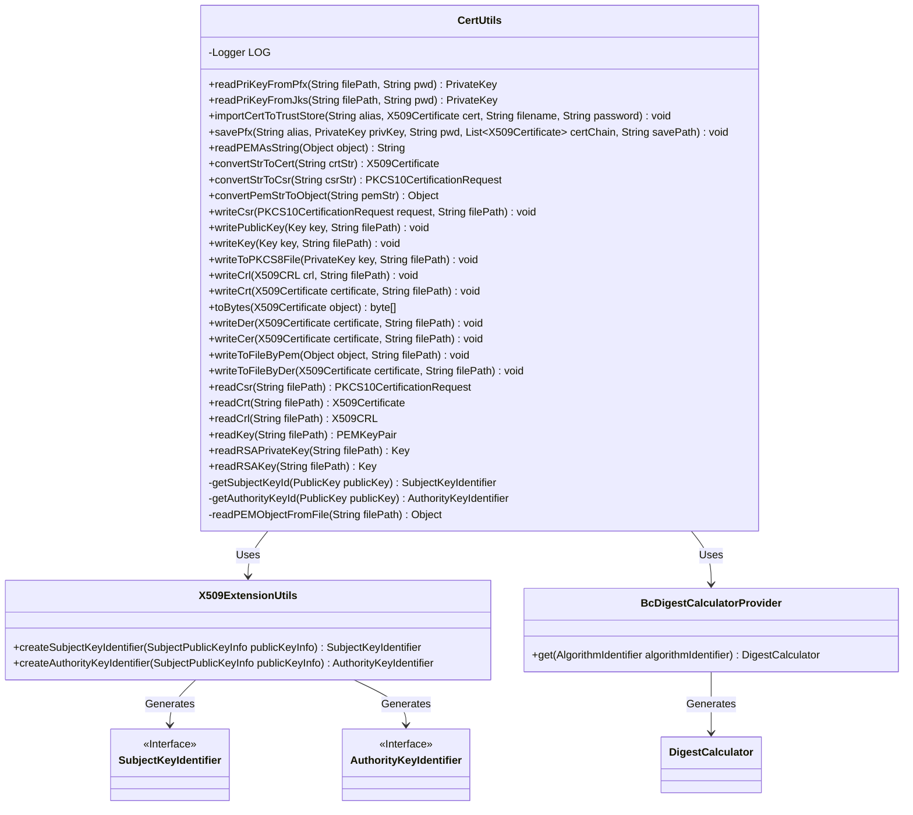

# Basic Information

|      |      |
|------|------|
| Name | CertUtils |
| Language | .java |
| Code Path | WeFe/common/java/common-cert/src/main/java/com/webank/cert/toolkit/utils/CertUtils.java |
| Package Name | com.webank.cert.toolkit.utils |
| Dependencies | ['java.io.ByteArrayOutputStream', 'java.io.File', 'java.io.FileInputStream', 'java.io.FileNotFoundException', 'java.io.FileOutputStream', 'java.io.FileReader', 'java.io.FileWriter', 'java.io.IOException', 'java.io.InputStream', 'java.io.OutputStream', 'java.io.OutputStreamWriter', 'java.io.StringReader', 'java.io.StringWriter', 'java.security.Key', 'java.security.KeyFactory', 'java.security.KeyStore', 'java.security.KeyStoreException', 'java.security.NoSuchAlgorithmException', 'java.security.PrivateKey', 'java.security.PublicKey', 'java.security.Security', 'java.security.cert.CRLException', 'java.security.cert.CertificateEncodingException', 'java.security.cert.CertificateException', 'java.security.cert.X509CRL', 'java.security.cert.X509Certificate', 'java.security.spec.PKCS8EncodedKeySpec', 'java.util.Enumeration', 'java.util.List', 'org.apache.commons.lang3.StringUtils', 'org.bouncycastle.asn1.oiw.OIWObjectIdentifiers', 'org.bouncycastle.asn1.pkcs.PrivateKeyInfo', 'org.bouncycastle.asn1.x509.AlgorithmIdentifier', 'org.bouncycastle.asn1.x509.AuthorityKeyIdentifier', 'org.bouncycastle.asn1.x509.SubjectKeyIdentifier', 'org.bouncycastle.asn1.x509.SubjectPublicKeyInfo', 'org.bouncycastle.cert.X509CRLHolder', 'org.bouncycastle.cert.X509CertificateHolder', 'org.bouncycastle.cert.X509ExtensionUtils', 'org.bouncycastle.cert.jcajce.JcaX509CRLConverter', 'org.bouncycastle.cert.jcajce.JcaX509CertificateConverter', 'org.bouncycastle.jce.provider.BouncyCastleProvider', 'org.bouncycastle.openssl.PEMKeyPair', 'org.bouncycastle.openssl.PEMParser', 'org.bouncycastle.openssl.jcajce.JcaPEMWriter', 'org.bouncycastle.openssl.jcajce.JcaPKCS8Generator', 'org.bouncycastle.operator.DigestCalculator', 'org.bouncycastle.operator.OperatorCreationException', 'org.bouncycastle.operator.bc.BcDigestCalculatorProvider', 'org.bouncycastle.pkcs.PKCS10CertificationRequest', 'org.bouncycastle.util.io.pem.PemReader', 'org.slf4j.Logger', 'org.slf4j.LoggerFactory'] |
| Brief Description | The CertUtils class provides certificate and key operation functionalities, including reading PFX/JKS private keys, generating key identifiers, importing/exporting certificates, and PEM/DER format conversion. It supports the BouncyCastle cryptographic library for handling X509 certificates, PKCS10 requests, and CRL lists. |

# Description

The CertUtils class is a utility class for handling certificates and keys, offering a variety of functions. It uses BouncyCastle as the security provider and supports reading private keys from PFX and JKS files, as well as generating subject key identifiers and authority key identifiers. The class also includes methods for writing objects such as certificates, private keys, and certificate signing requests to files in PEM or DER format, along with the ability to read these objects from files. Additionally, it supports converting objects into PEM-encoded strings and handling certificate revocation lists. The utility class provides comprehensive exception handling and logging capabilities to ensure the security and reliability of operations.

# Class Summary

| Name   | Type  | Description |
|-------|------|-------------|
| CertUtils | class | The CertUtils class provides certificate and key operation functionalities, including reading PFX/JKS private keys, generating key identifiers, importing/exporting certificates, and PEM/DER format conversion. |

## Class CertUtils

|      |      |
|------|------|
| Access Modifier | public |
| Type | class |
| Name | CertUtils |
| Description | The CertUtils class provides certificate and key operation functionalities, including reading PFX/JKS private keys, generating key identifiers, importing/exporting certificates, and PEM/DER format conversion. |

### UML Class Diagram

This diagram illustrates the CertUtils utility class and its dependencies. CertUtils primarily provides certificate and key read/write/conversion functionalities, including PFX/JKS keystore operations, PEM/DER format conversions, and CSR processing. It relies on X509ExtensionUtils to generate key identifiers and uses BcDigestCalculatorProvider to create digest calculators. The class diagram clearly demonstrates the collaboration between these classes, with SubjectKeyIdentifier and AuthorityKeyIdentifier marked as interfaces.

### Internal Method Call Graph

This flowchart illustrates the complete structure of the CertUtils class, including a static initializer, 2 private key processing methods, 15 public certificate operation methods, and 1 core private file reading method. The main functionalities are divided into four modules: 1) Key/Certificate Reading (e.g., readPriKeyFromPfx); 2) Certificate Storage Management (e.g., importCertToTrustStore); 3) PEM Format Conversion (e.g., convertStrToCert); 4) File I/O Operations (e.g., writeToPKCS8File). All methods rely on readPEMObjectFromFile for basic PEM parsing, forming a comprehensive certificate utility chain.

### Field List

| Name  | Type  | Description |
|-------|-------|------|
| LOG = LoggerFactory.getLogger(CertUtils.class) | Logger | The CertUtils class defines a protected static final log object named LOG. |

### Method List

| Name  | Type  | Description |
|-------|-------|------|
| getAuthorityKeyId | AuthorityKeyIdentifier | This method generates an authority key identifier from a public key: it converts the public key into a SubjectPublicKeyInfo instance, creates a digest calculator using the SHA1 algorithm, and finally generates the identifier via X509ExtensionUtils. |
| writeToFileByPem | void | The static method `writeToFileByPem` writes the object to a file in PEM format, automatically handles Base64 encoding, and logs error messages if exceptions occur. |
| savePfx | void | This method saves the private key and certificate chain as a PKCS12 format file. The parameters include the alias, private key, password, certificate chain, and save path. It creates a keystore and stores it at the specified path, then finally closes the output stream. |
| writeCer | void | This method writes the X509 certificate in DER format to the specified file path and may throw a certificate encoding exception. |
| importCertToTrustStore | void | Import the X509 certificate into the specified keystore file. If the password is empty, use the default value, automatically create directories, and save. |
| getSubjectKeyId | SubjectKeyIdentifier | The method generates a subject key identifier from the public key by computing a digest using the SHA1 algorithm and returns the identifier generated by the X509 extension utility. |
| readPriKeyFromPfx | PrivateKey | Static method for reading a private key from a PFX file, automatically handles cases where the password is empty, and returns a PrivateKey object. |
| writeCrt | void | This method writes the X509 certificate in PEM format to the specified file path. |
| convertStrToCert | X509Certificate | This method converts a PEM format string into an X509 certificate object. If the input is of type X509CertificateHolder, it returns the corresponding certificate; otherwise, it returns null. |
| readPEMAsString | String | The static method `readPEMAsString` converts the object into a PEM format string, uses `JcaPEMWriter` to write to `StringWriter`, and returns the resulting string after handling exceptions. |
| convertPemStrToObject | Object | This method converts a PEM format string into an object by using PemReader and PEMParser to read the content, captures and logs exceptions, and finally closes the resources. |
| writeToFileByDer | void | Write the X509 certificate in DER encoding format to the specified file path, handling potential certificate encoding and IO exceptions. |
| writePublicKey | void | The static method `writePublicKey` writes the key in PEM format to the specified file path. |
| readCrt | X509Certificate | Read the X509 certificate from the PEM file. If it is of type X509CertificateHolder, convert it to X509Certificate; otherwise, return null. |
| writeCsr | void | The static method `writeCsr` writes the PKCS10 certificate request to the specified file path, implemented by calling `writeToFileByPem`. |
| writeToPKCS8File | void | The method writes the private key into a PKCS8 format file, using JcaPEMWriter to handle IO exceptions and log error messages. |
| writeKey | void | Deprecated method writeKey: Writes the key to the specified file path in PEM format. |
| convertStrToCsr | PKCS10CertificationRequest | Convert a PEM-format CSR string into a PKCS10CertificationRequest object, and return null if the conversion fails. |
| writeCrl | void | This method writes the X509CRL object to the specified file path in PEM format. |
| readRSAPrivateKey | Key | Read the RSA private key file, return the private key in PKCS8 format if it is of type PrivateKeyInfo, otherwise return null. |
| readKey | PEMKeyPair | The static method `readKey` reads a PEM key pair from a file path. If the object is of type `PEMKeyPair`, it returns the object; otherwise, it returns `null`. A `FileNotFoundException` may be thrown. |
| readPriKeyFromJks | PrivateKey | Read the private key from a JKS file, handle cases with empty passwords, and return the private key of the first alias. |
| readRSAKey | Key | Read the RSA private key from a PEM file, use the key factory to generate a private key object, and return null if the file is not a key pair. |
| readPEMObjectFromFile | Object | This method reads a PEM object from a file, checks the file's existence, then parses the content using PemReader and PEMParser, logs exceptions, and returns the parsed result or null. |
| readCrl | X509CRL | Read the X509CRL certificate revocation list from the PEM file. If the file content is of type X509CRLHolder, convert it to an X509CRL object and return it; otherwise, return null. |
| writeDer | void | Java Method: Write an X509 certificate in DER format to the specified file path, which may throw a certificate encoding exception. |
| toBytes | byte[] | Convert the X509Certificate object to a byte array, use JcaPEMWriter to write to ByteArrayOutputStream, and log error messages if exceptions occur. |
| readCsr | PKCS10CertificationRequest | Read the PKCS10 certificate request from the file, return the object if the format is correct, otherwise return null. |

