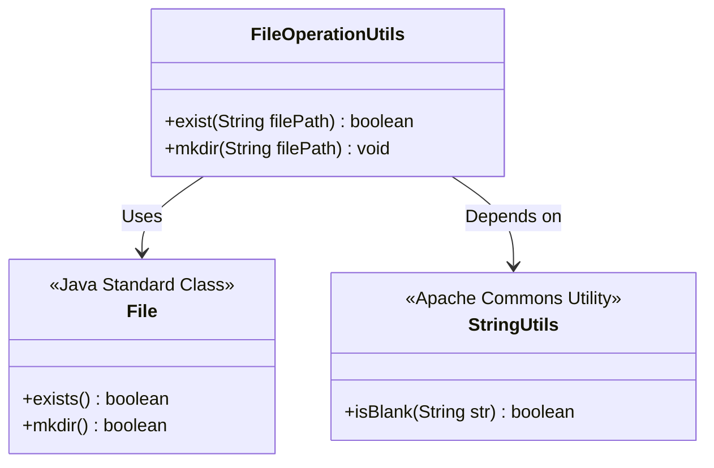
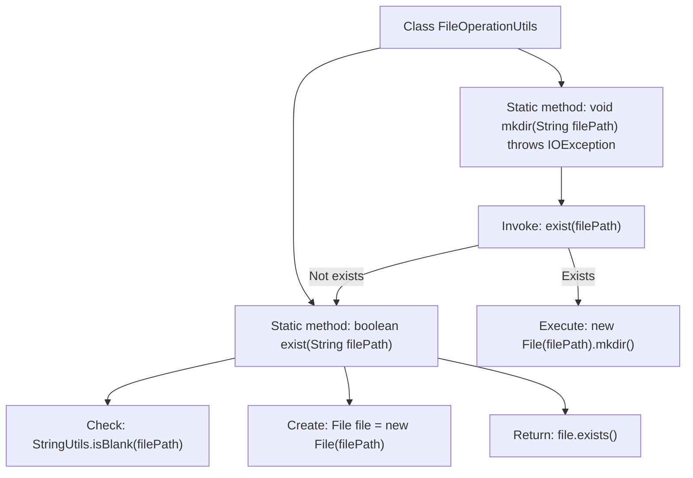

# Basic Information

|      |      |
|------|------|
| Name | FileOperationUtils |
| Language | .java |
| Code Path | WeFe/common/java/common-cert/src/main/java/com/webank/cert/toolkit/utils/FileOperationUtils.java |
| Package Name | com.webank.cert.toolkit.utils |
| Dependencies | ['lombok.extern.slf4j.Slf4j', 'org.apache.commons.lang3.StringUtils', 'java.io.File', 'java.io.IOException'] |
| Brief Description | The FileOperationUtils class provides file existence checking and directory creation functionalities, including the exist and mkdir methods. |

# Description

This is a Java utility class named FileOperationUtils, which provides two static methods for file operations. The exist method checks whether a file exists at the given path and returns false if the path is empty. The mkdir method is used to create a directory; it performs no action if the directory already exists, otherwise it creates a new directory. The class uses Lombok's @Slf4j annotation to generate a logger object.

# Class Summary

| Name   | Type  | Description |
|-------|------|-------------|
| FileOperationUtils | class | The FileOperationUtils class provides file existence checking and directory creation functionalities, including the exist and mkdir methods. exist checks whether a file path exists, while mkdir creates a directory (if it does not exist). |

## Class FileOperationUtils

|      |      |
|------|------|
| Access Modifier | @Slf4j;public |
| Type | class |
| Name | FileOperationUtils |
| Description | The FileOperationUtils class provides file existence checking and directory creation functionalities, including the exist and mkdir methods. exist checks whether a file path exists, while mkdir creates a directory (if it does not exist). |

### UML Class Diagram

Class diagram description: FileOperationUtils is a file operation utility class that provides static methods for checking file existence (exist) and creating directories (mkdir). It relies on the Java standard class File for underlying file operations and uses Apache Commons' StringUtils utility class for null/empty string checks. The exist method validates path non-emptiness before checking file existence; the mkdir method creates directories only when they don't exist, reflecting defensive programming principles.

### Internal Method Call Graph

Flowchart description: This flowchart illustrates the two core methods of the FileOperationUtils class. The exist() method first checks if the file path is empty, then creates a File object and returns its existence status. The mkdir() method invokes exist() to verify path existence and only creates the directory if the path does not exist. The flow clearly demonstrates the call relationships between methods and conditional logic, reflecting the safety mechanisms and exception handling in file operations.

### Field List

| Name  | Type  | Description |
|-------|-------|------|

### Method List

| Name  | Type  | Description |
|-------|-------|------|
| mkdir | void | The static method `mkdir` checks if the file path exists and creates a directory if it does not. If the path already exists, it returns directly. It may throw an `IOException`. |
| exist | boolean | Check if the file path exists; return false for empty paths. |

