# Basic Information

|      |      |
|------|------|
| Name | KeyUtils |
| Language | .java |
| Code Path | WeFe/common/java/common-cert/src/main/java/com/webank/cert/toolkit/utils/KeyUtils.java |
| Package Name | com.webank.cert.toolkit.utils |
| Dependencies | ['java.io.ByteArrayOutputStream', 'java.io.IOException', 'java.io.OutputStreamWriter', 'java.math.BigInteger', 'java.security.InvalidAlgorithmParameterException', 'java.security.KeyFactory', 'java.security.KeyPair', 'java.security.KeyPairGenerator', 'java.security.NoSuchAlgorithmException', 'java.security.NoSuchProviderException', 'java.security.PrivateKey', 'java.security.PublicKey', 'java.security.SecureRandom', 'java.security.interfaces.ECPrivateKey', 'java.security.spec.ECGenParameterSpec', 'java.security.spec.ECParameterSpec', 'java.security.spec.ECPoint', 'java.security.spec.ECPublicKeySpec', 'java.security.spec.InvalidKeySpecException', 'java.security.spec.PKCS8EncodedKeySpec', 'java.security.spec.RSAPrivateKeySpec', 'java.security.spec.RSAPublicKeySpec', 'java.security.spec.X509EncodedKeySpec', 'java.util.Collections', 'org.apache.commons.codec.binary.Base64', 'org.bouncycastle.crypto.AsymmetricCipherKeyPair', 'org.bouncycastle.crypto.generators.ECKeyPairGenerator', 'org.bouncycastle.crypto.params.ECDomainParameters', 'org.bouncycastle.crypto.params.ECKeyGenerationParameters', 'org.bouncycastle.jcajce.provider.asymmetric.ec.BCECPrivateKey', 'org.bouncycastle.jce.provider.BouncyCastleProvider', 'org.bouncycastle.math.ec.custom.gm.SM2P256V1Curve', 'org.bouncycastle.openssl.PEMKeyPair', 'org.bouncycastle.util.io.pem.PemObject', 'org.bouncycastle.util.io.pem.PemWriter', 'org.slf4j.Logger', 'org.slf4j.LoggerFactory'] |
| Brief Description | The KeyUtils class provides various key generation and conversion functions, including RSA, ECDSA, and SM2 key pair generation, PKCS8 to PEM format conversion, as well as public/private key extraction and processing. |

# Description

The `KeyUtils` class is a utility class designed for generating and managing key pairs, supporting various encryption algorithms including RSA, ECDSA, and SM2. This class defines SM2 elliptic curve parameters, encompassing the curve, base point, order, and cofactor, and provides methods for generating RSA, ECDSA, and SM2 key pairs. Additionally, it includes functionality to convert PKCS8-formatted private keys into EC private keys or PEM format, as well as methods to derive public keys from PEM strings or private keys. The class also implements capabilities to retrieve RSA and EC key pairs, supports parsing key pairs from PEM strings, and offers related helper methods such as locating named curve parameters.

# Class Summary

| Name   | Type  | Description |
|-------|------|-------------|
| KeyUtils | class | The KeyUtils class provides various key generation and conversion functions, including RSA, ECDSA, and SM2 key pair generation, PKCS8 to PEM format conversion, as well as public-private key transformation operations. |

## Class KeyUtils

|      |      |
|------|------|
| Access Modifier | public |
| Type | class |
| Name | KeyUtils |
| Description | The KeyUtils class provides various key generation and conversion functions, including RSA, ECDSA, and SM2 key pair generation, PKCS8 to PEM format conversion, as well as public-private key transformation operations. |

### UML Class Diagram

```mermaid
classDiagram
    class KeyUtils {
        +SM2P256V1Curve CURVE
        +BigInteger SM2_ECC_GX
        +BigInteger SM2_ECC_GY
        +BigInteger SM2_ECC_N
        +BigInteger SM2_ECC_H
        +ECPoint G_POINT
        +ECDomainParameters DOMAIN_PARAMS
        -String PEM_STRING_ECPRIVATEKEY
        -SecureRandom random
        -Logger LOG
        +KeyPair generateKeyPair()
        +KeyPair generateECDSAKeyPair() throws NoSuchProviderException, NoSuchAlgorithmException, InvalidAlgorithmParameterException
        +KeyPair generateSM2KeyPair() throws NoSuchProviderException, NoSuchAlgorithmException, InvalidAlgorithmParameterException
        +AsymmetricCipherKeyPair generateSM2KeyPairParameter()
        +KeyPair generateECKeyPair(ECDomainParameters domainParameters, SecureRandom random) throws NoSuchProviderException, NoSuchAlgorithmException, InvalidAlgorithmParameterException
        +AsymmetricCipherKeyPair generateKeyPairParameter(ECDomainParameters domainParameters, SecureRandom random)
        +BCECPrivateKey convertPKCS8ToECPrivateKey(byte[] pkcs8Key) throws NoSuchAlgorithmException, NoSuchProviderException, InvalidKeySpecException
        +String convertECPrivateKeyPKCS8ToPEM(byte[] encodedKey) throws IOException
        -String convertEncodedDataToPEM(String type, byte[] encodedData) throws IOException
        +PublicKey getRSAPublicKey(String key) throws Exception
        +PrivateKey getRSAPrivateKey(String key) throws Exception
        +PublicKey getRSAPublicKey(PrivateKey privateKey) throws Exception
        +KeyPair getECKeyPair(String privateStr) throws Exception
        +KeyPair getRSAKeyPair(String privateStr) throws Exception
        +PublicKey getPublicKey(ECPrivateKey privateKey) throws InvalidKeySpecException, NoSuchAlgorithmException, NoSuchProviderException
        -ECParameterSpec tryFindNamedCurveSpec(ECParameterSpec params)
    }

    class SM2P256V1Curve {
        <<External>>
    }

    class ECDomainParameters {
        <<External>>
    }

    class SecureRandom {
        <<External>>
    }

    class Logger {
        <<Interface>>
    }

    class KeyPairGenerator {
        <<External>>
    }

    class ECGenParameterSpec {
        <<External>>
    }

    class BouncyCastleProvider {
        <<External>>
    }

    class PKCS8EncodedKeySpec {
        <<External>>
    }

    class KeyFactory {
        <<External>>
    }

    class PemWriter {
        <<External>>
    }

    class X509EncodedKeySpec {
        <<External>>
    }

    class RSAPrivateKeySpec {
        <<External>>
    }

    class RSAPublicKeySpec {
        <<External>>
    }

    class PEMKeyPair {
        <<External>>
    }

    class ECPrivateKey {
        <<Interface>>
    }

    class ECPublicKeySpec {
        <<External>>
    }

    KeyUtils --> SM2P256V1Curve : uses
    KeyUtils --> ECDomainParameters : uses
    KeyUtils --> SecureRandom : uses
    KeyUtils --> Logger : uses
    KeyUtils --> KeyPairGenerator : uses
    KeyUtils --> ECGenParameterSpec : uses
    KeyUtils --> BouncyCastleProvider : uses
    KeyUtils --> PKCS8EncodedKeySpec : uses
    KeyUtils --> KeyFactory : uses
    KeyUtils --> PemWriter : uses
    KeyUtils --> X509EncodedKeySpec : uses
    KeyUtils --> RSAPrivateKeySpec : uses
    KeyUtils --> RSAPublicKeySpec : uses
    KeyUtils --> PEMKeyPair : uses
    KeyUtils --> ECPrivateKey : uses
    KeyUtils --> ECPublicKeySpec : uses
```

This class diagram illustrates the structure of the KeyUtils utility class and its relationships with other external classes. KeyUtils is a feature-rich cryptographic key utility class primarily used for generating key pairs for various encryption algorithms (RSA, ECDSA, SM2, etc.) and performing key format conversions (such as PKCS8 to PEM conversion). It relies on multiple external cryptographic-related classes (e.g., SM2P256V1Curve, ECDomainParameters) and Java Security API components (e.g., KeyPairGenerator, KeyFactory). The class provides key operation functionalities through static methods and constants, while leveraging the BouncyCastle cryptographic library for certain implementations. The diagram clearly depicts KeyUtils' dependencies with these external components.

### Internal Method Call Graph

```mermaid
graph TD
    A["Class KeyUtils"]
    B["Constant: SM2P256V1Curve CURVE"]
    C["Constant: BigInteger SM2_ECC_GX/GY/N/H"]
    D["Constant: ECPoint G_POINT"]
    E["Constant: ECDomainParameters DOMAIN_PARAMS"]
    F["Method: KeyPair generateKeyPair()"]
    G["Method: KeyPair generateECDSAKeyPair()"]
    H["Method: KeyPair generateSM2KeyPair()"]
    I["Method: AsymmetricCipherKeyPair generateSM2KeyPairParameter()"]
    J["Method: KeyPair generateECKeyPair()"]
    K["Method: AsymmetricCipherKeyPair generateKeyPairParameter()"]
    L["Method: BCECPrivateKey convertPKCS8ToECPrivateKey()"]
    M["Method: String convertECPrivateKeyPKCS8ToPEM()"]
    N["Method: PublicKey getRSAPublicKey()"]
    O["Method: PrivateKey getRSAPrivateKey()"]
    P["Method: KeyPair getECKeyPair()"]
    Q["Method: KeyPair getRSAKeyPair()"]
    R["Method: PublicKey getPublicKey()"]
    S["Private Method: ECParameterSpec tryFindNamedCurveSpec()"]

    A --> B
    A --> C
    A --> D
    A --> E
    A --> F
    A --> G
    A --> H
    A --> I
    A --> J
    A --> K
    A --> L
    A --> M
    A --> N
    A --> O
    A --> P
    A --> Q
    A --> R
    R --> S
```

This code represents the KeyUtils utility class, primarily used for generating and managing key pairs for various encryption algorithms including RSA, ECDSA, and SM2. It provides key generation, conversion, and PEM format processing functionalities, utilizing the BouncyCastle library for elliptic curve cryptography operations. The class contains multiple static methods capable of handling PKCS8-standard private key conversion, PEM format conversion, and public key derivation from private keys, while also defining standard curve parameters and domain parameters for the SM2 algorithm.

### Field List

| Name  | Type  | Description |
|-------|-------|------|
| SM2_ECC_N = CURVE.getOrder() | BigInteger | Define the order of the SM2 elliptic curve algorithm as the constant SM2_ECC_N, whose value is taken from the order attribute of the CURVE object. |
| SM2_ECC_GX = new BigInteger(			"32C4AE2C1F1981195F9904466A39C9948FE30BBFF2660BE1715A4589334C74C7", 16) | BigInteger | Define the hexadecimal constant value for the SM2 elliptic curve parameter GX. |
| SM2_ECC_H = CURVE.getCofactor() | BigInteger | The code defines an immutable static BigInteger constant SM2_ECC_H, whose value is the cofactor of the elliptic curve CURVE. |
| G_POINT = CURVE.createPoint(SM2_ECC_GX, SM2_ECC_GY) | org.bouncycastle.math.ec.ECPoint | Define the base point G of the SM2 elliptic curve, and create an ECPoint object using the given coordinates (GX, GY). |
| LOG = LoggerFactory.getLogger(KeyUtils.class) | Logger | The KeyUtils class defines a protected static final log object LOG for logging purposes. |
| CURVE = new SM2P256V1Curve() | SM2P256V1Curve | Defined a static immutable SM2P256V1 elliptic curve object CURVE. |
| PEM_STRING_ECPRIVATEKEY = "EC PRIVATE KEY" | String | Define the constant string "EC PRIVATE KEY" to identify an EC private key. |
| DOMAIN_PARAMS = new ECDomainParameters(CURVE, G_POINT,			SM2_ECC_N, SM2_ECC_H) | ECDomainParameters | Define the SM2 elliptic curve domain parameters: curve, base point, order, and cofactor. |
| SM2_ECC_GY = new BigInteger(			"BC3736A2F4F6779C59BDCEE36B692153D0A9877CC62A474002DF32E52139F0A0", 16) | BigInteger | SM2 elliptic curve parameter GY, hexadecimal value BC3736A2F4F6779C59BDCEE36B692153D0A9877CC62A474002DF32E52139F0A0. |
| random = new SecureRandom() | SecureRandom | Declare a private static final SecureRandom instance named random for generating secure random numbers. |

### Method List

| Name  | Type  | Description |
|-------|-------|------|
| generateECKeyPair | KeyPair | This method utilizes the BouncyCastle library to generate an elliptic curve parameter-based key pair, including initializing the key generator and returning the key pair. |
| generateSM2KeyPairParameter | AsymmetricCipherKeyPair | Generate SM2 key pair parameters by calling the generateKeyPairParameter method, passing in preset parameters and a random number. |
| generateKeyPair | KeyPair | Generate a 2048-bit RSA key pair, catch the NoSuchAlgorithmException exception, and log the error. |
| convertECPrivateKeyPKCS8ToPEM | String | Convert an EC private key in PKCS8 format to PEM format. The input is a byte array, and the output is a PEM string. |
| generateECDSAKeyPair | KeyPair | Generate an ECDSA key pair using the secp256k1 curve and Bouncy Castle provider. |
| generateKeyPairParameter | AsymmetricCipherKeyPair | Generate ECDSA key pair: Initialize the key generator with domain parameters and a random number, then generate and return an asymmetric key pair. |
| getRSAPublicKey | PublicKey | This method converts a Base64-encoded RSA public key string into a PublicKey object by decoding it using the X509 standard and generating the key. |
| convertEncodedDataToPEM | String | Convert byte array encoded data to a PEM format string using the specified type and ensure resource closure. |
| convertPKCS8ToECPrivateKey | BCECPrivateKey | Convert a PKCS8 format private key to an EC private key, handling exceptions using the BouncyCastle provider. |
| generateSM2KeyPair | KeyPair | Methods for generating SM2 key pairs using BouncyCastleProvider and sm2p256v1 parameters, returning a KeyPair object. |
| getRSAPrivateKey | PrivateKey | Java Method: Extract RSA private key from a string by removing header and footer markers, Base64 decode it, and generate a private key object following the PKCS8 standard. |
| getRSAPublicKey | PublicKey | This method generates the corresponding public key from an RSA private key, creates the public key specification using a fixed exponent of 65537 and the private key modulus, and ultimately returns the public key instance. |
| getECKeyPair | KeyPair | This method generates an EC key pair from a PEM string: it parses the PEM string into an object, uses the EC algorithm to generate a private key from the private key information, then derives the public key based on the private key, and finally returns the key pair. |
| getRSAKeyPair | KeyPair | This method generates an RSA key pair, including a private key and a public key, from a PEM string. If the PEM conversion fails, an exception is thrown; if successful, the key pair is returned. |
| getPublicKey | PublicKey | This method generates the corresponding public key from an EC private key: converting parameter specifications, calculating curve points, constructing the public key specification, and returning an EC public key instance. The process may throw exceptions for invalid keys, algorithms, or providers. |
| tryFindNamedCurveSpec | ECParameterSpec | The method attempts to convert ECParameterSpec into a named curve specification by comparing parameters and returns the corresponding ECNamedCurveSpec if matched, otherwise returns the original parameter. |

