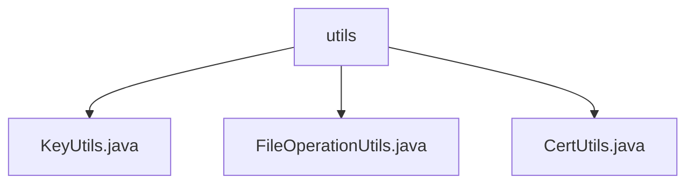

# Basic Information

|      |      |
|------|------|
| Name | utils |
| Language | .java |
| Code Path | WeFe/common/java/common-cert/src/main/java/com/webank/cert/toolkit/utils |
| Package Name | docs.common.java.common-cert.src.main.java.com.webank.cert.toolkit.utils |
| Brief Description | The KeyUtils class supports RSA, ECDSA, and SM2 key pair generation and conversion. The FileOperationUtils class provides file existence checks and directory creation functionality. The CertUtils class handles certificate key reading/writing and conversion, supporting PFX, JKS, and PEM formats. |

# Description

## Overview  
This module is a cryptographic security toolkit, with core responsibilities including key pair management, certificate operations, and basic file handling. The interface specifications cover key generation (supporting RSA/ECDSA/SM2 algorithms), certificate parsing (PFX/JKS formats), file operations (existence checks/directory creation), and more. Key data structures include SM2 elliptic curve parameters, PKCS8 private key formats, and PEM-encoded objects. External dependencies primarily include the BouncyCastle security library and the Lombok logging tool. For example, KeyUtils implements SM2 key pair generation, CertUtils handles PFX certificate parsing, and FileOperationUtils provides atomic file operations.  

## Key Business Scenarios  
The module is suitable for full lifecycle management of digital certificates, resembling a lightweight implementation of a PKI system. Business processes include: key generation → certificate issuance → persistent storage, supporting both the national SM2 standard and international algorithms. Interaction patterns are exposed through static utility methods, such as CertUtils.readPfx() for reading certificate chains. Typical applications, such as SSL certificate deployment, require combined use of KeyUtils for key pair generation, CertUtils for format conversion, and FileOperationUtils for directory creation. API types encompass cryptographic operations (e.g., ECDSA signature verification) and I/O operations (e.g., PEM file writing).

### Package Internal Structure View

This flowchart illustrates three utility class files under the `utils` directory: `KeyUtils.java`, `FileOperationUtils.java`, and `CertUtils.java`. All files are directly subordinate to the `utils` directory with no deeper nesting hierarchy, presenting a clear peer-level relationship. Such a structure is commonly used for organizing functionally related utility class collections.

# File List

| Name   | Type  | Description |
|-------|------|-------------|
| [KeyUtils.java](KeyUtils.md) | file | The KeyUtils class provides various key generation and conversion functions, including RSA, ECDSA, and SM2 key pair generation, PKCS8 and PEM format conversion, as well as public/private key extraction and processing. |
| [FileOperationUtils.java](FileOperationUtils.md) | file | The FileOperationUtils class provides file existence checking and directory creation functionalities, including the exist and mkdir methods. |
| [CertUtils.java](CertUtils.md) | file | The CertUtils class provides certificate and key operation functionalities, including reading PFX/JKS private keys, generating key identifiers, importing/exporting certificates, and PEM/DER format conversion. It supports the BouncyCastle cryptographic library for handling X509 certificates, PKCS10 requests, and CRL lists. |

