# Basic Information

|      |      |
|------|------|
| Name | com |
| Language | .java |
| Code Path | WeFe/common/java/common-data-mongodb/src/main/java/com |
| Package Name | docs.common.java.common-data-mongodb.src.main.java.com |
| Brief Description | The MongoDB data access layer provides CRUD and complex query functionalities, supporting logical deletion and timestamp constraints. It includes SMS business categorization and vendor enumeration management. The toolkit supports chained query construction and aggregation operations. The federated learning platform implements logging, certificates, and data governance. Unified query management handles datasets and member authentication. The connection management module dynamically registers MongoDB components. |

# Description

## Overview  
This module serves as the core data management component of the federated learning platform, implementing unified storage and operations for multi-domain data based on MongoDB, akin to a data bus pattern. Its core responsibilities include: 1) Managing 20+ business entities (e.g., certificates, datasets) through standardized CRUD interfaces; 2) Providing complex query construction tools and aggregation operation support; 3) Unified connection management and transaction control.  

The interface specification follows a layered design: the base layer (AbstractMongoModel/Repo) defines primary key and serialization rules, while the business layer extends specific operations (e.g., version control). Key data structures include the pagination object PageOutput, certificate PEM content, and dataset permission models. External dependencies include Spring Data MongoDB, QueryBuilder, and MongoDB drivers. For example, RealnameAuthAgreementTemplateMongoRepo implements optimistic lock updates, and QueryBuilder supports range filtering.  

## Key Business Scenarios  
The module supports four major scenarios: 1) Data governance (e.g., DataSet permission control), similar to the RBAC model; 2) Operation auditing (recording API call logs); 3) Federated resource retrieval (multi-condition paginated queries); 4) Full lifecycle management of certificates. Business processes include selecting SMS templates via enumerations, chaining update conditions, and handling dataset permissions through aggregation pipelines.  

The interaction mode primarily involves DTO transmission and API composition. For instance, ImageDataSetMongoRepo performs joint queries with label tables, while AccountMongoRepo implements activity detection. Functional completeness is reflected in covering the entire data lifecycle (metadata → usage statistics), with typical applications including resource selectors during task configuration and node qualification verification. API types encompass CRUD operations (e.g., certStatus updates) and configuration classes (@Configuration), with integration examples visible in the block synchronization service's height records.

### Package Internal Structure View

```mermaid
graph TD
    com --> welab
    welab --> wefe
    wefe --> common
    common --> data
    data --> mongodb
    mongodb --> repo
    mongodb --> constant
    mongodb --> util
    mongodb --> entity
    mongodb --> dto
    mongodb --> config
    repo --> RealnameAuthAgreementTemplateMongoRepo.java
    repo --> DataSetDefaultTagMongoRepo.java
    repo --> BlockSyncDetailInfoMongoRepo.java
    repo --> TrustCertsMongoRepo.java
    repo --> UnionOperationLogMongoRepo.java
    repo --> MemberFileInfoMongoRepo.java
    repo --> BlockSyncContractHeightMongoRepo.java
    repo --> CertRequestInfoRepo.java
    repo --> TableDataSetMongoReop.java
    repo --> ImageDataSetMongoReop.java
    repo --> AbstractDataSetMongoRepo.java
    repo --> DataResourceDefaultTagMongoRepo.java
    repo --> CertKeyInfoRepo.java
    repo --> DataSetMongoReop.java
    repo --> MemberServiceMongoReop.java
    repo --> UnionNodeConfigMongoRepo.java
    repo --> MemberAuthTypeMongoRepo.java
    repo --> DataSetMemberPermissionMongoRepo.java
    repo --> UnionNodeMongoRepo.java
    repo --> ManagerOperationLogMongoRepo.java
    repo --> DataResourceMongoReop.java
    repo --> AccountMongoRepo.java
    repo --> BlockSyncHeightMongoReop.java
    repo --> AbstractOperationLogMongoRepo.java
    repo --> MemberMongoReop.java
    repo --> DataResourceLazyUpdateModelMongoReop.java
    repo --> AbstractMongoRepo.java
    repo --> BloomFilterMongoReop.java
    repo --> CertInfoRepo.java
    constant --> SmsBusinessType.java
    constant --> SmsSupplierEnum.java
    constant --> MongodbTable.java
    util --> UpdateBuilder.java
    util --> AddFieldsOperation.java
    util --> QueryBuilder.java
    entity --> common
    entity --> manager
    entity --> union
    entity --> base
    common --> OperationLog.java
    manager --> CertInfo.java
    manager --> CertRequestInfo.java
    manager --> Account.java
    manager --> CertKeyInfo.java
    union --> ext
    union --> DataResourceDefaultTag.java
    union --> TableDataSet.java
    union --> TrustCerts.java
    union --> RealnameAuthAgreementTemplate.java
    union --> DataResourceLazyUpdateModel.java
    union --> MemberFileInfo.java
    union --> DataSet.java
    union --> BloomFilter.java
    union --> BlockSyncHeight.java
    union --> UnionNode.java
    union --> BlockSyncDetailInfo.java
    union --> BlockSyncContractHeight.java
    union --> DataResource.java
    union --> TransactionResponseDetailInfo.java
    union --> MemberAuthType.java
    union --> DataSetMemberPermission.java
    union --> ImageDataSet.java
    union --> MemberService.java
    union --> Member.java
    union --> DataSetDefaultTag.java
    union --> UnionNodeSm2Config.java
    ext --> DataSetDefaultTagExtJSON.java
    ext --> MemberServiceExtJSON.java
    ext --> MemberAuthTypeExtJSON.java
    ext --> TableDataSetExtJSON.java
    ext --> RealnameAuthAgreementTemplateExtJSON.java
    ext --> BloomFilterExtJSON.java
    ext --> MemberExtJSON.java
    ext --> DataSetMemberPermissionExtJSON.java
    ext --> ImageDataSetExtJSON.java
    ext --> UnionNodeExtJSON.java
    ext --> RealnameAuthFileInfo.java
    ext --> MemberFileInfoExtJSON.java
    ext --> DataResourceDefaultTagExtJSON.java
    ext --> DataResourceExtJSON.java
    ext --> TrustCertsExtJSON.java
    ext --> DataSetExtJSON.java
    base --> AbstractBlockChainBusinessModel.java
    base --> AbstractMongoModel.java
    base --> AbstractUnionNodeConfigMongoModel.java
    base --> AbstractNormalMongoModel.java
    dto --> dataresource
    dto --> dataset
    dto --> member
    dto --> PageOutput.java
    dto --> PageInput.java
    dto --> AbstractQueryOutput.java
    dataresource --> DataResourceQueryInput.java
    dataresource --> DataResourceQueryOutput.java
    dataset --> ImageDataSetQueryOutput.java
    dataset --> DataSetQueryOutput.java
    dataset --> DataSetQueryInput.java
    dataset --> TableDataSetQueryInput.java
    dataset --> DataSetTagsQueryOutput.java
    dataset --> ImageDataSetQueryInput.java
    member --> RealnameAuthInfoQueryOutput.java
    member --> MemberAuthQueryOutput.java
    member --> MemberServiceQueryOutput.java
    config --> MongoManagerConfig.java
    config --> AbstractConfig.java
    config --> MongoUnionConfig.java
```

This flowchart presents the complete Java package structure of the common-data-mongodb module in the WeFe project, starting from the root package com.welab.wefe.common.data.mongodb and hierarchically expanding to the underlying entity classes, repository interfaces, and utility classes. The diagram includes six main submodules (repo/constant/util/entity/dto/config), with the entity package further divided into four secondary subpackages, fully illustrating the code organization of MongoDB-related functionalities. All nodes use end-path names, strictly adhering to the given 56 path entries.

# File List

| Name   | Type  | Description |
|-------|------|-------------|
| [welab](welab/_module.md) | package | The MongoDB data access layer provides CRUD and complex query functionalities, supporting logical deletion and timestamp constraints. It includes SMS business categorization and vendor enumeration management. The toolkit supports chained query building and aggregation operations. The federated learning platform implements logging, certificate, and data governance. Unified query management handles datasets and member authentication. The connection management module dynamically registers MongoDB components. |

