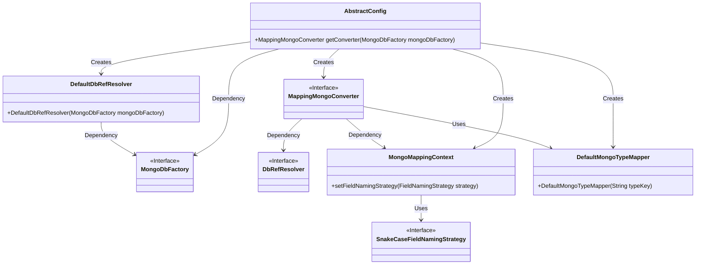
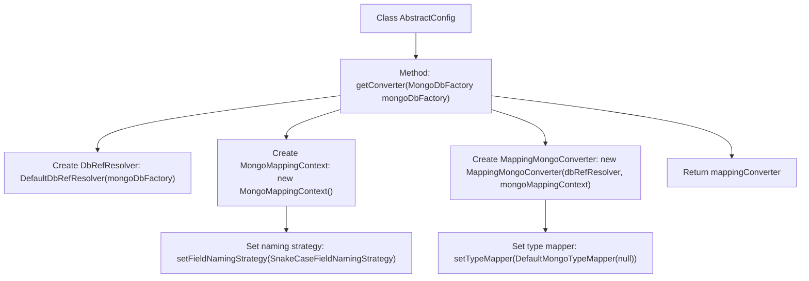

# Basic Information

|      |      |
|------|------|
| Name | AbstractConfig |
| Language | .java |
| Code Path | WeFe/common/java/common-data-mongodb/src/main/java/com/welab/wefe/common/data/mongodb/config/AbstractConfig.java |
| Package Name | com.welab.wefe.common.data.mongodb.config |
| Dependencies | ['org.springframework.data.mapping.model.SnakeCaseFieldNamingStrategy', 'org.springframework.data.mongodb.MongoDbFactory', 'org.springframework.data.mongodb.core.convert.DbRefResolver', 'org.springframework.data.mongodb.core.convert.DefaultDbRefResolver', 'org.springframework.data.mongodb.core.convert.DefaultMongoTypeMapper', 'org.springframework.data.mongodb.core.convert.MappingMongoConverter', 'org.springframework.data.mongodb.core.mapping.MongoMappingContext'] |
| Brief Description | The abstract configuration class provides methods for obtaining MongoDB converters, including a reference resolver, mapping context (configured with snake case naming strategy), and removes the default `_class` field to optimize storage views. |

# Description

This passage describes a method named `getConverter` in a class called `AbstractConfig`, which is used to create and configure a `MappingMongoConverter` object. The method takes a `MongoDbFactory` parameter and first creates instances of `DbRefResolver` and `MongoMappingContext`. The `MongoMappingContext` is configured with a field naming strategy set to `SnakeCaseFieldNamingStrategy`, enabling the conversion from underscore to camelCase naming. These components are then used to initialize the `MappingMongoConverter`. By setting the `DefaultMongoTypeMapper` to `null`, the default `_class` field addition functionality is disabled to avoid affecting visual presentation. Finally, the configured `MappingMongoConverter` instance is returned.

# Class Summary

| Name   | Type  | Description |
|-------|------|-------------|
| AbstractConfig | class | The abstract configuration class provides methods to create MongoDB converters, sets the field naming strategy to convert underscores to camelCase, and removes the default `_class` field to maintain data conciseness. |

## Class AbstractConfig

|      |      |
|------|------|
| Access Modifier | public |
| Type | class |
| Name | AbstractConfig |
| Description | The abstract configuration class provides methods to create MongoDB converters, sets the field naming strategy to convert underscores to camelCase, and removes the default `_class` field to maintain data conciseness. |

### UML Class Diagram

This code demonstrates an abstract configuration class `AbstractConfig`, which is responsible for creating and configuring a `MappingMongoConverter` object. This converter is used for MongoDB data mapping, resolving database references via `DefaultDbRefResolver`, setting field naming strategies (snake_case to camelCase) with `MongoMappingContext`, and removing the default `_class` field through `DefaultMongoTypeMapper`. The class diagram clearly illustrates the dependency relationships and creation flow among the components.

### Internal Method Call Graph

This flowchart illustrates the execution flow of the getConverter method in the AbstractConfig class. The method first creates instances of DbRefResolver and MongoMappingContext, then sets a snake case naming strategy for the mapping context, subsequently creates a MappingMongoConverter and configures the type mapper to remove the default _class field, and finally returns the configured converter. The entire process clearly presents the initialization steps for configuring a MongoDB data converter.

### Field List

| Name  | Type  | Description |
|-------|-------|------|

### Method List

| Name  | Type  | Description |
|-------|-------|------|
| getConverter | MappingMongoConverter | Create a MongoDB converter using the underscore to camel case naming strategy and remove the default _class field. |

