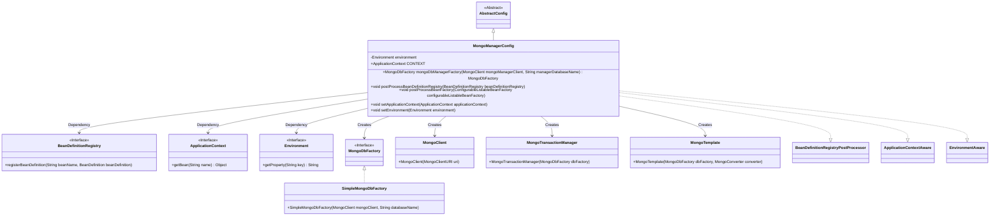
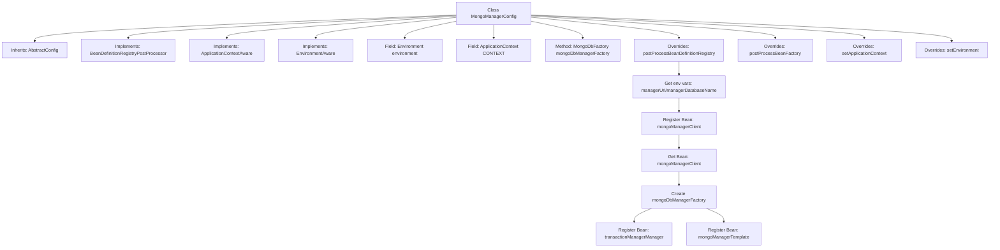

# Basic Information

|      |      |
|------|------|
| Name | MongoManagerConfig |
| Language | .java |
| Code Path | WeFe/common/java/common-data-mongodb/src/main/java/com/welab/wefe/common/data/mongodb/config/MongoManagerConfig.java |
| Package Name | com.welab.wefe.common.data.mongodb.config |
| Dependencies | ['com.mongodb.MongoClient', 'com.mongodb.MongoClientURI', 'org.apache.commons.lang3.StringUtils', 'org.springframework.beans.BeansException', 'org.springframework.beans.factory.config.BeanDefinition', 'org.springframework.beans.factory.config.ConfigurableListableBeanFactory', 'org.springframework.beans.factory.support.BeanDefinitionBuilder', 'org.springframework.beans.factory.support.BeanDefinitionRegistry', 'org.springframework.beans.factory.support.BeanDefinitionRegistryPostProcessor', 'org.springframework.context.ApplicationContext', 'org.springframework.context.ApplicationContextAware', 'org.springframework.context.EnvironmentAware', 'org.springframework.context.annotation.Configuration', 'org.springframework.core.env.Environment', 'org.springframework.data.mongodb.MongoDbFactory', 'org.springframework.data.mongodb.MongoTransactionManager', 'org.springframework.data.mongodb.core.MongoTemplate', 'org.springframework.data.mongodb.core.SimpleMongoDbFactory'] |
| Brief Description | MongoDB configuration class, registering MongoClient, transaction manager, and template beans, obtaining connection information through environment variables. |

# Description

The configuration class `MongoManagerConfig` extends `AbstractConfig` and implements multiple Spring interfaces to manage the registration and configuration of MongoDB-related beans. It retrieves the MongoDB connection URI and database name from environment variables, dynamically registering beans such as `MongoClient`, `MongoTransactionManager`, and `MongoTemplate`. The class includes factory methods to create `MongoDbFactory` instances and utilizes dependency injection with `ApplicationContext` and `Environment` for configuration management.

# Class Summary

| Name   | Type  | Description |
|-------|------|-------------|
| MongoManagerConfig | class | The MongoManagerConfig class configures MongoDB clients, factories, transaction management, and templates, initializing them through environment variables and registering them as Spring Beans. |

## Class MongoManagerConfig

|      |      |
|------|------|
| Access Modifier | @Configuration;public |
| Type | class |
| Name | MongoManagerConfig |
| Description | The MongoManagerConfig class configures MongoDB clients, factories, transaction management, and templates, initializing them through environment variables and registering them as Spring Beans. |

### UML Class Diagram

This code represents the Spring configuration class MongoManagerConfig, which extends AbstractConfig and implements multiple interfaces for managing the registration and configuration of MongoDB-related beans. It retrieves MongoDB connection information through environment variables, dynamically creates core components such as MongoClient, transaction manager, and MongoTemplate, and registers them into the Spring container. The class diagram illustrates the dependencies and creation relationships between the configuration class and various Spring interfaces and MongoDB components, reflecting the initialization process of MongoDB resources during Spring container startup.

### Internal Method Call Graph

This code represents a Spring configuration class for initializing MongoDB-related components. The main workflow includes: inheriting an abstract class and implementing multiple interfaces, configuring MongoDB connection details through environment variables, and dynamically registering beans such as MongoClient, MongoTransactionManager, and MongoTemplate. The core method is postProcessBeanDefinitionRegistry, which verifies configuration validity before sequentially creating and registering these components to form a complete MongoDB transaction management chain.

### Field List

| Name  | Type  | Description |
|-------|-------|------|
| CONTEXT = null | ApplicationContext | Declare a public static variable CONTEXT of type ApplicationContext with an initial value of null. |
| environment | Environment | Private environment variable object. |

### Method List

| Name  | Type  | Description |
|-------|-------|------|
| postProcessBeanDefinitionRegistry | void | This method dynamically registers MongoDB-related Beans—MongoClient, MongoTransactionManager, and MongoTemplate—based on the configuration, requiring the parameters manager.uri and databaseName to be provided. |
| postProcessBeanFactory | void | Override the postProcessBeanFactory method to handle BeanFactory configuration, which may throw a BeansException. |
| mongoDbManagerFactory | MongoDbFactory | This method creates a MongoDbFactory instance, accepting parameters of MongoClient and database name. If the client is null, it returns null; otherwise, it returns a new SimpleMongoDbFactory instance based on the parameters. |
| setApplicationContext | void | This method overrides setApplicationContext, assigning the passed-in Spring application context to the static variable CONTEXT. |
| setEnvironment | void | Rewrite the setEnvironment method to assign the passed-in environment to the instance variable of the same name. |

