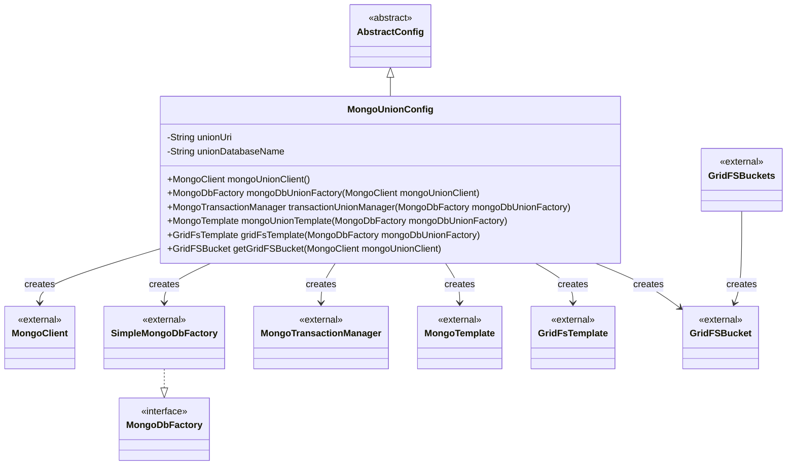
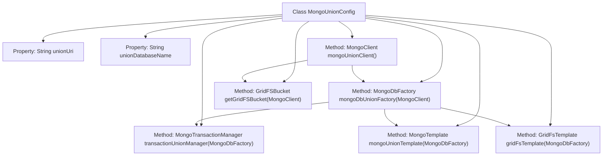

# Basic Information

|      |      |
|------|------|
| Name | MongoUnionConfig |
| Language | .java |
| Code Path | WeFe/common/java/common-data-mongodb/src/main/java/com/welab/wefe/common/data/mongodb/config/MongoUnionConfig.java |
| Package Name | com.welab.wefe.common.data.mongodb.config |
| Dependencies | ['com.mongodb.MongoClient', 'com.mongodb.MongoClientURI', 'com.mongodb.client.MongoDatabase', 'com.mongodb.client.gridfs.GridFSBucket', 'com.mongodb.client.gridfs.GridFSBuckets', 'org.springframework.beans.factory.annotation.Value', 'org.springframework.context.annotation.Bean', 'org.springframework.context.annotation.Configuration', 'org.springframework.data.mongodb.MongoDbFactory', 'org.springframework.data.mongodb.MongoTransactionManager', 'org.springframework.data.mongodb.core.MongoTemplate', 'org.springframework.data.mongodb.core.SimpleMongoDbFactory', 'org.springframework.data.mongodb.gridfs.GridFsTemplate'] |
| Brief Description | The MongoUnionConfig class configures MongoDB connections, including clients, factories, transaction management, templates, and GridFS storage. |

# Description

This configuration class defines the connection and operation components for a MongoDB federated database. It injects the database URI and name through external configuration to create a MongoClient instance for database connection. It provides a MongoDbFactory factory class to manage database connections and configures a transaction manager to support transactional operations. Additionally, it creates MongoTemplate and GridFsTemplate for database operations, as well as GridFSBucket for file storage functionality. All components are constructed based on the injected configuration parameters.

# Class Summary

| Name   | Type  | Description |
|-------|------|-------------|
| MongoUnionConfig | class | The MongoUnionConfig class configures MongoDB connections, including clients, database factories, transaction management, templates, and GridFS storage functionality. |

## Class MongoUnionConfig

|      |      |
|------|------|
| Access Modifier | @Configuration;public |
| Type | class |
| Name | MongoUnionConfig |
| Description | The MongoUnionConfig class configures MongoDB connections, including clients, database factories, transaction management, templates, and GridFS storage functionality. |

### UML Class Diagram

This diagram illustrates how the MongoUnionConfig class inherits from AbstractConfig and creates multiple MongoDB-related components. MongoUnionConfig injects configuration parameters via @Value and defines six @Bean methods to create MongoClient, MongoDbFactory (implemented by SimpleMongoDbFactory), transaction manager, MongoTemplate, GridFsTemplate, and GridFSBucket. These components have clear creation dependencies, forming a complete MongoDB data access configuration system.

### Internal Method Call Graph

This code represents a Spring configuration class designed to set up MongoDB connection and operation-related beans. It injects URI and database name properties to create a MongoClient connection, then builds components such as MongoDbFactory, transaction manager, MongoTemplate, GridFsTemplate, and GridFSBucket based on this connection. These components have clear dependency relationships—for example, MongoDbFactory depends on MongoClient, while other templates and components depend on MongoDbFactory. The entire configuration process is well-structured, ensuring the integrity and consistency of MongoDB-related operations.

### Field List

| Name  | Type  | Description |
|-------|-------|------|
| unionDatabaseName | String | Inject the MongoDB federated database name into the private variable unionDatabaseName from Spring configuration. |
| unionUri | String | Inject the MongoDB federated data source URI from Spring configuration into the private variable unionUri. |

### Method List

| Name  | Type  | Description |
|-------|-------|------|
| mongoUnionClient | MongoClient | Create a MongoDB client Bean by specifying the URI to connect to the database. |
| mongoDbUnionFactory | MongoDbFactory | Define a Spring Bean, create a MongoDB factory instance, and initialize SimpleMongoDbFactory using the specified MongoClient and database name. |
| transactionUnionManager | MongoTransactionManager | Define a MongoDB transaction manager Bean, initialized using the specified MongoDbFactory instance. |
| mongoUnionTemplate | MongoTemplate | Define a Spring Bean, create a MongoTemplate instance using the specified MongoDbFactory and converter. |
| gridFsTemplate | GridFsTemplate | Define a Spring Bean for creating a GridFsTemplate instance, which depends on MongoDbFactory and a converter. |
| getGridFSBucket | GridFSBucket | Create a GridFSBucket Bean, obtain the database through MongoClient, and generate a bucket instance. |

