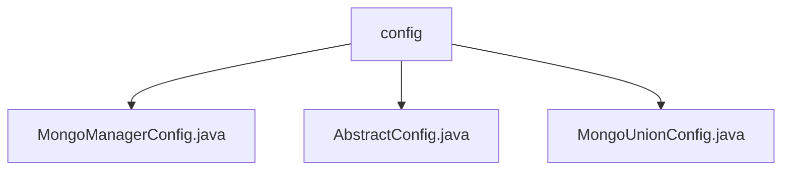

# Basic Information

|      |      |
|------|------|
| Name | config |
| Language | .java |
| Code Path | WeFe/common/java/common-data-mongodb/src/main/java/com/welab/wefe/common/data/mongodb/config |
| Package Name | docs.common.java.common-data-mongodb.src.main.java.com.welab.wefe.common.data.mongodb.config |
| Brief Description | The MongoManagerConfig class manages MongoDB Bean registration and dynamically creates components such as MongoClient. The getConverter method of the AbstractConfig class configures the MappingMongoConverter, disabling the _class field. The MongoUnionConfig class defines MongoDB connection components, supporting transactions and file storage. |

# Description

## Overview  
The core responsibility of this module is to uniformly manage MongoDB connections and operation components by dynamically registering various Beans through Spring configuration. It primarily implements the creation of MongoClient, transaction managers, and template classes, supporting database connections, transaction operations, and file storage functionalities. The interface specifications include environment variable injection, factory methods for creating instances (e.g., MongoDbFactory), and type converter configurations (e.g., disabling the `_class` field). Key data structures include MongoMappingContext (using the SnakeCase naming strategy) and DefaultMongoTypeMapper. External dependencies are the Spring framework (ApplicationContext/Environment) and the MongoDB driver. For example, MongoUnionConfig integrates GridFSBucket for file storage handling.

## Main Business Scenarios  
This module is suitable for scenarios requiring unified management of MongoDB connections, similar to a database connection pool pattern. The business process includes: parsing environment variables → creating connection factories → initializing transaction managers → generating operation templates (e.g., MongoTemplate). The interaction mode achieves component linkage through Spring dependency injection, such as MongoManagerConfig combining MongoTransactionManager with MongoTemplate. A typical application is configuring multiple data sources, where the `getConverter` method of AbstractConfig unifies field naming rules. API types encompass configuration classes (`@Configuration`) and factory methods, with integration examples including dynamically constructing GridFsTemplate instances for file operations.

### Package Internal Structure View

This flowchart illustrates the file structure relationships within the MongoDB configuration module. The config folder contains three Java configuration files: MongoManagerConfig.java handles MongoDB connection management, AbstractConfig.java serves as the abstract base configuration class, and MongoUnionConfig.java manages federated database configurations. Together, these files form the core configuration components of the MongoDB data access layer.

# File List

| Name   | Type  | Description |
|-------|------|-------------|
| [MongoManagerConfig.java](MongoManagerConfig.md) | file | MongoDB configuration class, registers MongoClient, transaction manager, and template beans, retrieves connection information through environment variables. |
| [AbstractConfig.java](AbstractConfig.md) | file | The abstract configuration class provides methods for obtaining MongoDB converters, including a reference resolver, mapping context (configured with a snake case naming strategy), and removes the default `_class` field to optimize storage views. |
| [MongoUnionConfig.java](MongoUnionConfig.md) | file | The MongoUnionConfig class configures MongoDB connections, including clients, factories, transaction management, templates, and GridFS storage. |

