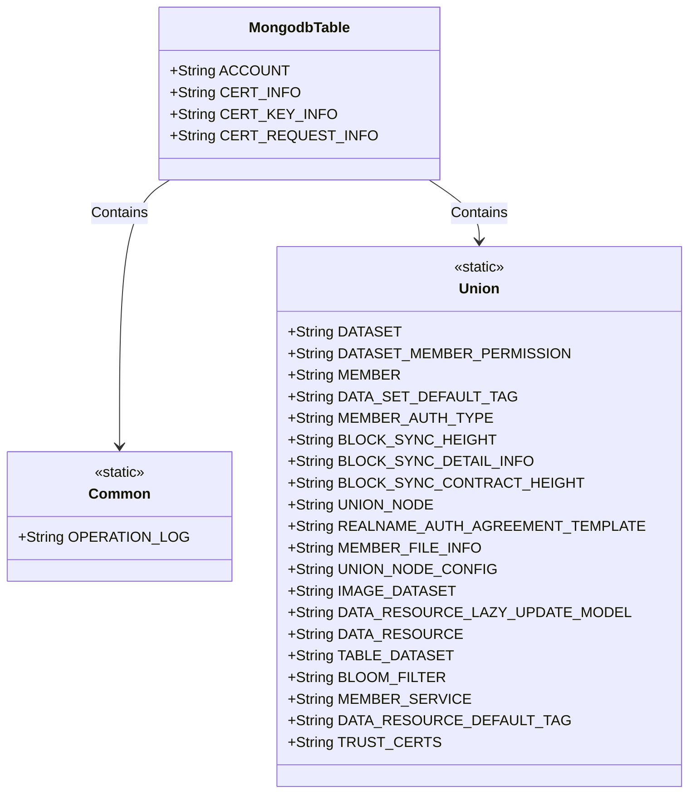

# Basic Information

|      |      |
|------|------|
| Name | MongodbTable |
| Language | .java |
| Code Path | WeFe/common/java/common-data-mongodb/src/main/java/com/welab/wefe/common/data/mongodb/constant/MongodbTable.java |
| Package Name | com.welab.wefe.common.data.mongodb.constant |
| Dependencies | [] |
| Brief Description | The `MongodbTable` class defines MongoDB collection name constants, including key table names such as general operation logs, alliance datasets, member permissions, and node configurations. |

# Description

The code defines a Java class named `MongodbTable`, which contains multiple static inner classes and constant string fields to represent MongoDB collection names. The `Common` inner class includes operation log collection names, while the `Union` inner class contains over 20 collection name constants for datasets, member permissions, node configurations, etc. The class also directly defines four string constants for collection names such as account and certificate information. These constants are used to uniformly manage MongoDB collection naming and avoid hardcoding.

# Class Summary

| Name   | Type  | Description |
|-------|------|-------------|
| MongodbTable | class | The MongodbTable class defines the names of MongoDB collections, including two inner classes (Common and Union) and four independent fields, covering core data tables such as operation logs, datasets, member permissions, and block synchronization. |

## Class MongodbTable

|      |      |
|------|------|
| Access Modifier | public |
| Type | class |
| Name | MongodbTable |
| Description | The MongodbTable class defines the names of MongoDB collections, including two inner classes (Common and Union) and four independent fields, covering core data tables such as operation logs, datasets, member permissions, and block synchronization. |

### UML Class Diagram

This code defines a MongodbTable class containing two static inner classes Common and Union, along with four static string constants. The Common class defines the operation log table name, while the Union class defines over 20 MongoDB collection names related to datasets, member permissions, blockchain synchronization, etc. The entire structure is used to centrally manage MongoDB collection names for unified maintenance and usage. The class diagram clearly illustrates the containment relationship between MongodbTable and its two inner classes, as well as the definitions of all public constants.

### Internal Method Call Graph

```mermaid
graph TD
    A["Class MongodbTable"]
    B["Nested Class Common"]
    C["Nested Class Union"]
    D["Constant String: OPERATION_LOG"]
    E["Constant String: DATASET"]
    F["Constant String: DATASET_MEMBER_PERMISSION"]
    G["Constant String: MEMBER"]
    H["Constant String: DATA_SET_DEFAULT_TAG"]
    I["Constant String: MEMBER_AUTH_TYPE"]
    J["Constant String: BLOCK_SYNC_HEIGHT"]
    K["Constant String: BLOCK_SYNC_DETAIL_INFO"]
    L["Constant String: BLOCK_SYNC_CONTRACT_HEIGHT"]
    M["Constant String: UNION_NODE"]
    N["Constant String: REALNAME_AUTH_AGREEMENT_TEMPLATE"]
    O["Constant String: MEMBER_FILE_INFO"]
    P["Constant String: UNION_NODE_CONFIG"]
    Q["Constant String: IMAGE_DATASET"]
    R["Constant String: DATA_RESOURCE_LAZY_UPDATE_MODEL"]
    S["Constant String: DATA_RESOURCE"]
    T["Constant String: TABLE_DATASET"]
    U["Constant String: BLOOM_FILTER"]
    V["Constant String: MEMBER_SERVICE"]
    W["Constant String: DATA_RESOURCE_DEFAULT_TAG"]
    X["Constant String: TRUST_CERTS"]
    Y["Class-level Constant: ACCOUNT"]
    Z["Class-level Constant: CERT_INFO"]
    AA["Class-level Constant: CERT_KEY_INFO"]
    AB["Class-level Constant: CERT_REQUEST_INFO"]

    A --> B
    A --> C
    A --> Y
    A --> Z
    A --> AA
    A --> AB
    B --> D
    C --> E
    C --> F
    C --> G
    C --> H
    C --> I
    C --> J
    C --> K
    C --> L
    C --> M
    C --> N
    C --> O
    C --> P
    C --> Q
    C --> R
    C --> S
    C --> T
    C --> U
    C --> V
    C --> W
    C --> X
```

This flowchart illustrates the complete structure of the MongodbTable class, which includes two nested static classes (Common and Union) and four class-level constants. The Common class contains the OPERATION_LOG constant, while the Union class holds 21 constants representing different database table names. The overall structure clearly reflects the design intent of this class as a centralized management system for MongoDB table names. Through nested classes, the table names are logically grouped, facilitating unified maintenance and usage of database table names within the project.

### Field List

| Name  | Type  | Description |
|-------|-------|------|
| CERT_REQUEST_INFO = "certRequestInfo" | String | Define a static constant string CERT_REQUEST_INFO with the value "certRequestInfo". |
| CERT_INFO = "certInfo" | String | Define a static constant CERT_INFO with the value "certInfo". |
| ACCOUNT = "account" | String | Define a static constant ACCOUNT with the value "account". |
| CERT_KEY_INFO = "certKeyInfo" | String | Define the static constant CERT_KEY_INFO with the value "certKeyInfo". |

### Method List

| Name  | Type  | Description |
|-------|-------|------|

