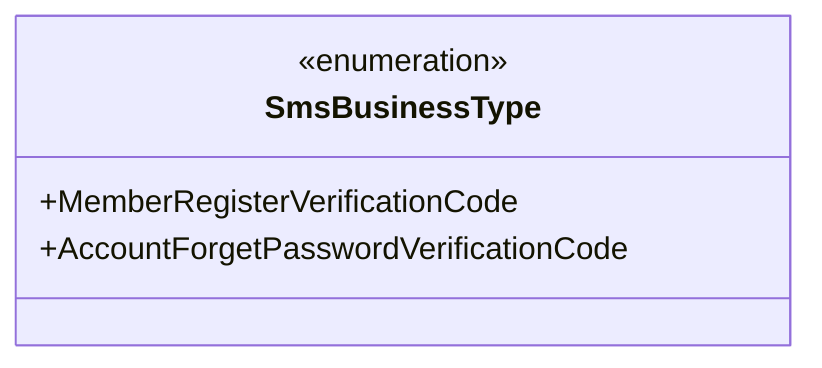
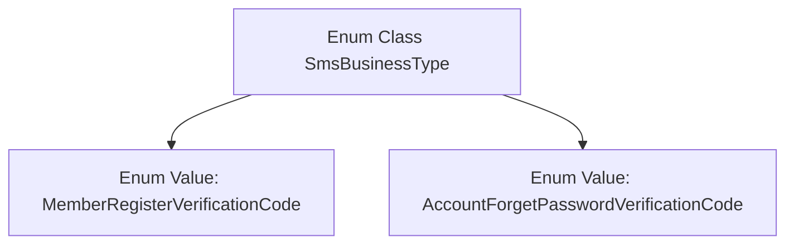

# Basic Information

|      |      |
|------|------|
| Name | SmsBusinessType |
| Language | .java |
| Code Path | WeFe/common/java/common-data-mongodb/src/main/java/com/welab/wefe/common/data/mongodb/constant/SmsBusinessType.java |
| Package Name | com.welab.wefe.common.data.mongodb.constant |
| Dependencies | [] |
| Brief Description | The enumeration SmsBusinessType defines two types of SMS services: member registration verification code and account password recovery verification code. |

# Description

This content defines a public enumeration type named SmsBusinessType, which includes two enumeration values: MemberRegisterVerificationCode and AccountForgetPasswordVerificationCode. These two enumeration values represent the business types for member registration verification code and account password recovery verification code respectively, used to distinguish between different scenarios for SMS sending.

# Class Summary

| Name   | Type  | Description |
|-------|------|-------------|
| SmsBusinessType | enum | SMS service type enumeration, including member registration verification code and account forgot password verification code. |

## Class SmsBusinessType

|      |      |
|------|------|
| Access Modifier | public |
| Type | enum |
| Name | SmsBusinessType |
| Description | SMS service type enumeration, including member registration verification code and account forgot password verification code. |

### UML Class Diagram

This enumeration class diagram illustrates a classification system for SMS business types, defining two fixed business scenarios: member registration verification code and account password recovery verification code. As an enumeration type, it ensures type safety through predefined constant values, making it suitable for systems that require strict constraints on SMS business scenarios, such as user registration, password retrieval, and other functionalities requiring SMS verification. The enumeration members are all public static instances and can be directly accessed via the class name.

### Internal Method Call Graph

This code defines an enum class named SmsBusinessType, which includes two enum values: MemberRegisterVerificationCode (Member Registration Verification Code) and AccountForgetPasswordVerificationCode (Account Password Recovery Verification Code). The enum is used to represent SMS business types, standardizing the use of SMS types in business scenarios by limiting fixed values, thereby avoiding maintenance issues caused by hard-coded strings. Each enum value corresponds to a specific SMS verification scenario, making it easier to clearly distinguish between different business logics in the code.

### Field List

| Name  | Type  | Description |
|-------|-------|------|

### Method List

| Name  | Type  | Description |
|-------|-------|------|

