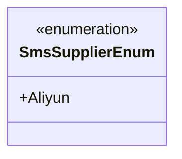
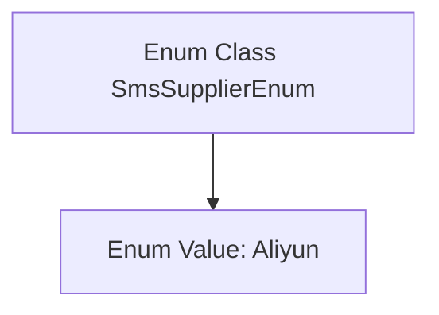

# Basic Information

|      |      |
|------|------|
| Name | SmsSupplierEnum |
| Language | .java |
| Code Path | WeFe/common/java/common-data-mongodb/src/main/java/com/welab/wefe/common/data/mongodb/constant/SmsSupplierEnum.java |
| Package Name | com.welab.wefe.common.data.mongodb.constant |
| Dependencies | [] |
| Brief Description | The enumeration SmsSupplierEnum defines a short message service supplier Aliyun. |

# Description

The content defines a public enumeration type named SmsSupplierEnum, which includes an enumeration value Aliyun. This enumeration is used to represent SMS service suppliers, currently supporting only Alibaba Cloud as the supplier. The structure is concise and clear, reserving space for future expansion to include other suppliers.

# Class Summary

| Name   | Type  | Description |
|-------|------|-------------|
| SmsSupplierEnum | enum | The enumeration type SmsSupplierEnum defines a SMS service provider Aliyun. |

## Class SmsSupplierEnum

|      |      |
|------|------|
| Access Modifier | public |
| Type | enum |
| Name | SmsSupplierEnum |
| Description | The enumeration type SmsSupplierEnum defines a SMS service provider Aliyun. |

### UML Class Diagram

This code defines an enumeration type named SmsSupplierEnum, which currently contains only one enum value, Aliyun. An enumeration is a special class used to represent a fixed set of constant values. In this example, SmsSupplierEnum might be used to denote SMS service providers, with Aliyun being the only supported vendor at present. Enumeration types are often employed as an alternative to constant definitions, offering better type safety and readability. The structure of this enumeration is simple and can be extended in the future to include enum values for other SMS service providers.

### Internal Method Call Graph

This code defines an enum class named `SmsSupplierEnum` containing an enum value `Aliyun`. Enum classes are used to represent a fixed set of constants, which in this case likely identifies SMS service providers. The flowchart illustrates the containment relationship between the class and its sole enum value. The structure is simple and clear, making it suitable for scenarios requiring type-safe management of limited options.

### Field List

| Name  | Type  | Description |
|-------|-------|------|

### Method List

| Name  | Type  | Description |
|-------|-------|------|

