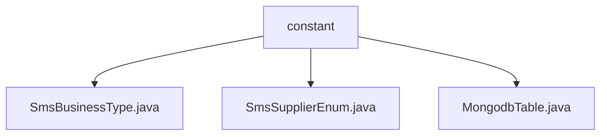

# Basic Information

|      |      |
|------|------|
| Name | constant |
| Language | .java |
| Code Path | WeFe/common/java/common-data-mongodb/src/main/java/com/welab/wefe/common/data/mongodb/constant |
| Package Name | docs.common.java.common-data-mongodb.src.main.java.com.welab.wefe.common.data.mongodb.constant |
| Brief Description | The SmsBusinessType enumeration defines verification code types for member registration and password recovery. The SmsSupplierEnum enumeration currently only supports Alibaba Cloud SMS provider. The MongodbTable class manages MongoDB collection name constants, including over 20 collection names such as operation logs and datasets. |

# Description

## Overview  
The core responsibility of this module is to provide SMS business type classification, vendor enumeration, and MongoDB collection naming convention management. The interface specifications include SmsBusinessType to distinguish scenarios such as member registration/password recovery verification codes, and SmsSupplierEnum currently only supports Alibaba Cloud as the vendor. Key data structures involve two enumeration types and the MongodbTable class containing constants for 20+ collection names. The only external dependency is the MongoDB database. For example, the MemberRegisterVerificationCode enumeration value identifies registration scenarios, while the Aliyun enumeration value specifies the SMS vendor.  

## Primary Business Scenarios  
The module supports end-to-end SMS service management, functioning similarly to a configuration center. Typical scenarios include: selecting SMS templates via business type enumerations, such as AccountForgetPasswordVerificationCode triggering the password reset process; switching SMS platforms via vendor enumerations; and accessing datasets, permissions, and other collections uniformly through MongodbTable constants. For instance, the Union inner class manages federated learning-related collection names to ensure naming consistency across modules. The system adopts a static constant pool pattern to mitigate hardcoding risks.

### Package Internal Structure View

This flowchart illustrates the structural relationships within the constant package of the MongoDB data module. The top-level node is the constant directory, which contains three enumeration class files: SmsBusinessType, SmsSupplierEnum, and MongodbTable. These files reside at the same hierarchical level and are used to define different types of business constants. The overall structure is concise and clear, demonstrating a centralized approach to constant definition management.

# File List

| Name   | Type  | Description |
|-------|------|-------------|
| [SmsBusinessType.java](SmsBusinessType.md) | file | The enumeration SmsBusinessType defines two types of SMS services: member registration verification code and account password recovery verification code. |
| [SmsSupplierEnum.java](SmsSupplierEnum.md) | file | The enumeration SmsSupplierEnum defines a SMS supplier Aliyun. |
| [MongodbTable.java](MongodbTable.md) | file | The MongodbTable class defines MongoDB collection name constants, including key table names such as general operation logs, alliance datasets, member permissions, and node configurations. |

