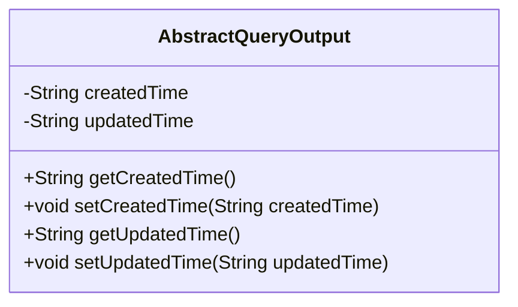
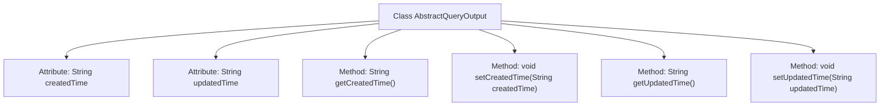

# Basic Information

|      |      |
|------|------|
| Name | AbstractQueryOutput |
| Language | .java |
| Code Path | WeFe/common/java/common-data-mongodb/src/main/java/com/welab/wefe/common/data/mongodb/dto/AbstractQueryOutput.java |
| Package Name | com.welab.wefe.common.data.mongodb.dto |
| Dependencies | [] |
| Brief Description | The AbstractQueryOutput class includes attributes for creation time and update time, providing corresponding getter and setter methods. |

# Description

AbstractQueryOutput is an abstract query output class that contains two protected string-type attributes, `createdTime` and `updatedTime`, representing the creation time and update time respectively. The class provides four public methods: `getCreatedTime` and `setCreatedTime` for retrieving and setting the creation time, and `getUpdatedTime` and `setUpdatedTime` for retrieving and setting the update time. These methods allow external code to access and modify these two time attributes.

# Class Summary

| Name   | Type  | Description |
|-------|------|-------------|
| AbstractQueryOutput | class | The AbstractQueryOutput class includes attributes for creation time and update time, providing corresponding getter and setter methods. |

## Class AbstractQueryOutput

|      |      |
|------|------|
| Access Modifier | public |
| Type | class |
| Name | AbstractQueryOutput |
| Description | The AbstractQueryOutput class includes attributes for creation time and update time, providing corresponding getter and setter methods. |

### UML Class Diagram

This class diagram describes an abstract query output class AbstractQueryOutput, which contains two protected string-type member variables: createdTime and updatedTime, representing the creation time and update time respectively. The class provides four public methods: get creation time, set creation time, get update time, and set update time. This class may serve as a base class for other concrete query output classes to uniformly manage time-related attributes and operations.

### Internal Method Call Graph

This code defines a class named AbstractQueryOutput, which contains two String-type attributes: createdTime and updatedTime, representing creation time and update time respectively. The class provides four methods: getCreatedTime() and getUpdatedTime() for retrieving the corresponding times, and setCreatedTime() and setUpdatedTime() for setting the corresponding times. This is a typical data encapsulation class used for storing and manipulating time-related data.

### Field List

| Name  | Type  | Description |
|-------|-------|------|
| createdTime | String | Declare a protected string variable named createdTime to store the creation time. |
| updatedTime | String | Declare a protected string variable updatedTime to store the update time. |

### Method List

| Name  | Type  | Description |
|-------|-------|------|
| setUpdatedTime | void | This is a Java method used to set the updatedTime property value of an object. The method takes a string parameter updatedTime and assigns it to the member variable of the same name in the object. |
| setCreatedTime | void | Method for setting the object creation time, with the parameter being a string-type createdTime. |
| getCreatedTime | String | Methods to obtain the creation time, returning the value of the createdTime variable as a string type. |
| getUpdatedTime | String | Methods to obtain the update time, returning a string-type variable updatedTime. |

