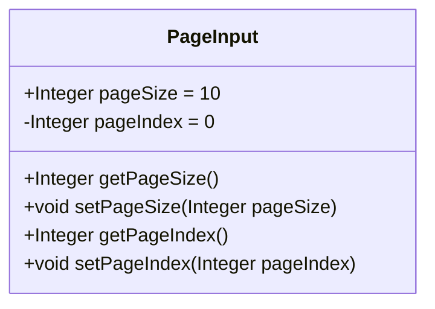
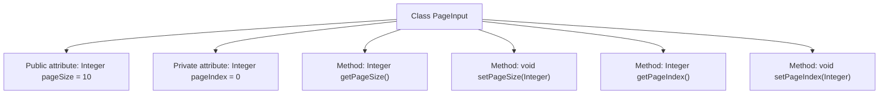

# Basic Information

|      |      |
|------|------|
| Name | PageInput |
| Language | .java |
| Code Path | WeFe/common/java/common-data-mongodb/src/main/java/com/welab/wefe/common/data/mongodb/dto/PageInput.java |
| Package Name | com.welab.wefe.common.data.mongodb.dto |
| Dependencies | [] |
| Brief Description | Pagination input class, containing page size and page index attributes along with get/set methods. |

# Description

The `PageInput` class is a Java class designed for paginated input, containing two integer attributes: `pageSize` and `pageIndex`. `pageSize` represents the page size with a default value of 10 and is a public attribute; `pageIndex` denotes the page number with a default value of 0 and is a private attribute. The class provides four methods: public methods to get and set `pageSize`, as well as public methods to get and set `pageIndex`. These methods allow external code to access and modify the values of these two attributes.

# Class Summary

| Name   | Type  | Description |
|-------|------|-------------|
| PageInput | class | The PageInput class defines pagination parameters, with a default of 10 entries per page and page index 0, providing get/set methods. |

## Class PageInput

|      |      |
|------|------|
| Access Modifier | public |
| Type | class |
| Name | PageInput |
| Description | The PageInput class defines pagination parameters, with a default of 10 entries per page and page index 0, providing get/set methods. |

### UML Class Diagram

This code defines a class named `PageInput` for managing pagination parameters. The class contains two member variables: a public variable `pageSize` (default value 10) and a private variable `pageIndex` (default value 0), along with corresponding getter and setter methods. This class is primarily used to encapsulate page size and page index parameters during paginated queries, providing access and modification capabilities for these parameters. By exposing operations on private fields through public methods, it adheres to the object-oriented encapsulation principle.

### Internal Method Call Graph

This code defines a class named PageInput for managing pagination parameters. The class contains two core attributes: a public attribute pageSize (default value 10) and a private attribute pageIndex (default value 0), along with corresponding getter and setter methods. The flowchart clearly illustrates the class structure and member relationships, where pageSize can be accessed directly while pageIndex requires method access, demonstrating encapsulation. All methods revolve around read-write operations of pagination parameters, forming a complete data access loop.

### Field List

| Name  | Type  | Description |
|-------|-------|------|
| pageSize = 10 | Integer | Define an integer variable pageSize with a default value of 10. |
| pageIndex = 0 | Integer | Define an integer variable pageIndex with an initial value of 0. |

### Method List

| Name  | Type  | Description |
|-------|-------|------|
| getPageSize | Integer | Method to obtain the integer value of pageSize. |
| setPageSize | void | The method to set the number of items displayed per page, with the parameter being the integer type pageSize. |
| getPageIndex | Integer | The method getPageIndex returns the value of the integer variable pageIndex. |
| setPageIndex | void | The method to set the current page number, with the parameter being an integer pageIndex. |

