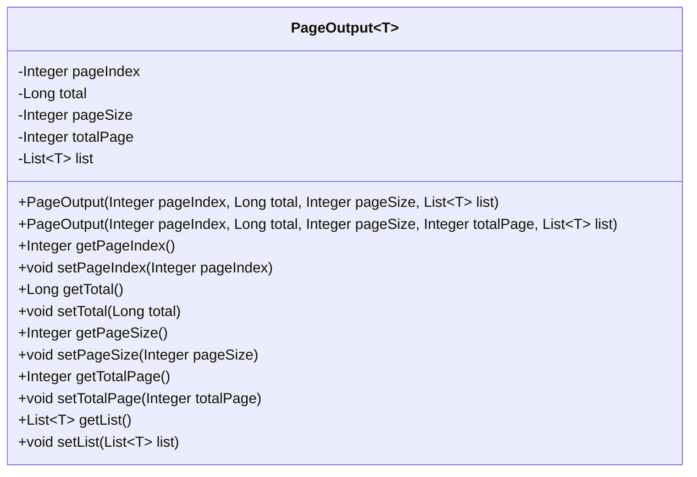

# Basic Information

|      |      |
|------|------|
| Name | PageOutput |
| Language | .java |
| Code Path | WeFe/common/java/common-data-mongodb/src/main/java/com/welab/wefe/common/data/mongodb/dto/PageOutput.java |
| Package Name | com.welab.wefe.common.data.mongodb.dto |
| Dependencies | ['java.util.List'] |
| Brief Description | Pagination output class, including page number, total count, page size, total pages, and data list, providing constructor methods and getter/setter. |

# Description

PageOutput is a generic class designed to encapsulate paginated query results. It contains five core properties: `pageIndex` indicates the current page number, `total` represents the total record count, `pageSize` specifies the page size, `totalPage` denotes the total number of pages, and `list` stores the data list of the current page. The class provides two constructors—one automatically calculates the total pages, while the other allows manual specification of the total page count. All properties are equipped with getter and setter methods for access and modification. This class is suitable for any scenario requiring paginated data display.

# Class Summary

| Name   | Type  | Description |
|-------|------|-------------|
| PageOutput | class | Pagination output class, including page number, total count, page size, total pages, and data list, providing constructor methods and getter/setter. |

## Class PageOutput

|      |      |
|------|------|
| Access Modifier | public |
| Type | class |
| Name | PageOutput |
| Description | Pagination output class, including page number, total count, page size, total pages, and data list, providing constructor methods and getter/setter. |

### UML Class Diagram

This code defines a generic class `PageOutput<T>` for encapsulating paginated query results. It includes core attributes such as page number, total records, page size, total pages, and data list, providing two constructors (automatically calculating total pages or manually specifying them) along with standard getter/setter methods. The class supports data lists of any type through the generic parameter `T`, making it suitable for various pagination scenarios. The total page calculation logic uses the formula `(total + pageSize - 1) / pageSize` to ensure rounding up.

### Internal Method Call Graph

```mermaid
graph TD
    A["Class PageOutput<T>"]
    B["Property: Integer pageIndex"]
    C["Property: Long total"]
    D["Property: Integer pageSize"]
    E["Property: Integer totalPage"]
    F["Property: List<T> list"]
    G["Constructor 1: PageOutput(pageIndex, total, pageSize, list)"]
    H["Constructor 2: PageOutput(pageIndex, total, pageSize, totalPage, list)"]
    I["Method: getPageIndex()"]
    J["Method: setPageIndex(Integer)"]
    K["Method: getTotal()"]
    L["Method: setTotal(Long)"]
    M["Method: getPageSize()"]
    N["Method: setPageSize(Integer)"]
    O["Method: getTotalPage()"]
    P["Method: setTotalPage(Integer)"]
    Q["Method: getList()"]
    R["Method: setList(List<T>)"]

    A --> B
    A --> C
    A --> D
    A --> E
    A --> F
    A --> G
    A --> H
    A --> I
    A --> J
    A --> K
    A --> L
    A --> M
    A --> N
    A --> O
    A --> P
    A --> Q
    A --> R
```

This code defines a generic class `PageOutput<T>` for encapsulating paginated query results. The class contains five core properties: current page number (pageIndex), total record count (total), page size (pageSize), total pages (totalPage), and data list (list). It provides two constructors - one automatically calculates total pages while the other allows manual specification. All properties are equipped with getter/setter methods to support flexible data access. This design is commonly used in backend pagination interfaces to return structured data, ensuring clients receive complete pagination information along with the current page's data list.

### Field List

| Name  | Type  | Description |
|-------|-------|------|
| totalPage | Integer | Private integer variable representing the total number of pages. |
| pageIndex | Integer | Private integer variable pageIndex, used to store the page index number. |
| pageSize | Integer | Define a private integer variable pageSize to store the pagination size. |
| total | Long | Private long integer variable total, used to store the total count. |
| list | List<T> | A private generic list variable named list. |

### Method List

| Name  | Type  | Description |
|-------|-------|------|
| setPageIndex | void | Set the current page number value. |
| getPageSize | Integer | Methods to obtain the current page size, returns an integer value pageSize. |
| getPageIndex | Integer | The method getPageIndex returns the value of the integer variable pageIndex. |
| setTotal | void | This is a Java method used to set the value of the class member variable `total`. The method takes a parameter of type Long and assigns it to the `total` property of the class. |
| setTotalPage | void | Method to set the total number of pages, with the parameter being an integer totalPage, which is assigned to the class variable totalPage. |
| getTotalPage | Integer | Method to get the total number of pages, returns an integer value totalPage. |
| getTotal | Long | The method returns a long integer value of total. |
| setPageSize | void | The method to set the number of items displayed per page, with the parameter being an integer type named pageSize. |
| setList | void | This is a Java method used to set the List-type member variable `list` of a class. The method accepts a List parameter and assigns it to the `list` property of the current object. |
| getList | List<T> | Returns the list object. |

