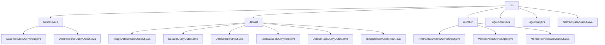

# Basic Information

|      |      |
|------|------|
| Name | dto |
| Language | .java |
| Code Path | WeFe/common/java/common-data-mongodb/src/main/java/com/welab/wefe/common/data/mongodb/dto |
| Package Name | docs.common.java.common-data-mongodb.src.main.java.com.welab.wefe.common.data.mongodb.dto |
| Brief Description | The data query module provides multi-criteria filtering and result encapsulation functionalities, supporting paginated queries for data types such as images/tables. It includes input parameter encapsulation, permission filtering, and result aggregation display, and is applied in scenarios like federated learning resource retrieval. It relies on MongoDB and implements CRUD operations through DTO. |

# Description

## Overview  
The core responsibility of this module is to provide unified query and management functions for data resources in a federated learning environment, covering multi-dimensional data such as datasets, member authentication, and service configurations. The core interface specifications adopt a layered design: basic pagination is implemented via PageInput/PageInput, business DTOs like DataResourceQueryInput extend pagination parameters, and the abstract class AbstractQueryOutput defines common timestamp fields. Key data structures include type-specific fields for image/tabular datasets (e.g., forJobType, containsY), the nested FileInfo structure for member authentication, and the extJSON extension field for service management. External dependencies focus on MongoDB drivers and basic pagination components. For example, image queries enhance retrieval capabilities through extended fields like sample count, while member authentication achieves state transitions via typeId.  

## Key Business Scenarios  
The module supports three major scenarios: 1) Multi-condition dataset retrieval (similar to e-commerce filters, such as combined queries by tags + resource type + pagination); 2) Member qualification review chain (implementing authentication workflows through real-name file lists and status fields); 3) Federated service routing management (similar to API gateways, dynamically configured based on baseUrl and extJson). The interaction mode uniformly adopts DTO transmission. For instance, tabular data is quickly filtered via the containsY flag, and service discovery enables flexible configuration through extension fields. Functional completeness is reflected in covering the full data lifecycle (metadata queries, usage statistics, type-specific operations). Typical applications include resource selectors during federated task configuration and qualification checks during node registration. API types are predominantly query-based, with integration examples visible in image dataset filtering by task type during deep learning task initialization.

### Package Internal Structure View

This flowchart illustrates the DTO structure of the MongoDB data access layer, comprising three main subdirectories: dataresource, dataset, and member, along with generic pagination and abstract class files in the root directory. Each subdirectory contains multiple specific DTO class files designed to handle different types of data query and transfer requirements.

# File List

| Name   | Type  | Description |
|-------|------|-------------|
| [PageOutput.java](PageOutput.md) | file | Pagination output class, including page number, total count, page size, total pages, and data list, providing constructor methods and getter/setter. |
| [PageInput.java](PageInput.md) | file | Pagination input class, including page size and page index properties along with get/set methods. |
| [AbstractQueryOutput.java](AbstractQueryOutput.md) | file | The AbstractQueryOutput class includes attributes for creation time and update time, providing corresponding getter and setter methods. |
| [dataresource](dataresource/_module.md) | package | The DataResourceQueryInput class inherits from PageInput and includes multiple query fields such as ID, name, type, etc., providing getter/setter methods. The DataResourceQueryOutput class encapsulates query results, containing resource details, status, type, and three types of dataset references, with getter/setter methods provided. |
| [dataset](dataset/_module.md) | package | The `ImageDataSetQueryOutput` class stores image dataset query results, including attributes such as ID, name, labels, and corresponding methods. The `DataSetQueryOutput` class represents dataset query output, containing attributes and methods like ID, name, and features. The `DataSetQueryInput` class inherits from `PageInput` and includes query conditions such as dataset ID and member information. The `TableDataSetQueryInput` class inherits from `DataResourceQueryInput` and focuses on the `containsY` flag. The `DataSetTagsQueryOutput` class encapsulates tag query results. The `ImageDataSetQueryInput` class inherits from `DataResourceQueryInput` and includes the `forJobType` attribute. |
| [member](member/_module.md) | package | The RealnameAuthInfoQueryOutput class stores real-name authentication query results, including fields such as status, name, certificate, and file information. The MemberAuthQueryOutput class defines member authentication query output, containing type identifier, name, and status. The MemberServiceQueryOutput class inherits from AbstractQueryOutput and includes service-related fields and extended JSON. |

