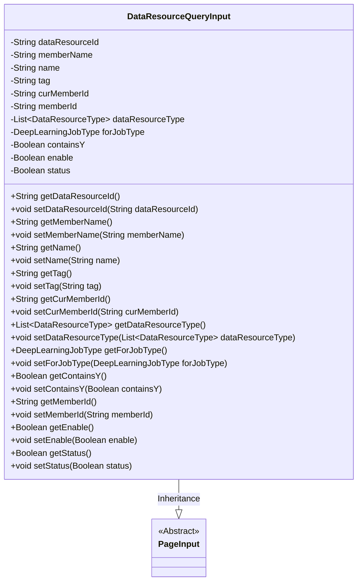

# Basic Information

|      |      |
|------|------|
| Name | DataResourceQueryInput |
| Language | .java |
| Code Path | WeFe/common/java/common-data-mongodb/src/main/java/com/welab/wefe/common/data/mongodb/dto/dataresource/DataResourceQueryInput.java |
| Package Name | com.welab.wefe.common.data.mongodb.dto.dataresource |
| Dependencies | ['com.welab.wefe.common.data.mongodb.dto.PageInput', 'com.welab.wefe.common.wefe.enums.DataResourceType', 'com.welab.wefe.common.wefe.enums.DeepLearningJobType', 'java.util.List'] |
| Brief Description | The DataResourceQueryInput class inherits from PageInput and includes fields such as data resource ID, member name, tags, current member ID, resource type list, deep learning task type, whether it contains Y, enabled status, and their corresponding getter/setter methods. |

# Description

The `DataResourceQueryInput` class inherits from `PageInput` and includes multiple fields for querying data resources: `dataResourceId`, `memberName`, `name`, `tag`, `curMemberId`, `memberId`, a `dataResourceType` list, a `forJobType` enum, a `containsY` boolean, an `enable` boolean, and a `status` boolean. Each field has corresponding getter and setter methods for retrieving and setting property values.

# Class Summary

| Name   | Type  | Description |
|-------|------|-------------|
| DataResourceQueryInput | class | The DataResourceQueryInput class inherits from PageInput and includes fields such as data resource ID, member name, name, label, current member ID, resource type list, deep learning task type, whether it contains Y, enabled status, and their corresponding getter/setter methods. |

## Class DataResourceQueryInput

|      |      |
|------|------|
| Access Modifier | public |
| Type | class |
| Name | DataResourceQueryInput |
| Description | The DataResourceQueryInput class inherits from PageInput and includes fields such as data resource ID, member name, name, label, current member ID, resource type list, deep learning task type, whether it contains Y, enabled status, and their corresponding getter/setter methods. |

### UML Class Diagram

This code defines a data resource query input class `DataResourceQueryInput`, which inherits from the abstract class `PageInput`. The class contains multiple private fields for storing query conditions such as resource ID, member name, tags, etc., along with corresponding getter and setter methods. These fields support multi-criteria filtering of data resources, including resource type, deep learning job type, status flags, etc. The class diagram clearly illustrates the inheritance relationship and all attributes/methods.

### Internal Method Call Graph

This code defines a class named DataResourceQueryInput, which inherits from PageInput. It includes multiple private properties such as dataResourceId, memberName, name, etc., along with corresponding getter and setter methods. These properties are primarily used to store and query information related to data resources, including resource ID, member name, tags, member ID, and more. The class also contains some Boolean-type properties like containsY, enable, and status, which indicate the state and characteristics of the resources. Overall, this class is a typical Data Transfer Object (DTO) designed to encapsulate input parameters for querying data resources.

### Field List

| Name  | Type  | Description |
|-------|-------|------|
| tag | String | Private string variable tag. |
| dataResourceType | List<DataResourceType> | List of private data resource types. |
| name | String | Private string type variable name |
| status | Boolean | Private boolean type state variable. |
| dataResourceId | String | Declare a private string variable dataResourceId. |
| curMemberId | String | Current member ID string variable. |
| enable | Boolean | The private boolean variable `enable` is used to control the function switch status. |
| memberId | String | Declare a private string variable memberId. |
| forJobType | DeepLearningJobType | Private deep learning task type variable forJobType. |
| containsY | Boolean | Boolean variable indicating whether the letter Y is included. |
| memberName | String | Declare a private string variable memberName. |

### Method List

| Name  | Type  | Description |
|-------|-------|------|
| setMemberName | void | The method to set the member variable memberName, with the parameter being of string type. |
| getContainsY | Boolean | The method getContainsY returns a boolean value containsY. |
| setContainsY | void | Method to set the boolean value containsY. |
| setForJobType | void | This is a Java method used to set the deep learning task type property. The method accepts a DeepLearningJobType parameter and assigns it to the class member variable forJobType. |
| setCurMemberId | void | The method to set the current member ID, with the parameter being of string type. |
| setTag | void | Methods for setting object tags, assigning the input string to the member variable tag. |
| getForJobType | DeepLearningJobType | Methods to Obtain the Current Deep Learning Task Type. |
| setName | void | This is a Java method used to set the name property of an object, which accepts a string parameter name and assigns it to the name field of the current object. |
| getDataResourceType | List<DataResourceType> | Methods for obtaining a list of data resource types. |
| getName | String | This is a Java method that returns the value of the string variable named "name". |
| setDataResourceId | void | The method for setting the data resource ID assigns the input parameter to the class member variable `dataResourceId`. |
| getDataResourceId | String | Methods to obtain the data resource ID, returns a string type. |
| getTag | String | Methods to obtain label strings. |
| getCurMemberId | String | The method to obtain the current member ID, which returns a string-type curMemberId. |
| getMemberName | String | The method to get the member name returns the value of the member variable memberName. |
| setDataResourceType | void | The method for setting the data resource type list assigns the input parameters to the member variables of the class. |
| getMemberId | String | Methods to obtain the member ID, which returns a string-type memberId. |
| setMemberId | void | The method to set the member ID assigns the input parameter to the class's member variable memberId. |
| getEnable | Boolean | Public method to obtain the enable boolean value. |
| setEnable | void | Methods for setting boolean enabled status. |
| getStatus | Boolean | Methods for obtaining boolean state values. |
| setStatus | void | This is a Java method used to set the boolean value of the status property. The method accepts a boolean parameter and assigns it to the status member variable of the class. |

