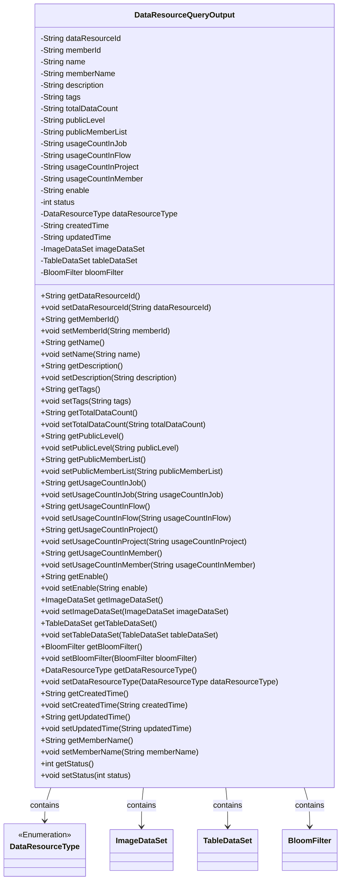

# Basic Information

|      |      |
|------|------|
| Name | DataResourceQueryOutput |
| Language | .java |
| Code Path | WeFe/common/java/common-data-mongodb/src/main/java/com/welab/wefe/common/data/mongodb/dto/dataresource/DataResourceQueryOutput.java |
| Package Name | com.welab.wefe.common.data.mongodb.dto.dataresource |
| Dependencies | ['com.welab.wefe.common.data.mongodb.entity.union.BloomFilter', 'com.welab.wefe.common.data.mongodb.entity.union.ImageDataSet', 'com.welab.wefe.common.data.mongodb.entity.union.TableDataSet', 'com.welab.wefe.common.wefe.enums.DataResourceType'] |
| Brief Description | The DataResourceQueryOutput class includes data resource ID, member information, name, description, tags, data volume, public level, usage statistics, status, type, timestamps, and dataset attributes. |

# Description

The `DataResourceQueryOutput` class is a Java class designed to encapsulate the results of data resource queries. It includes attributes such as data resource ID, member ID, name, description, tags, total data volume, public level, list of public members, various usage counts, enabled status, status code, resource type, creation and update times. Additionally, it contains references to three specific dataset types (image datasets, tabular datasets, and Bloom filters) along with their corresponding getter and setter methods.

# Class Summary

| Name   | Type  | Description |
|-------|------|-------------|
| DataResourceQueryOutput | class | The DataResourceQueryOutput class includes data resource ID, member information, name, description, tags, data volume, public level, usage statistics, status, type, timestamps, and dataset attributes. |

## Class DataResourceQueryOutput

|      |      |
|------|------|
| Access Modifier | public |
| Type | class |
| Name | DataResourceQueryOutput |
| Description | The DataResourceQueryOutput class includes data resource ID, member information, name, description, tags, data volume, public level, usage statistics, status, type, timestamps, and dataset attributes. |

### UML Class Diagram

This code defines a class named DataResourceQueryOutput, which represents the output result of a data resource query. The class includes multiple private fields such as dataResourceId, memberId, name, etc., along with corresponding getter and setter methods. Additionally, the class references four other classes: DataResourceType (an enumeration type), ImageDataSet, TableDataSet, and BloomFilter, representing data resource type, image dataset, table dataset, and Bloom filter, respectively. These reference relationships are indicated by dependency arrows, illustrating the associations between the DataResourceQueryOutput class and the other classes. Overall, this class is a complex data transfer object designed to encapsulate and convey information related to data resources.

### Internal Method Call Graph

```mermaid
graph TD
    A["Class DataResourceQueryOutput"]
    B["Attribute: String dataResourceId"]
    C["Attribute: String memberId"]
    D["Attribute: String name"]
    E["Attribute: String memberName"]
    F["Attribute: String description"]
    G["Attribute: String tags"]
    H["Attribute: String totalDataCount"]
    I["Attribute: String publicLevel"]
    J["Attribute: String publicMemberList"]
    K["Attribute: String usageCountInJob"]
    L["Attribute: String usageCountInFlow"]
    M["Attribute: String usageCountInProject"]
    N["Attribute: String usageCountInMember"]
    O["Attribute: String enable"]
    P["Attribute: int status"]
    Q["Attribute: DataResourceType dataResourceType"]
    R["Attribute: String createdTime"]
    S["Attribute: String updatedTime"]
    T["Attribute: ImageDataSet imageDataSet"]
    U["Attribute: TableDataSet tableDataSet"]
    V["Attribute: BloomFilter bloomFilter"]

    A --> B
    A --> C
    A --> D
    A --> E
    A --> F
    A --> G
    A --> H
    A --> I
    A --> J
    A --> K
    A --> L
    A --> M
    A --> N
    A --> O
    A --> P
    A --> Q
    A --> R
    A --> S
    A --> T
    A --> U
    A --> V
```

This code defines a class named DataResourceQueryOutput, containing 21 private attributes with corresponding getter/setter methods. The class encapsulates query output results for data resources, including resource ID, member information, name, description, tags, data statistics, public level, usage counts, status flags, resource type, timestamps, and references to three specific dataset types (image, table, and Bloom filter). All attributes are accessible and modifiable through public methods, reflecting the Java Bean design pattern.

### Field List

| Name  | Type  | Description |
|-------|-------|------|
| usageCountInFlow | String | The private string variable `usageCountInFlow` is used to record the number of uses within the flow. |
| usageCountInJob | String | Private string variable, recording the number of uses in the job. |
| tableDataSet | TableDataSet | The private TableDataSet type variable tableDataSet. |
| publicLevel | String | The private string variable `publicLevel` is used to store public level information. |
| updatedTime | String | String variable for update time. |
| enable | String | Private string variable enable. |
| usageCountInMember | String | Class member variable `usageCountInMember`, string type, private access. |
| tags | String | Private string variable tags |
| createdTime | String | Define a string-type variable named createdTime to record the creation time. |
| memberName | String | The member variable is named memberName, and its type is String. |
| status | int | Private integer variable status, used to represent the state. |
| dataResourceId | String | The private string-type variable `dataResourceId` is used to identify the data resource. |
| totalDataCount | String | Private string variable used to store the total data count. |
| name | String | private String name |
| imageDataSet | ImageDataSet | Private image dataset object. |
| usageCountInProject | String | The usage count string variable in the project. |
| dataResourceType | DataResourceType | The variable for private data resource type is `dataResourceType`. |
| bloomFilter | BloomFilter | The private Bloom filter variable bloomFilter. |
| publicMemberList | String | private String variable publicMemberList |
| description | String | Private string type variable description. |
| memberId | String | Member ID string type private variable. |

### Method List

| Name  | Type  | Description |
|-------|-------|------|
| setUsageCountInMember | void | This is a Java method used to set the value of the member variable `usageCountInMember`. The method accepts a string parameter and assigns it to the variable of the same name in the class. |
| setTotalDataCount | void | Java Method: Set Total Data Count String Value. |
| getUsageCountInProject | String | Get the string value of usage count within the project. |
| setUsageCountInFlow | void | Java Method: Setting the Usage Count Variable Value in a Process. |
| getUsageCountInMember | String | Get the member usage count string method. |
| getTags | String | The method getTags returns the value of the string-type variable tags. |
| setName | void | Methods for setting object names, assigning the parameter `name` to the `name` property of the object. |
| getMemberId | String | The method returns the member ID string. |
| setPublicMemberList | void | Method for setting the public member list, which assigns the input string to the class's publicMemberList variable. |
| getPublicMemberList | String | The method to obtain the public member list, which returns the publicMemberList string. |
| setUsageCountInProject | void | Set a public method for the usage count within the project, with the parameter being of string type. |
| setDataResourceId | void | The method to set the data resource ID assigns the input parameter to the class member variable `dataResourceId`. |
| getDataResourceId | String | Methods to obtain the data resource ID, returning a string-type value `dataResourceId`. |
| getPublicLevel | String | The method getPublicLevel returns the value of the publicLevel variable, which is of type string. |
| getTableDataSet | TableDataSet | Public method for retrieving table dataset, returns a tableDataSet object. |
| setTags | void | This is a Java method used to set the tags property of an object. The method accepts a string parameter, tags, and assigns it to the tags field of the current object. |
| getImageDataSet | ImageDataSet | Methods to obtain image dataset, returns an imageDataSet object. |
| getBloomFilter | BloomFilter | Methods to obtain a Bloom filter instance. |
| setImageDataSet | void | Method for setting the image dataset, assigning the input parameter to the imageDataSet property of the current object. |
| getUsageCountInJob | String | Retrieve the usage count method in the job and return the string-type `usageCountInJob` value. |
| getDataResourceType | DataResourceType | This is a Java method that returns a DataResourceType object named dataResourceType. |
| getDescription | String | String methods for obtaining descriptive information. |
| setMemberId | void | The method to set the member ID assigns the input parameter memberId to the class's member variable memberId. |
| setTableDataSet | void | Method for setting the table dataset, assigns the input parameters to the tableDataSet property of the current object. |
| getUsageCountInFlow | String | Get the number of uses in the process. |
| getName | String | This is a Java method that returns the value of the string variable named "name". |
| setDataResourceType | void | The method for setting the data resource type assigns the input parameter to the member variable dataResourceType of the class. |
| getCreatedTime | String | Method to get the creation time, returns the value of the createdTime variable as a string type. |
| setCreatedTime | void | This is a Java method used to set the creation time property of an object. The method accepts a string parameter `createdTime` and assigns it to the class's member variable `createdTime`. |
| getUpdatedTime | String | Methods to obtain the update time, returning the value of the updatedTime variable as a string type. |
| setUpdatedTime | void | The method to set the update time is to assign the parameter updatedTime to the member variable updatedTime of the class. |
| getMemberName | String | Methods to obtain the member name, returning the value of the member variable memberName. |
| setMemberName | void | The method to set the member variable memberName, with the parameter being of string type. |
| getStatus | int | The method returns a status value named status. |
| setStatus | void | This is a Java method used to set the value of the object's status property. The method takes an integer parameter status and assigns it to the status field of the current object. |
| setDescription | void | The method for setting the object description assigns the input string to the description property of the object. |
| getEnable | String | Public method to get the enable value, returns a string type. |
| setUsageCountInJob | void | The method setUsageCountInJob is used to set the usage count in a job, with the parameter being of string type. |
| setEnable | void | This is a Java method used to set the value of the enable property. The method takes a string parameter named enable and assigns it to the class member variable of the same name. |
| setPublicLevel | void | Define the public method setPublicLevel to set the value of the publicLevel property. |
| getTotalDataCount | String | This is a Java method that returns the value of the string-type variable totalDataCount. |
| setBloomFilter | void | Set the Bloom filter instance to the current object. |

