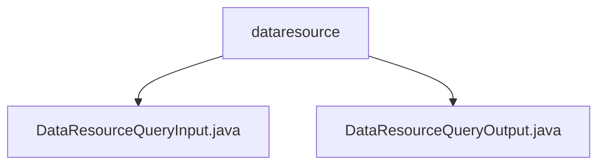

# Basic Information

|      |      |
|------|------|
| Name | dataresource |
| Language | .java |
| Code Path | WeFe/common/java/common-data-mongodb/src/main/java/com/welab/wefe/common/data/mongodb/dto/dataresource |
| Package Name | docs.common.java.common-data-mongodb.src.main.java.com.welab.wefe.common.data.mongodb.dto.dataresource |
| Brief Description | The DataResourceQueryInput class inherits from PageInput and includes multiple query fields such as ID, name, type, etc., providing getter/setter methods. The DataResourceQueryOutput class encapsulates query results, containing resource details, status, type, and three types of dataset references, with getter/setter methods provided. |

# Description

## Overview  
The core responsibility of this module is to provide data resource query functionality, including input parameter encapsulation and result set encapsulation. The interface specification comprises two types of DTOs: DataResourceQueryInput (inheriting pagination parameters) and DataResourceQueryOutput. The former supports multi-condition filtering such as ID/name/tags, while the latter extends resource details and statistical fields.  

Key data structures include the enum-type forJobType and boolean status markers in DataResourceQueryInput, as well as the nested structure of three dataset types (image/table/Bloom filter) in Output. External dependencies only involve the basic pagination class PageInput. For example, Input implements permission filtering via curMemberId, and Output manages visibility through publicMemberList.  

## Primary Business Scenarios  
A typical application is data resource retrieval in federated learning, supporting combined queries (e.g., filtering by tags + resource type) and result aggregation display (e.g., counting usage statistics). The interaction mode resembles the Read operation in CRUD, with boolean fields enabling granular status management. Functional completeness is reflected in covering all resource attributes (metadata + usage data + type-specific fields), such as Output including both basic descriptions and image dataset-specific references.  

The API type belongs to query interfaces, with integration cases including resource selectors during federated task configuration. The business process is divided into: constructing multi-condition Input → executing the query → parsing composite data in Output, such as quickly identifying datasets containing Y values via the containsY field.

### Package Internal Structure View

This flowchart illustrates the structural relationship between two Java files under the dataresource directory. With dataresource as the parent node, it contains two child nodes: DataResourceQueryInput.java and DataResourceQueryOutput.java, clearly reflecting the hierarchical positions of the input and output DTO files related to MongoDB data resource queries within the project.

# File List

| Name   | Type  | Description |
|-------|------|-------------|
| [DataResourceQueryInput.java](DataResourceQueryInput.md) | file | The DataResourceQueryInput class inherits from PageInput and includes fields such as data resource ID, member name, tags, current member ID, resource type list, deep learning task type, whether to include Y, enabled status, along with their corresponding getter/setter methods. |
| [DataResourceQueryOutput.java](DataResourceQueryOutput.md) | file | The DataResourceQueryOutput class includes data resource ID, member information, name, description, tags, data volume, public level, usage statistics, status, type, timestamps, and dataset attributes. |

