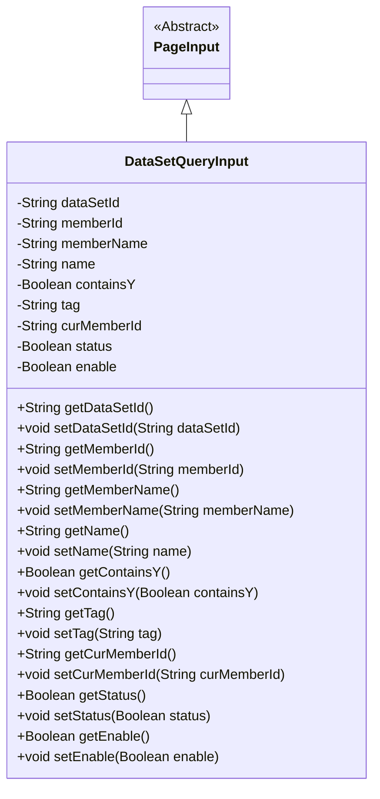

# Basic Information

|      |      |
|------|------|
| Name | DataSetQueryInput |
| Language | .java |
| Code Path | WeFe/common/java/common-data-mongodb/src/main/java/com/welab/wefe/common/data/mongodb/dto/dataset/DataSetQueryInput.java |
| Package Name | com.welab.wefe.common.data.mongodb.dto.dataset |
| Dependencies | ['com.welab.wefe.common.data.mongodb.dto.PageInput'] |
| Brief Description | The DataSetQueryInput class inherits from PageInput and includes query fields such as dataset ID, member ID, name, tags, as well as status control fields. |

# Description

The `DataSetQueryInput` class inherits from `PageInput` and includes multiple private fields for dataset query conditions: `dataSetId` identifies the dataset, `memberId` and `memberName` represent member information, `name` denotes the name, `containsY` checks whether it contains Y, `tag` is the label, `curMemberId` records the current member ID, and `status` and `enable` indicate the status and enable flag. Each field has corresponding getter and setter methods.

# Class Summary

| Name   | Type  | Description |
|-------|------|-------------|
| DataSetQueryInput | class | The DataSetQueryInput class extends PageInput, containing query parameters such as dataset ID, member ID, name, label, status, and their corresponding getter/setter methods. |

## Class DataSetQueryInput

|      |      |
|------|------|
| Access Modifier | public |
| Type | class |
| Name | DataSetQueryInput |
| Description | The DataSetQueryInput class extends PageInput, containing query parameters such as dataset ID, member ID, name, label, status, and their corresponding getter/setter methods. |

### UML Class Diagram

This code defines a `DataSetQueryInput` class that inherits from the abstract class `PageInput`. The class contains multiple private fields such as `dataSetId`, `memberId`, `memberName`, etc., which are used to store input parameters for dataset queries. It also provides corresponding getter and setter methods for each field, allowing external code to access and modify the values of these private fields. The class diagram clearly illustrates the inheritance relationship between `DataSetQueryInput` and `PageInput`, as well as the structure of `DataSetQueryInput`'s own attributes and methods.

### Internal Method Call Graph

```mermaid
graph TD
    A["Class DataSetQueryInput"]
    B["Inherits from: PageInput"]
    C["Property: String dataSetId"]
    D["Property: String memberId"]
    E["Property: String memberName"]
    F["Property: String name"]
    G["Property: Boolean containsY"]
    H["Property: String tag"]
    I["Property: String curMemberId"]
    J["Property: Boolean status"]
    K["Property: Boolean enable"]
    L["Method: getDataSetId()/setDataSetId()"]
    M["Method: getMemberId()/setMemberId()"]
    N["Method: getMemberName()/setMemberName()"]
    O["Method: getName()/setName()"]
    P["Method: getContainsY()/setContainsY()"]
    Q["Method: getTag()/setTag()"]
    R["Method: getCurMemberId()/setCurMemberId()"]
    S["Method: getStatus()/setStatus()"]
    T["Method: getEnable()/setEnable()"]

    A --> B
    A --> C
    A --> D
    A --> E
    A --> F
    A --> G
    A --> H
    A --> I
    A --> J
    A --> K
    A --> L
    A --> M
    A --> N
    A --> O
    A --> P
    A --> Q
    A --> R
    A --> S
    A --> T
```

This code defines a DataSetQueryInput class that inherits from the PageInput class, containing 9 private properties and corresponding getter/setter methods. The class is primarily used to encapsulate input parameters for dataset queries, including fields such as dataset ID, member information, name tags, and status flags. Each property follows the standard JavaBean specification to provide access methods, facilitating the retrieval or modification of these query condition parameters in other modules.

### Field List

| Name  | Type  | Description |
|-------|-------|------|
| tag | String | Private string variable tag |
| memberId | String | Member ID string type private variable. |
| dataSetId | String | Dataset ID string variable declaration |
| curMemberId | String | The private string variable of the current member ID. |
| enable | Boolean | Private boolean variable indicating the enabled status. |
| name | String | Private string type variable name |
| status | Boolean | Boolean type state variables |
| containsY | Boolean | Private boolean variable indicating whether Y is included. |
| memberName | String | Member variable: memberName, of type String, with private access modifier. |

### Method List

| Name  | Type  | Description |
|-------|-------|------|
| getStatus | Boolean | Methods for obtaining boolean state values. |
| getCurMemberId | String | Methods to obtain the current member ID, where the return value is the string-type curMemberId. |
| setMemberId | void | The method to set the member ID assigns the input parameter to the class's member variable `memberId`. |
| setStatus | void | Methods for setting boolean state values. |
| getDataSetId | String | Methods to obtain the dataset ID, returning the value of the dataSetId field. |
| getTag | String | The method returns the value of the tag variable, which is of string type. |
| setName | void | This is a Java method used to set the name property of an object. The method accepts a string parameter name and assigns it to the name field of the current object. |
| getName | String | Methods to obtain the name, returning the value of the name variable of string type. |
| getMemberName | String | The method to obtain the member name returns the value of the member variable `memberName`. |
| getMemberId | String | This is a Java method that returns a member ID string. The method is named getMemberId, takes no parameters, and directly returns the value of the member variable memberId. |
| setEnable | void | The method to set the boolean value `enable`, used to control the feature switch. |
| setTag | void | The method setTag is used to set the tag property of an object, with the parameter being of string type. |
| getContainsY | Boolean | The method getContainsY returns a boolean value containsY. |
| setMemberName | void | Set the value of the member variable memberName. |
| setCurMemberId | void | Method to set the current member ID, with the parameter being of string type. |
| getEnable | Boolean | Public method to obtain the enable boolean value. |
| setContainsY | void | This is a Java method used to set the value of a boolean variable named containsY. The method is called setContainsY and accepts a Boolean parameter. |
| setDataSetId | void | Methods for setting the dataset ID, assigning the input parameter to the class's dataSetId member variable. |

