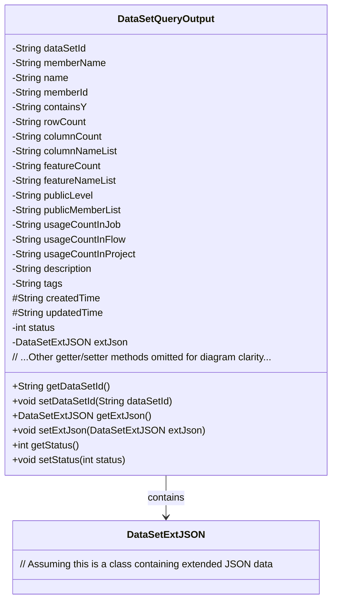

# Basic Information

|      |      |
|------|------|
| Name | DataSetQueryOutput |
| Language | .java |
| Code Path | WeFe/common/java/common-data-mongodb/src/main/java/com/welab/wefe/common/data/mongodb/dto/dataset/DataSetQueryOutput.java |
| Package Name | com.welab.wefe.common.data.mongodb.dto.dataset |
| Dependencies | ['com.welab.wefe.common.data.mongodb.entity.union.ext.DataSetExtJSON'] |
| Brief Description | The `DataSetQueryOutput` class contains attributes such as dataset ID, member information, row and column counts, feature list, public level, usage statistics, description, tags, creation/update time, and status, and provides corresponding getter and setter methods. |

# Description

The `DataSetQueryOutput` class is a Java class used to represent dataset query outputs, containing various attributes of the dataset and corresponding getter and setter methods. Key attributes include dataset ID, member name, name, member ID, whether it contains the Y flag, row count, column count, column name list, feature count, feature name list, public level, public member list, usage count in jobs, workflows, and projects, description, tags, creation time, update time, status, and extended JSON data. Each attribute has corresponding access and modification methods to ensure data encapsulation and operability.

# Class Summary

| Name   | Type  | Description |
|-------|------|-------------|
| DataSetQueryOutput | class | The DataSetQueryOutput class contains attributes such as dataset ID, name, member information, row and column counts, feature list, public level, usage statistics, description, tags, creation/update time, and status. |

## Class DataSetQueryOutput

|      |      |
|------|------|
| Access Modifier | public |
| Type | class |
| Name | DataSetQueryOutput |
| Description | The DataSetQueryOutput class contains attributes such as dataset ID, name, member information, row and column counts, feature list, public level, usage statistics, description, tags, creation/update time, and status. |

### UML Class Diagram

This code defines a `DataSetQueryOutput` class for encapsulating output information of dataset query results. The class contains over 20 private fields, primarily recording dataset metadata (such as ID, name, row/column counts), usage statistics (e.g., usage counts in jobs/flows/projects), access control (public level, member list), and timestamps. The `extJson` field implements extended data storage through association with the `DataSetExtJSON` class. All fields are accessed via standard getter/setter methods, complying with JavaBean specifications, making it suitable as a DTO for transferring structured data between systems.

### Internal Method Call Graph

```mermaid
graph TD
    A["Class DataSetQueryOutput"]
    B["Private attribute: String dataSetId"]
    C["Private attribute: String memberName"]
    D["Private attribute: String name"]
    E["Private attribute: String memberId"]
    F["Private attribute: String containsY"]
    G["Private attribute: String rowCount"]
    H["Private attribute: String columnCount"]
    I["Private attribute: String columnNameList"]
    J["Private attribute: String featureCount"]
    K["Private attribute: String featureNameList"]
    L["Private attribute: String publicLevel"]
    M["Private attribute: String publicMemberList"]
    N["Private attribute: String usageCountInJob"]
    O["Private attribute: String usageCountInFlow"]
    P["Private attribute: String usageCountInProject"]
    Q["Private attribute: String description"]
    R["Private attribute: String tags"]
    S["Protected attribute: String createdTime"]
    T["Protected attribute: String updatedTime"]
    U["Private attribute: int status"]
    V["Private attribute: DataSetExtJSON extJson"]
    W["Getter/Setter methods: dataSetId/memberName/name/memberId"]
    X["Getter/Setter methods: containsY/rowCount/columnCount/columnNameList"]
    Y["Getter/Setter methods: featureCount/featureNameList/publicLevel/publicMemberList"]
    Z["Getter/Setter methods: usageCountInJob/usageCountInFlow/usageCountInProject"]
    AA["Getter/Setter methods: description/tags/createdTime/updatedTime"]
    AB["Getter/Setter methods: status/extJson"]

    A --> B
    A --> C
    A --> D
    A --> E
    A --> F
    A --> G
    A --> H
    A --> I
    A --> J
    A --> K
    A --> L
    A --> M
    A --> N
    A --> O
    A --> P
    A --> Q
    A --> R
    A --> S
    A --> T
    A --> U
    A --> V
    A --> W
    A --> X
    A --> Y
    A --> Z
    A --> AA
    A --> AB
```

This code defines a DataSetQueryOutput class containing 20 attributes and corresponding Getter/Setter methods. The attributes are primarily categorized into three types: private String type (e.g., dataSetId, name), protected time type (createdTime/updatedTime), and special types (status as integer, extJson as DataSetExtJSON object). All attributes are exposed through standard accessor methods, implementing data encapsulation. The class is designed to encapsulate dataset query results, including a complete set of attributes such as dataset identifiers, metadata, usage statistics, and extended information.

### Field List

| Name  | Type  | Description |
|-------|-------|------|
| containsY | String | Declare a private string variable containsY. |
| rowCount | String | The private string variable rowCount is used to store row count information. |
| memberName | String | Declare a private string variable memberName. |
| columnCount | String | The private string variable columnCount is used to store column count information. |
| extJson | DataSetExtJSON | Extending JSON Objects with Private Datasets. |
| description | String | Private string type variable description. |
| status | int | The private integer variable `status` is used to represent the state. |
| dataSetId | String | Private string variable for dataset ID. |
| createdTime | String | Define a string-type variable named createdTime to store the creation time. |
| usageCountInProject | String | Usage Count Statistics Variables Within the Project |
| updatedTime | String | Updated time protection string variable |
| columnNameList | String | The private string variable columnNameList is used to store the list of column names. |
| publicMemberList | String | private String variable publicMemberList |
| usageCountInFlow | String | Private string variable to record the number of uses in the process. |
| featureCount | String | The private string variable featureCount is used to store the number of features. |
| publicLevel | String | Private string variable publicLevel |
| memberId | String | Declare a private string type variable memberId. |
| name | String | private String variable name |
| tags | String | The private string variable `tags` is used to store tag information. |
| featureNameList | String | Private string variable used to store the list of feature names. |
| usageCountInJob | String | Private string variable, recording the number of uses in the job. |

### Method List

| Name  | Type  | Description |
|-------|-------|------|
| getUsageCountInProject | String | Retrieve string methods used in the project along with their usage counts. |
| getUsageCountInFlow | String | String method for obtaining the number of process usage times. |
| getDescription | String | Methods for obtaining descriptive information, returning a string-type description content. |
| getRowCount | String | The method returns the line count value. |
| setContainsY | void | Java Method: Set the containsY string property value. |
| getMemberId | String | Methods to obtain member ID, returns the member ID string. |
| getUsageCountInJob | String | The method returns the usage count in the job. |
| setFeatureCount | void | This is a Java method used to set the value of the featureCount property. The method takes a string parameter named featureCount and assigns it to the class member variable of the same name. |
| setColumnNameList | void | Methods for setting the column name list, assign the parameter columnNameList to the class member variable with the same name. |
| getPublicLevel | String | The method getPublicLevel returns the publicLevel value of type string. |
| setFeatureNameList | void | This is a Java method used to set the value of the featureNameList property. The method takes a string parameter and assigns it to the class's member variable featureNameList. |
| setPublicMemberList | void | The method to set the public member list assigns the input string to the class's publicMemberList variable. |
| getTags | String | The method returns the value of the tags variable, which is of string type. |
| setUsageCountInJob | void | Java Method: Set the number of uses in the job, with the parameter being of string type. |
| getName | String | Methods to obtain the name, returning the value of the string-type name variable. |
| setUsageCountInProject | void | Set a public method for the usage count within the project, with the parameter being of string type. |
| getMemberName | String | Methods to obtain the member name, returning the value of the member variable `memberName`. |
| setMemberId | void | The method to set the member ID assigns the input parameter to the class's member variable `memberId`. |
| getFeatureCount | String | Public method to obtain the featureCount value. |
| setPublicLevel | void | This is a Java method used to set the value of the object's publicLevel property. The method takes a string parameter and assigns it to the member variable publicLevel. |
| getColumnCount | String | Methods to get the number of columns, returning the columnCount value. |
| getColumnNameList | String | Methods to obtain the column name list, returning a string type columnNameList. |
| getPublicMemberList | String | The method to obtain the public member list, which returns the string variable publicMemberList. |
| setDescription | void | The method for setting description information assigns the input parameter to the object's `description` property. |
| setMemberName | void | This is a Java method used to set the value of the member variable `memberName`. The method takes a string parameter `memberName` and assigns it to the member variable of the same name in the current object. |
| setTags | void | Method for setting tags: Assigns the input string to the object's tags property. |
| getCreatedTime | String | Methods to obtain the creation time, returning the value of the createdTime variable as a string type. |
| setCreatedTime | void | The method to set the creation time takes a parameter of string type and assigns it to the member variable createdTime. |
| getUpdatedTime | String | Methods to obtain the update time, returning the value of the updatedTime variable as a string type. |
| setUpdatedTime | void | This is a Java method used to set the updatedTime property value of an object. The method takes a string parameter updatedTime and assigns it to the member variable of the same name in the object. |
| getExtJson | DataSetExtJSON | Get extended JSON dataset. |
| setExtJson | void | Set external JSON data object. |
| getStatus | int | The method returns a status value named status. |
| setStatus | void | Methods for setting status values, assigning the input parameter `status` to the `status` property of the current object. |
| setUsageCountInFlow | void | Method for setting string values of usage counts within a process. |
| setName | void | This is a Java method used to set the name property of an object, assigning the passed string parameter to the member variable name. |
| getContainsY | String | Methods to obtain the value of the containsY string. |
| getDataSetId | String | Methods to obtain the dataset ID, returning a string-type dataset ID. |
| getFeatureNameList | String | The method returns a list string of feature names. |
| setColumnCount | void | This is a Java method used to set the value of the columnCount property of an object. The method takes a string parameter named columnCount and assigns it to the property of the same name in the current object. |
| setDataSetId | void | Methods for setting the dataset ID: Assign the input parameter to the class's `dataSetId` member variable. |
| setRowCount | void | The method to set the number of rows assigns the input string to the class's rowCount variable. |

