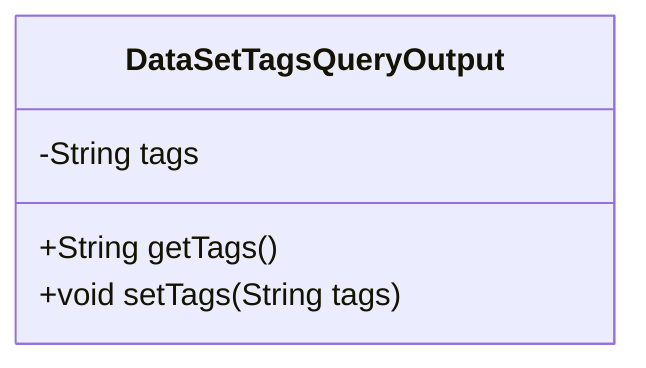
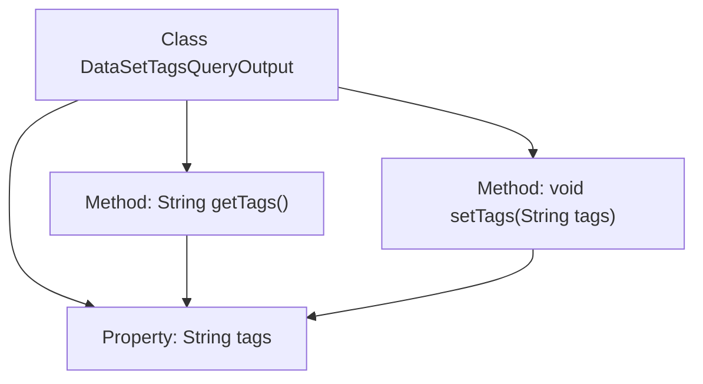

# Basic Information

|      |      |
|------|------|
| Name | DataSetTagsQueryOutput |
| Language | .java |
| Code Path | WeFe/common/java/common-data-mongodb/src/main/java/com/welab/wefe/common/data/mongodb/dto/dataset/DataSetTagsQueryOutput.java |
| Package Name | com.welab.wefe.common.data.mongodb.dto.dataset |
| Dependencies | [] |
| Brief Description | The DataSetTagsQueryOutput class includes the tags attribute and its corresponding getter/setter methods. |

# Description

This is a Java class named `DataSetTagsQueryOutput`, designed to encapsulate the output results of dataset tag queries. The class includes a private string-type member variable `tags` for storing tag data. It provides standard getter and setter methods: `getTags()` for retrieving tag values and `setTags(String tags)` for setting tag values. This class implements simple data encapsulation functionality, facilitating the transfer and processing of tag data within the program.

# Class Summary

| Name   | Type  | Description |
|-------|------|-------------|
| DataSetTagsQueryOutput | class | The DataSetTagsQueryOutput class contains a private field tags along with its getter and setter methods. |

## Class DataSetTagsQueryOutput

|      |      |
|------|------|
| Access Modifier | public |
| Type | class |
| Name | DataSetTagsQueryOutput |
| Description | The DataSetTagsQueryOutput class contains a private field tags along with its getter and setter methods. |

### UML Class Diagram

This code defines a simple Java class `DataSetTagsQueryOutput` for encapsulating the output of dataset tag queries. The class contains a private string field `tags` along with corresponding getter and setter methods. The getter method retrieves the tag string, while the setter method assigns the tag string. This represents a typical Data Transfer Object (DTO) design pattern, used for passing tag data between different layers. The class structure is simple and clear, compliant with JavaBean specifications, facilitating serialization and deserialization operations.

### Internal Method Call Graph

This flowchart illustrates the structure of the DataSetTagsQueryOutput class, which contains a private property 'tags' and two public methods: getTags() and setTags(). The getTags() method retrieves the value of 'tags', while setTags() assigns a value to 'tags', both directly manipulating the 'tags' property. The class design is simple and clear, adhering to JavaBean specifications, making it suitable for storing and manipulating tag data.

### Field List

| Name  | Type  | Description |
|-------|-------|------|
| tags | String | Declare a private string variable tags. |

### Method List

| Name  | Type  | Description |
|-------|-------|------|
| getTags | String | The method getTags returns the value of the string tags. |
| setTags | void | This is a Java method used to set the tags property of an object, which accepts a string parameter tags and assigns it to the member variable tags of the object. |

