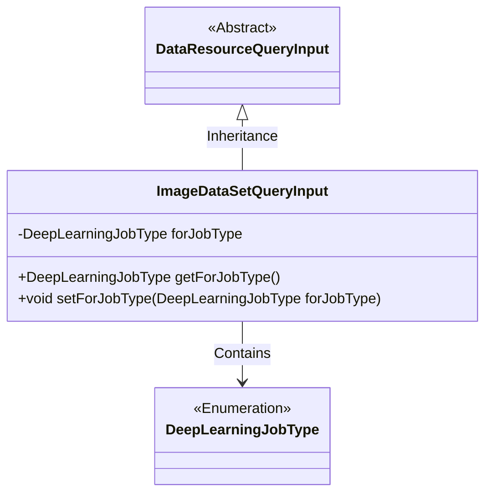
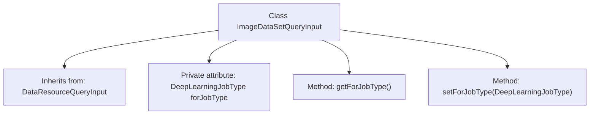

# Basic Information

|      |      |
|------|------|
| Name | ImageDataSetQueryInput |
| Language | .java |
| Code Path | WeFe/common/java/common-data-mongodb/src/main/java/com/welab/wefe/common/data/mongodb/dto/dataset/ImageDataSetQueryInput.java |
| Package Name | com.welab.wefe.common.data.mongodb.dto.dataset |
| Dependencies | ['com.welab.wefe.common.data.mongodb.dto.dataresource.DataResourceQueryInput', 'com.welab.wefe.common.wefe.enums.DeepLearningJobType'] |
| Brief Description | ImageDataSetQueryInput extends DataResourceQueryInput and includes the forJobType property of type DeepLearningJobType along with its getter and setter methods. |

# Description

The `ImageDataSetQueryInput` class inherits from `DataResourceQueryInput` and includes a private attribute `forJobType` of type `DeepLearningJobType`. This class provides the `getForJobType` and `setForJobType` methods for retrieving and setting the value of the `forJobType` attribute, respectively.

# Class Summary

| Name   | Type  | Description |
|-------|------|-------------|
| ImageDataSetQueryInput | class | ImageDataSetQueryInput inherits from DataResourceQueryInput and includes the forJobType property of type DeepLearningJobType along with its getter and setter methods. |

## Class ImageDataSetQueryInput

|      |      |
|------|------|
| Access Modifier | public |
| Type | class |
| Name | ImageDataSetQueryInput |
| Description | ImageDataSetQueryInput inherits from DataResourceQueryInput and includes the forJobType property of type DeepLearningJobType along with its getter and setter methods. |

### UML Class Diagram

This class diagram illustrates that ImageDataSetQueryInput inherits from the abstract class DataResourceQueryInput and contains a private field forJobType of the enumeration type DeepLearningJobType. The class operates on this field through public getter and setter methods, demonstrating encapsulation of deep learning job types. The inheritance relationship indicates that the image dataset query input possesses the generic characteristics of basic data resource queries while extending properties specific to deep learning job types.

### Internal Method Call Graph

This code illustrates a class named ImageDataSetQueryInput, which inherits from DataResourceQueryInput. The class contains a private attribute forJobType of type DeepLearningJobType, along with corresponding getter and setter methods. The flowchart clearly presents the class's inheritance relationship and internal structure, including attribute declarations and method definitions, demonstrating fundamental object-oriented programming features such as encapsulation and inheritance.

### Field List

| Name  | Type  | Description |
|-------|-------|------|
| forJobType | DeepLearningJobType | The private deep learning task type variable forJobType. |

### Method List

| Name  | Type  | Description |
|-------|-------|------|
| getForJobType | DeepLearningJobType | Methods to obtain the current deep learning task type, returns the value of the forJobType field. |
| setForJobType | void | This is a Java method used to set the property for deep learning task types. The method accepts a DeepLearningJobType parameter and assigns it to the class member variable forJobType. |

