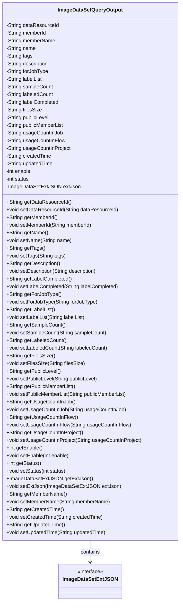

# Basic Information

|      |      |
|------|------|
| Name | ImageDataSetQueryOutput |
| Language | .java |
| Code Path | WeFe/common/java/common-data-mongodb/src/main/java/com/welab/wefe/common/data/mongodb/dto/dataset/ImageDataSetQueryOutput.java |
| Package Name | com.welab.wefe.common.data.mongodb.dto.dataset |
| Dependencies | ['com.welab.wefe.common.data.mongodb.entity.union.ext.ImageDataSetExtJSON'] |
| Brief Description | The ImageDataSetQueryOutput class contains attributes and methods for image datasets, covering fields such as resource ID, member information, labels, descriptions, sample statistics, usage counts, status, and extended JSON. |

# Description

The `ImageDataSetQueryOutput` class is a Java class designed for storing and manipulating query results of image datasets. It contains multiple private fields to record various attributes of the dataset, such as data resource ID, member ID, name, labels, description, applicable task types, label lists, sample count, annotated count, annotation completion status, file size, public level, public member lists, usage counts in different scenarios, creation and update timestamps, activation status, status code, and extended JSON information. Each field has corresponding getter and setter methods for retrieving and setting field values. This class is primarily used for managing and transmitting detailed information about image datasets.

# Class Summary

| Name   | Type  | Description |
|-------|------|-------------|
| ImageDataSetQueryOutput | class | The ImageDataSetQueryOutput class contains attributes such as the resource ID, member information, name, labels, description, annotation status, sample count, file size, public level, usage statistics, creation/update time, and status of the image dataset. |

## Class ImageDataSetQueryOutput

|      |      |
|------|------|
| Access Modifier | public |
| Type | class |
| Name | ImageDataSetQueryOutput |
| Description | The ImageDataSetQueryOutput class contains attributes such as the resource ID, member information, name, labels, description, annotation status, sample count, file size, public level, usage statistics, creation/update time, and status of the image dataset. |

### UML Class Diagram

This code defines a class named ImageDataSetQueryOutput, primarily used to encapsulate output information for image dataset query results. The class contains numerous private String fields (such as data resource ID, member information, tags, description, etc.), two integer fields (enable and status), and an extended JSON object of type ImageDataSetExtJSON. Standard getter and setter methods are provided for each field, enabling data encapsulation and access control. The class has an association relationship with the ImageDataSetExtJSON interface, indicating that the output may include extended JSON data. The overall design complies with JavaBean specifications, making it suitable for data transfer and serialization operations.

### Internal Method Call Graph

```mermaid
graph TD
    A["Class ImageDataSetQueryOutput"]
    B["Property: String dataResourceId"]
    C["Property: String memberId"]
    D["Property: String memberName"]
    E["Property: String name"]
    F["Property: String tags"]
    G["Property: String description"]
    H["Property: String forJobType"]
    I["Property: String labelList"]
    J["Property: String sampleCount"]
    K["Property: String labeledCount"]
    L["Property: String labelCompleted"]
    M["Property: String filesSize"]
    N["Property: String publicLevel"]
    O["Property: String publicMemberList"]
    P["Property: String usageCountInJob"]
    Q["Property: String usageCountInFlow"]
    R["Property: String usageCountInProject"]
    S["Property: String createdTime"]
    T["Property: String updatedTime"]
    U["Property: int enable"]
    V["Property: int status"]
    W["Property: ImageDataSetExtJSON extJson"]
    X["Getter/Setter Methods Group"]

    A --> B
    A --> C
    A --> D
    A --> E
    A --> F
    A --> G
    A --> H
    A --> I
    A --> J
    A --> K
    A --> L
    A --> M
    A --> N
    A --> O
    A --> P
    A --> Q
    A --> R
    A --> S
    A --> T
    A --> U
    A --> V
    A --> W
    A -.-> X
    X -->|corresponds to| B
    X -->|corresponds to| C
    X -->|corresponds to| D
    X -->|corresponds to| E
    X -->|corresponds to| F
    X -->|corresponds to| G
    X -->|corresponds to| H
    X -->|corresponds to| I
    X -->|corresponds to| J
    X -->|corresponds to| K
    X -->|corresponds to| L
    X -->|corresponds to| M
    X -->|corresponds to| N
    X -->|corresponds to| O
    X -->|corresponds to| P
    X -->|corresponds to| Q
    X -->|corresponds to| R
    X -->|corresponds to| S
    X -->|corresponds to| T
    X -->|corresponds to| U
    X -->|corresponds to| V
    X -->|corresponds to| W
```

This flowchart illustrates the complete structure of the ImageDataSetQueryOutput class, comprising 23 properties and their corresponding getter/setter method group. The class primarily manages metadata of image datasets, including fields such as resource identifiers, member information, tags, descriptions, usage statistics, timestamps, etc., with additional JSON-formatted data stored via the extJson property. All properties are private fields encapsulated through public accessor methods, complying with JavaBean specifications.

### Field List

| Name  | Type  | Description |
|-------|-------|------|
| name | String | private String variable name |
| usageCountInFlow | String | Private string variable, recording the number of uses in the process. |
| filesSize | String | Define a private string variable `filesSize` to store file size information. |
| memberId | String | Member ID string type private variable. |
| publicMemberList | String | The private string variable publicMemberList is used to store the public member list. |
| updatedTime | String | The field updatedTime is used to record the update time. |
| extJson | ImageDataSetExtJSON | A private variable `extJson` is defined, with the type `ImageDataSetExtJSON`. |
| sampleCount | String | Private string variable sampleCount. |
| createdTime | String | Declare a private string variable named createdTime to store the creation time. |
| usageCountInJob | String | Private string variable, recording the number of uses in the job. |
| labeledCount | String | The private string variable labeledCount is used to store the count of labels. |
| publicLevel | String | private String variable publicLevel |
| status | int | The private integer variable `status` is used to store state information. |
| forJobType | String | Private string variable used to store work type information. |
| description | String | Private string type variable description |
| enable | int | The private integer variable `enable` is used to control the function activation status. |
| memberName | String | The member variable memberName, of type String, with private access. |
| dataResourceId | String | The private string variable dataResourceId is used to identify the data resource. |
| labelCompleted | String | Private string variable used to mark completion status. |
| labelList | String | The private string variable labelList is used to store the list of labels. |
| usageCountInProject | String | Usage count statistics variable within the project |
| tags | String | Private string variable tags |

### Method List

| Name  | Type  | Description |
|-------|-------|------|
| getMemberName | String | The method to get the member name returns the value of the member variable memberName. |
| getPublicLevel | String | The method getPublicLevel returns the string value publicLevel. |
| getUsageCountInProject | String | Get the usage count in the project. |
| setLabeledCount | void | Set the label counting method by assigning the parameter `labeledCount` to the class member variable of the same name. |
| setFilesSize | void | This is a Java method used to set the value of the filesSize property. The method accepts a string parameter filesSize and assigns it to the member variable of the same name in the class. |
| getLabelList | String | This is a Java method that returns a string variable named labelList. |
| setTags | void | Methods for setting label strings. |
| setForJobType | void | The method to set the job type assigns the input parameter to the class member variable `forJobType`. |
| setUsageCountInFlow | void | Set the usage count variable value in the setup process. |
| getUsageCountInFlow | String | Get the usage count in the process. |
| setExtJson | void | Set the extended JSON data for the image dataset. |
| getLabeledCount | String | Public method to obtain the labeledCount value. |
| setStatus | void | Methods for setting object states, with parameters being integer state values. |
| setUsageCountInProject | void | Set public methods for the number of uses within the project. |
| getPublicMemberList | String | The method to obtain the public member list returns a string-type variable named publicMemberList. |
| getDataResourceId | String | Methods to obtain the data resource ID, returns the dataResourceId as a string type. |
| setLabelList | void | This is a Java method used to set the value of the labelList property. The method takes a string parameter and assigns it to the class's member variable labelList. |
| setName | void | The method to set the object name assigns the input parameter `name` to the `name` property of the object. |
| getFilesSize | String | Methods to obtain file size, returning the value of the filesSize variable. |
| getUpdatedTime | String | Methods to obtain the update time, returning the value of the updatedTime variable as a string type. |
| setCreatedTime | void | This is a Java method used to set the creation time property of an object, which accepts a string parameter createdTime and assigns it to the member variable. |
| setMemberName | void | The method to set the member variable memberName, with the parameter being of string type. |
| setUsageCountInJob | void | This is a Java method used to set the usage count property in a job. The method accepts a string parameter and assigns it to the class member variable `usageCountInJob`. |
| setDataResourceId | void | The method for setting the data resource ID assigns the input parameter to the class member variable dataResourceId. |
| getEnable | int | Get the integer value of the enable variable. |
| getDescription | String | This is a Java method that returns the value of the description attribute as a string. |
| setMemberId | void | This is a Java method used to set the value of the member variable memberId. The method accepts a string parameter memberId and assigns it to the memberId property of the current object. |
| getTags | String | This method returns the value of the tags variable as a string type. |
| setLabelCompleted | void | Set the value of the completion label in the method. |
| getLabelCompleted | String | Get the string value of the completed label. |
| getExtJson | ImageDataSetExtJSON | Get the extJson object of type ImageDataSetExtJSON. |
| setEnable | void | The method `setEnable` sets the value of `enable`. The parameter is an integer `enable`. |
| setPublicMemberList | void | The method to set the public member list assigns the input string to the class's publicMemberList variable. |
| setUpdatedTime | void | The method to set the update time assigns the parameter updatedTime to the member variable updatedTime of the class. |
| getStatus | int | Methods to obtain the current status value. |
| setSampleCount | void | Define the method setSampleCount to set the value of the sampleCount property. |
| getUsageCountInJob | String | This is a Java method that returns the value of the string-type variable usageCountInJob. |
| setPublicLevel | void | The method for setting the public level assigns the input parameter publicLevel to the current object's property of the same name. |
| getName | String | This is a Java method that returns the value of the string variable named "name". |
| getMemberId | String | Methods to obtain member ID, returns a string-type memberId. |
| getCreatedTime | String | Method to get the creation time, returns the createdTime as a string type. |
| getSampleCount | String | Methods for obtaining sample count, returns the sample count value as a string type. |
| getForJobType | String | Methods for obtaining the type of work, returns a string type value. |
| setDescription | void | This is a Java method used to set the description property of an object. The method takes a string parameter named description and assigns it to the description member variable of the object. |

