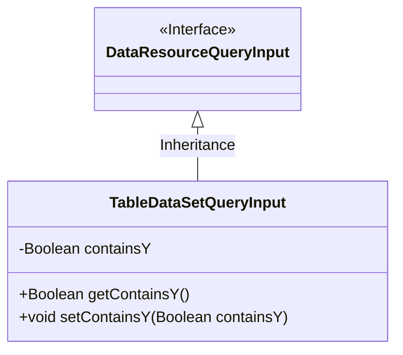
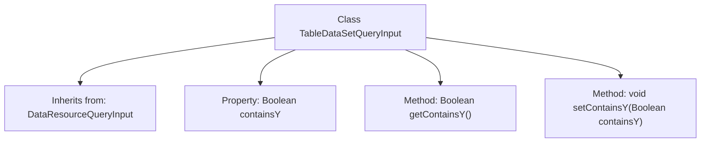

# Basic Information

|      |      |
|------|------|
| Name | TableDataSetQueryInput |
| Language | .java |
| Code Path | WeFe/common/java/common-data-mongodb/src/main/java/com/welab/wefe/common/data/mongodb/dto/dataset/TableDataSetQueryInput.java |
| Package Name | com.welab.wefe.common.data.mongodb.dto.dataset |
| Dependencies | ['com.welab.wefe.common.data.mongodb.dto.dataresource.DataResourceQueryInput'] |
| Brief Description | TableDataSetQueryInput extends DataResourceQueryInput, containing a boolean attribute containsY along with its getter and setter methods. |

# Description

The TableDataSetQueryInput class inherits from DataResourceQueryInput and contains a Boolean property named containsY along with its corresponding getter and setter methods. This class is designed to handle data resource query inputs, with a specific focus on the Boolean flag indicating whether Y elements are included.

# Class Summary

| Name   | Type  | Description |
|-------|------|-------------|
| TableDataSetQueryInput | class | The TableDataSetQueryInput class inherits from DataResourceQueryInput and includes a boolean property containsY along with its getter and setter methods. |

## Class TableDataSetQueryInput

|      |      |
|------|------|
| Access Modifier | public |
| Type | class |
| Name | TableDataSetQueryInput |
| Description | The TableDataSetQueryInput class inherits from DataResourceQueryInput and includes a boolean property containsY along with its getter and setter methods. |

### UML Class Diagram

This class diagram illustrates the inheritance structure where TableDataSetQueryInput extends the DataResourceQueryInput interface. The TableDataSetQueryInput class contains a private Boolean field 'containsY' along with corresponding public getter and setter methods. The diagram clearly demonstrates the inheritance relationship between the interface and its implementing class, adhering to the object-oriented design principle of "implementation class inheriting from interface". The DataResourceQueryInput is marked with <<Interface>> notation as an interface, while TableDataSetQueryInput as a concrete implementation class points to the interface with a hollow triangle arrow, indicating it fulfills all contracts of the interface.

### Internal Method Call Graph

This code illustrates a class named TableDataSetQueryInput, which inherits from the DataResourceQueryInput class. The class contains a Boolean property called containsY, along with its corresponding getter and setter methods. The flowchart clearly depicts the class's inheritance relationship and internal structure, including property declarations and method definitions. This structure follows the typical Java Bean pattern, designed for data encapsulation and controlled access.

### Field List

| Name  | Type  | Description |
|-------|-------|------|
| containsY | Boolean | Boolean variable indicating whether Y is included. |

### Method List

| Name  | Type  | Description |
|-------|-------|------|
| getContainsY | Boolean | The method getContainsY returns a boolean value containsY, indicating whether it contains Y. |
| setContainsY | void | Method to set the boolean value containsY. |

