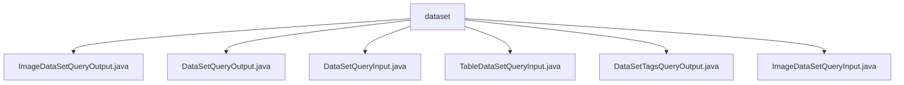

# Basic Information

|      |      |
|------|------|
| Name | dataset |
| Language | .java |
| Code Path | WeFe/common/java/common-data-mongodb/src/main/java/com/welab/wefe/common/data/mongodb/dto/dataset |
| Package Name | docs.common.java.common-data-mongodb.src.main.java.com.welab.wefe.common.data.mongodb.dto.dataset |
| Brief Description | The `ImageDataSetQueryOutput` class stores image dataset query results, including attributes such as ID, name, labels, and corresponding methods. The `DataSetQueryOutput` class represents dataset query output, containing attributes and methods like ID, name, and features. The `DataSetQueryInput` class inherits from `PageInput` and includes query conditions such as dataset ID and member information. The `TableDataSetQueryInput` class inherits from `DataResourceQueryInput` and focuses on the `containsY` flag. The `DataSetTagsQueryOutput` class encapsulates tag query results. The `ImageDataSetQueryInput` class inherits from `DataResourceQueryInput` and includes the `forJobType` attribute. |

# Description

## Overview  
The core responsibility of this module is to provide input/output encapsulation for dataset queries, supporting conditional filtering and result transmission for both image and tabular data. The interface specification uniformly adopts the Java Bean pattern, including private fields and corresponding getter/setter methods. For example, `DataSetQueryInput` inherits `PageInput` to implement paginated queries. Key data structures include common attributes such as dataset ID, member information, labels, and status flags, as well as image-specific `DeepLearningJobType` and tabular-specific `containsY` flags. The only external dependency is the MongoDB data access layer. For instance, `ImageDataSetQueryOutput` extends image dataset-specific properties such as sample count and annotation status.  

## Key Business Scenarios  
The module supports two typical scenarios: generic dataset queries (e.g., paginated filtering with `DataSetQueryInput`) and operations specific to certain dataset types (e.g., filtering image datasets by task type with `ImageDataSetQueryInput`). The interaction mode resembles DTO transmission, where input classes encapsulate query conditions (e.g., filtering tabular data using the `containsY` flag), and output classes return result sets with status (e.g., `DataSetTagsQueryOutput` encapsulates only label data). API types cover basic CRUD and extended queries, such as fetching image datasets by specifying deep learning task types via `forJobType`. All scenarios enable flexible filtering through attribute flags, such as public access level or usage count.

### Package Internal Structure View

This flowchart illustrates the hierarchical relationships of DTO classes in a MongoDB dataset. All files are located under the dataset directory and include six distinct Java class files, each handling different types of dataset query input/output operations. These classes cover functionalities related to image dataset queries, table dataset queries, and dataset tag queries.

# File List

| Name   | Type  | Description |
|-------|------|-------------|
| [ImageDataSetQueryOutput.java](ImageDataSetQueryOutput.md) | file | The ImageDataSetQueryOutput class contains attributes and methods for image datasets, covering fields such as resource ID, member information, labels, descriptions, sample statistics, usage counts, status, and extended JSON. |
| [DataSetQueryOutput.java](DataSetQueryOutput.md) | file | The DataSetQueryOutput class contains attributes such as dataset ID, member information, row and column counts, feature list, public level, usage statistics, description, tags, creation/update time, and status, providing corresponding getter and setter methods. |
| [DataSetQueryInput.java](DataSetQueryInput.md) | file | The DataSetQueryInput class inherits from PageInput and includes query fields such as dataset ID, member ID, name, tags, as well as status control fields. |
| [TableDataSetQueryInput.java](TableDataSetQueryInput.md) | file | TableDataSetQueryInput inherits from DataResourceQueryInput and includes a boolean attribute containsY along with its getter and setter methods. |
| [DataSetTagsQueryOutput.java](DataSetTagsQueryOutput.md) | file | The DataSetTagsQueryOutput class contains a tags attribute and corresponding getter/setter methods. |
| [ImageDataSetQueryInput.java](ImageDataSetQueryInput.md) | file | ImageDataSetQueryInput extends DataResourceQueryInput and includes the forJobType property of type DeepLearningJobType along with its getter and setter methods. |

