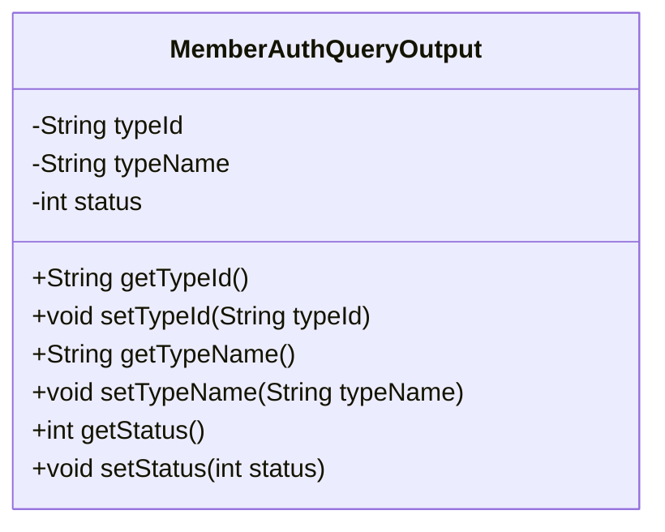
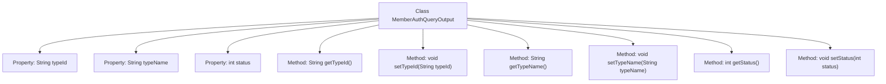

# Basic Information

|      |      |
|------|------|
| Name | MemberAuthQueryOutput |
| Language | .java |
| Code Path | WeFe/common/java/common-data-mongodb/src/main/java/com/welab/wefe/common/data/mongodb/dto/member/MemberAuthQueryOutput.java |
| Package Name | com.welab.wefe.common.data.mongodb.dto.member |
| Dependencies | [] |
| Brief Description | The MemberAuthQueryOutput class includes attributes such as typeId, typeName, and status, providing corresponding getter and setter methods. |

# Description

The MemberAuthQueryOutput class defines the output data structure for member authentication queries, containing three private fields: typeId represents the type identifier, typeName represents the type name, and status represents the status value. The class provides corresponding getter and setter methods for each field to retrieve and set the field values.

# Class Summary

| Name   | Type  | Description |
|-------|------|-------------|
| MemberAuthQueryOutput | class | The class MemberAuthQueryOutput contains three attributes: typeId, typeName, and status, each with corresponding getter and setter methods. |

## Class MemberAuthQueryOutput

|      |      |
|------|------|
| Access Modifier | public |
| Type | class |
| Name | MemberAuthQueryOutput |
| Description | The class MemberAuthQueryOutput contains three attributes: typeId, typeName, and status, each with corresponding getter and setter methods. |

### UML Class Diagram

This code defines a class named `MemberAuthQueryOutput`, which represents the output of a member authorization query. The class contains three private attributes: `typeId` (type ID), `typeName` (type name), and `status` (status), along with corresponding getter and setter methods for each attribute. This class is primarily used to encapsulate and transfer data related to member authorization queries, allowing secure access and modification of these attribute values through the getter and setter methods.

### Internal Method Call Graph

This flowchart illustrates the complete structure of the MemberAuthQueryOutput class, including three private properties (typeId, typeName, status) and their corresponding getter/setter methods. Each method is connected to the main class via arrows, clearly reflecting the hierarchical relationships between class members. This represents a typical Data Transfer Object (DTO) design, used to encapsulate status information for member authentication query results, providing secure read/write operations for private properties through accessor methods.

### Field List

| Name  | Type  | Description |
|-------|-------|------|
| typeId | String | Define a private string variable typeId. |
| typeName | String | Private string type name variable. |
| status | int | The private integer variable `status` is used to store status information. |

### Method List

| Name  | Type  | Description |
|-------|-------|------|
| getTypeId | String | Methods to obtain the type ID, returning a string-type typeId. |
| setStatus | void | Methods for setting status values, assigning the input parameter status to the class member variable status. |
| setTypeName | void | This is a Java method used to set the value of the class member variable typeName. The method takes a string parameter and assigns it to the typeName property of the current object. |
| getTypeName | String | Methods to obtain the type name, returning a string typeName. |
| setTypeId | void | The method for setting the type ID assigns the input parameter typeId to the typeId property of the current object. |
| getStatus | int | Methods for obtaining status values, returns an integer variable `status`. |

