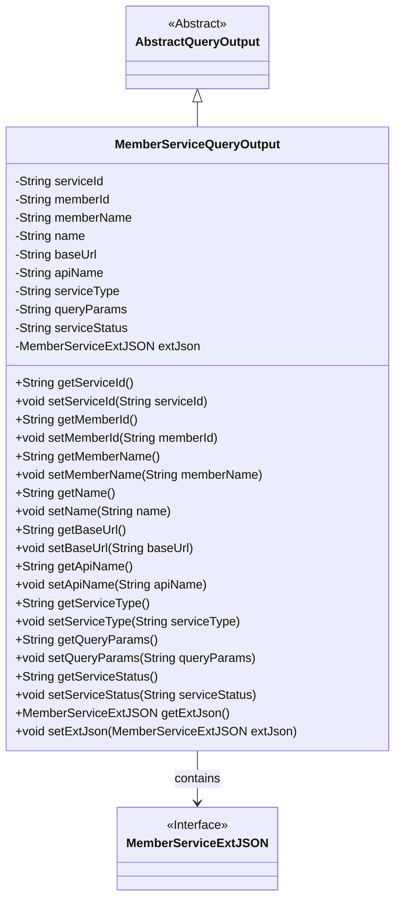

# Basic Information

|      |      |
|------|------|
| Name | MemberServiceQueryOutput |
| Language | .java |
| Code Path | WeFe/common/java/common-data-mongodb/src/main/java/com/welab/wefe/common/data/mongodb/dto/member/MemberServiceQueryOutput.java |
| Package Name | com.welab.wefe.common.data.mongodb.dto.member |
| Dependencies | ['com.welab.wefe.common.data.mongodb.dto.AbstractQueryOutput', 'com.welab.wefe.common.data.mongodb.entity.union.ext.MemberServiceExtJSON'] |
| Brief Description | The MemberServiceQueryOutput class inherits from AbstractQueryOutput and includes properties such as service ID, member ID, name, base URL, API name, service type, query parameters, status, and extended JSON attributes. |

# Description

The MemberServiceQueryOutput class inherits from AbstractQueryOutput and includes string-type fields such as service ID, member ID, member name, name, base URL, API name, service type, query parameters, service status, as well as an extended JSON field of type MemberServiceExtJSON. Each field has corresponding getter and setter methods for accessing and modifying property values.

# Class Summary

| Name   | Type  | Description |
|-------|------|-------------|
| MemberServiceQueryOutput | class | The MemberServiceQueryOutput class inherits from AbstractQueryOutput and includes attributes such as service ID, member ID, name, base URL, API name, service type, query parameters, status, and extended JSON, along with their corresponding getter/setter methods. |

## Class MemberServiceQueryOutput

|      |      |
|------|------|
| Access Modifier | public |
| Type | class |
| Name | MemberServiceQueryOutput |
| Description | The MemberServiceQueryOutput class inherits from AbstractQueryOutput and includes attributes such as service ID, member ID, name, base URL, API name, service type, query parameters, status, and extended JSON, along with their corresponding getter/setter methods. |

### UML Class Diagram

Class diagram description: MemberServiceQueryOutput inherits from the abstract class AbstractQueryOutput and contains multiple String-type attributes for storing service-related information, along with an extension JSON object of type MemberServiceExtJSON. The class provides complete getter/setter methods for property access, reflecting the standard JavaBean design pattern. MemberServiceExtJSON serves as an interface type, which is held by MemberServiceQueryOutput through a composition relationship.

### Internal Method Call Graph

```mermaid
graph TD
    A["Class MemberServiceQueryOutput"]
    B["Inherits from: AbstractQueryOutput"]
    C["Property: String serviceId"]
    D["Property: String memberId"]
    E["Property: String memberName"]
    F["Property: String name"]
    G["Property: String baseUrl"]
    H["Property: String apiName"]
    I["Property: String serviceType"]
    J["Property: String queryParams"]
    K["Property: String serviceStatus"]
    L["Property: MemberServiceExtJSON extJson"]
    M["Method: get/setServiceId"]
    N["Method: get/setMemberId"]
    O["Method: get/setMemberName"]
    P["Method: get/setName"]
    Q["Method: get/setBaseUrl"]
    R["Method: get/setApiName"]
    S["Method: get/setServiceType"]
    T["Method: get/setQueryParams"]
    U["Method: get/setServiceStatus"]
    V["Method: get/setExtJson"]

    A --> B
    A --> C
    A --> D
    A --> E
    A --> F
    A --> G
    A --> H
    A --> I
    A --> J
    A --> K
    A --> L
    A --> M
    A --> N
    A --> O
    A --> P
    A --> Q
    A --> R
    A --> S
    A --> T
    A --> U
    A --> V
```

This flowchart illustrates the structure of the MemberServiceQueryOutput class, which includes 11 private properties and their corresponding getter/setter methods. The class inherits from AbstractQueryOutput and primarily encapsulates data fields related to member service queries, such as serviceId, memberId, apiName, etc. It also stores additional JSON-formatted information via the extJson property. Each property is equipped with standard data access methods, forming a complete data encapsulation structure.

### Field List

| Name  | Type  | Description |
|-------|-------|------|
| serviceType | String | private String variable serviceType |
| apiName | String | private String variable apiName |
| memberId | String | Member ID string variable |
| queryParams | String | The private string variable queryParams is used to store query parameters. |
| extJson | MemberServiceExtJSON | Member service extension JSON object. |
| serviceStatus | String | Define a string variable `serviceStatus` to store service status information. |
| name | String | Declare a private string variable name. |
| memberName | String | The member variable is named memberName, and its type is String. |
| baseUrl | String | Declare a private string variable baseUrl. |
| serviceId | String | private String serviceId |

### Method List

| Name  | Type  | Description |
|-------|-------|------|
| setServiceType | void | This is a Java method used to set the value of the serviceType property in a class. The method takes a string parameter serviceType and assigns it to the member variable of the same name in the class. |
| getMemberName | String | The method getMemberName returns the value of the member variable memberName. |
| getApiName | String | Methods to obtain the API name, returning a string-type apiName variable. |
| setName | void | Methods for setting object names, assigning the parameter `name` to the `name` property of the object. |
| setBaseUrl | void | The method to set the base URL assigns the input parameter `baseUrl` to the class member variable `this.baseUrl`. |
| getQueryParams | String | Methods to Obtain Query Parameter Strings. |
| setQueryParams | void | Methods for setting query parameters, assigning input parameters to the member variable queryParams of the class. |
| setApiName | void | Java Method: Set API Name, assign the parameter value to the class variable apiName. |
| getServiceStatus | String | Methods for obtaining service status, returning a string-type status value. |
| getServiceId | String | The method to obtain the serviceId directly returns the value of the member variable serviceId. |
| setMemberName | void | Define a public method `setMemberName` that accepts a string parameter `memberName` and assigns it to the member variable of the same name in the current object. |
| setServiceStatus | void | This is a Java method used to set the value of the serviceStatus property in a class. The method takes a string parameter serviceStatus and assigns it to the member variable of the same name in the class. |
| getExtJson | MemberServiceExtJSON | Get extended JSON data for member services. |
| setExtJson | void | Set extended JSON data for member services. |
| getServiceType | String | Methods to obtain the service type, returning a string variable `serviceType`. |
| getName | String | This is a Java method that returns the value of the member variable "name" of type String. |
| setMemberId | void | The method to set the member ID assigns the input string to the class's member variable memberId. |
| setServiceId | void | The method to set the service ID assigns the input parameter to the serviceId member variable of the class. |
| getMemberId | String | The method returns the member ID string. |
| getBaseUrl | String | The method returns the baseUrl string value. |

