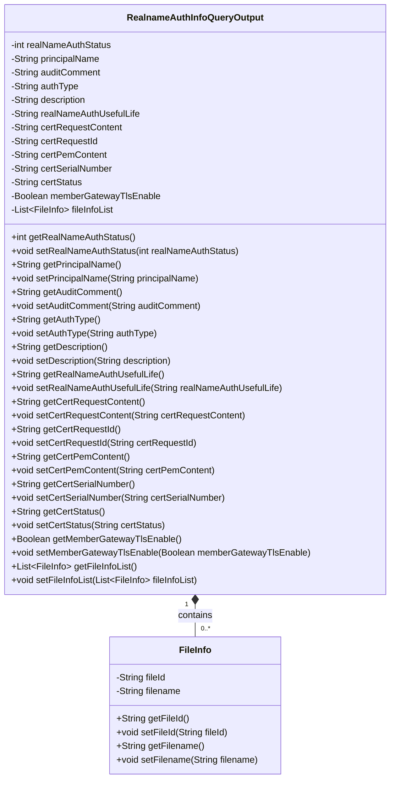

# Basic Information

|      |      |
|------|------|
| Name | RealnameAuthInfoQueryOutput |
| Language | .java |
| Code Path | WeFe/common/java/common-data-mongodb/src/main/java/com/welab/wefe/common/data/mongodb/dto/member/RealnameAuthInfoQueryOutput.java |
| Package Name | com.welab.wefe.common.data.mongodb.dto.member |
| Dependencies | ['java.util.List'] |
| Brief Description | The RealnameAuthInfoQueryOutput class includes fields such as real-name authentication status, entity name, review comments, authentication type, description, validity period, as well as certificate-related information and file lists. The FileInfo class contains file ID and file name. |

# Description

The RealnameAuthInfoQueryOutput class is used to store real-name authentication query result information, including basic details such as authentication status, subject name, review comments, authentication type, description, and validity period. Additionally, it contains certificate-related fields like certificate request content, request ID, PEM content, serial number, status, and whether TLS communication is enabled. The class also defines a nested FileInfo class for storing file ID and file name information, with multiple file details preserved via the fileInfoList field. All fields are equipped with corresponding getter and setter methods.

# Class Summary

| Name   | Type  | Description |
|-------|------|-------------|
| RealnameAuthInfoQueryOutput | class | The RealnameAuthInfoQueryOutput class includes fields such as real-name authentication status, entity name, review comments, authentication type, description, validity period, as well as certificate-related information and file lists. |

## Class RealnameAuthInfoQueryOutput

|      |      |
|------|------|
| Access Modifier | public |
| Type | class |
| Name | RealnameAuthInfoQueryOutput |
| Description | The RealnameAuthInfoQueryOutput class includes fields such as real-name authentication status, entity name, review comments, authentication type, description, validity period, as well as certificate-related information and file lists. |

### UML Class Diagram

This class diagram illustrates the structure of a real-name authentication information query output class (RealnameAuthInfoQueryOutput) and its internal file information class (FileInfo). The main class includes basic fields such as authentication status, principal name, audit comments, as well as certificate-related fields like certificate request content and serial numbers. It associates with multiple file information objects through a list. The FileInfo class encapsulates two attributes: file ID and filename. The overall design follows a typical JavaBean style, with all fields being private and accessed through getter/setter methods, making it suitable as a DTO for data transfer.

### Internal Method Call Graph

```mermaid
graph TD
    A["Class RealnameAuthInfoQueryOutput"]
    B["Attribute: int realNameAuthStatus"]
    C["Attribute: String principalName"]
    D["Attribute: String auditComment"]
    E["Attribute: String authType"]
    F["Attribute: String description"]
    G["Attribute: String realNameAuthUsefulLife"]
    H["Certificate-related attribute group"]
    I["Class FileInfo"]
    J["Attribute: List<FileInfo> fileInfoList"]

    A --> B
    A --> C
    A --> D
    A --> E
    A --> F
    A --> G
    A --> H
    H --> H1["String certRequestContent"]
    H --> H2["String certRequestId"]
    H --> H3["String certPemContent"]
    H --> H4["String certSerialNumber"]
    H --> H5["String certStatus"]
    H --> H6["Boolean memberGatewayTlsEnable"]
    A --> I
    I --> I1["String fileId"]
    I --> I2["String filename"]
    I --> I3["getFileId()"]
    I --> I4["setFileId()"]
    I --> I5["getFilename()"]
    I --> I6["setFilename()"]
    A --> J
```

This code defines a real-name authentication information query output class RealnameAuthInfoQueryOutput, containing basic fields such as authentication status, principal name, audit comments, along with certificate-related fields and a file information list. The FileInfo serves as an inner class for storing file ID and filename information. The main class provides access interfaces for all attributes through getter/setter methods, clearly distinguishing between basic authentication information and certificate-related data, making it suitable for handling complex response data structures containing multiple types of authentication information.

### Field List

| Name  | Type  | Description |
|-------|-------|------|
| memberGatewayTlsEnable | Boolean | Boolean configuration item for whether the member gateway enables TLS. |
| certPemContent | String | The private string variable certPemContent is used to store the certificate content in PEM format. |
| authType | String | Declare a private string variable authType to store authentication type information. |
| certSerialNumber | String | The private string variable certSerialNumber is used to store the certificate serial number. |
| certRequestId | String | The private string variable certRequestId is used to store the certificate request ID. |
| certStatus | String | The private string variable certStatus is used to store the certificate status. |
| certRequestContent | String | The private string variable certRequestContent is used to store the certificate request content. |
| realNameAuthUsefulLife | String | The field realNameAuthUsefulLife stores the validity period information of real-name authentication. |
| fileInfoList | List<FileInfo> | List of private file information variables `fileInfoList`. |
| principalName | String | Declare a private string variable principalName. |
| realNameAuthStatus | int | Private integer variable indicating real-name authentication status. |
| auditComment | String | The private string variable auditComment is used to store audit comments. |
| description | String | Private string type variable used to store descriptive information. |

### Method List

| Name  | Type  | Description |
|-------|-------|------|
| setCertPemContent | void | Method to set certificate PEM content: assign the input string to the class member variable certPemContent. |
| setCertRequestContent | void | The method for setting certificate request content assigns the input parameters to the class member variable certRequestContent. |
| setCertSerialNumber | void | The method to set the certificate serial number assigns the input parameter to the member variable certSerialNumber. |
| getAuthType | String | Methods to obtain the authentication type, returning a string `authType`. |
| getRealNameAuthUsefulLife | String | Method to obtain the validity period string of real-name authentication. |
| setRealNameAuthStatus | void | Method for setting real-name authentication status, with the parameter being the authentication status integer value. |
| getDescription | String | This is a Java method that returns the value of the description attribute as a string. |
| getCertRequestContent | String | The method returns the certificate request content string. |
| getRealNameAuthStatus | int | Method to obtain real-name authentication status, returns an integer status value. |
| getCertRequestId | String | The method to obtain the certificate request ID returns a string-type variable `certRequestId`. |
| getPrincipalName | String | The method returns the principalName string value. |
| getAuditComment | String | The method to obtain audit comments, returns the auditComment string. |
| setDescription | void | This is a Java method used to set the description information of an object. The method takes a string parameter and assigns it to the description property of the object. |
| setRealNameAuthUsefulLife | void | A public method for setting the validity period of real-name authentication. |
| getCertPemContent | String | Methods to obtain the PEM content of the certificate, returning the certPemContent string. |
| getCertSerialNumber | String | Methods to obtain the certificate serial number, returning a string-type variable certSerialNumber. |
| getFileInfoList | List<FileInfo> | This method returns a list of file information. |
| setFileInfoList | void | The method for setting the file information list assigns the passed `fileInfoList` to the property of the same name in the current object. |
| setCertRequestId | void | The method for setting the certificate request ID assigns the parameter certRequestId to the property of the same name in the current object. |
| setAuditComment | void | The method for setting review comments involves assigning the parameter `auditComment` to the class's `auditComment` property. |
| setAuthType | void | This is a Java method used to set the authentication type (authType). The method accepts a string parameter authType and assigns it to the class's member variable this.authType. |
| getCertStatus | String | Methods to obtain certificate status, returning a string-type status value. |
| setCertStatus | void | Method for setting the certificate status, which assigns the input parameter certStatus to the certStatus property of the current object. |
| getMemberGatewayTlsEnable | Boolean | Get the boolean value method for the TLS enablement status of the member gateway. |
| setMemberGatewayTlsEnable | void | Methods for enabling TLS status on member gateways. |
| setPrincipalName | void | Set the value of the member variable principalName. |

