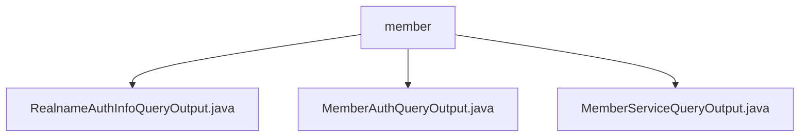

# Basic Information

|      |      |
|------|------|
| Name | member |
| Language | .java |
| Code Path | WeFe/common/java/common-data-mongodb/src/main/java/com/welab/wefe/common/data/mongodb/dto/member |
| Package Name | docs.common.java.common-data-mongodb.src.main.java.com.welab.wefe.common.data.mongodb.dto.member |
| Brief Description | The RealnameAuthInfoQueryOutput class stores real-name authentication query results, including fields such as status, name, certificate, and file information. The MemberAuthQueryOutput class defines member authentication query output, containing type identifier, name, and status. The MemberServiceQueryOutput class inherits from AbstractQueryOutput and includes service-related fields and extended JSON. |

# Description

## Overview  
The core responsibility of this module is to manage data output related to member authentication and service queries, including structured data such as real-name authentication information, member authentication status, and service configurations. The interface specification uniformly adopts the private field + public Getter/Setter pattern. For example, `RealnameAuthInfoQueryOutput` provides PEM certificate content access, while `MemberServiceQueryOutput` supports extended JSON field operations.  

Key data structures include the `FileInfo` nested class (containing file ID/name) for real-name authentication and the `MemberServiceExtJSON` extended field for service queries. The only external dependency is the MongoDB database driver, with persistence implemented through the `common-data-mongodb` submodule. For instance, `MemberAuthQueryOutput` uses `typeId`/`status` fields to track state in a state machine pattern.  

## Primary Business Scenarios  
The module supports three typical workflows: real-name authentication result queries (e.g., verifying TLS certificate status), member qualification reviews (coordinated via `typeName`/`status` fields), and federated service management (similar to URL/parameter configurations in API gateways). The interaction mode exclusively employs POJO data transfer. For example, `MemberServiceQueryOutput` uses the `baseUrl` field to implement service route discovery.  

Functional completeness is reflected in covering the entire authentication-authorization-service chain. For instance, `RealnameAuthInfoQueryOutput` handles both entity qualifications and certificate lifecycles. Typical applications include automatically associating real-name documents during federated learning node registration (via `fileInfoList`) and parsing `extJson` extended fields during service status synchronization. All API types are query-class outputs, with integration examples visible in cascaded information validation during federated member onboarding.

### Package Internal Structure View

This flowchart illustrates the structural relationships within the member directory of the common-data-mongodb module in the WeFe project. The parent node 'member' contains three DTO class files: RealnameAuthInfoQueryOutput, MemberAuthQueryOutput, and MemberServiceQueryOutput. These files reside under the member directory and belong to the same hierarchical level as data transfer object implementations.

# File List

| Name   | Type  | Description |
|-------|------|-------------|
| [RealnameAuthInfoQueryOutput.java](RealnameAuthInfoQueryOutput.md) | file | The RealnameAuthInfoQueryOutput class includes fields such as real-name authentication status, entity name, review comments, authentication type, description, validity period, as well as certificate-related information and file lists. The FileInfo class contains file ID and file name. |
| [MemberAuthQueryOutput.java](MemberAuthQueryOutput.md) | file | The MemberAuthQueryOutput class includes attributes such as typeId, typeName, and status, providing corresponding getter and setter methods. |
| [MemberServiceQueryOutput.java](MemberServiceQueryOutput.md) | file | The MemberServiceQueryOutput class inherits from AbstractQueryOutput and includes properties such as service ID, member ID, name, base URL, API name, service type, query parameters, status, and extended JSON attributes. |

