# Basic Information

|      |      |
|------|------|
| Name | entity |
| Language | .java |
| Code Path | WeFe/common/java/common-data-mongodb/src/main/java/com/welab/wefe/common/data/mongodb/entity |
| Package Name | docs.common.java.common-data-mongodb.src.main.java.com.welab.wefe.common.data.mongodb.entity |
| Brief Description | The OperationLog class records API operation logs, including request and response information along with timestamps. The certificate management module stores full lifecycle data of certificates and supports the issuance process. The federated learning module manages multi-type data resources and supports extensibility. The universal data model abstraction layer defines storage specifications, supporting time tracking and node configuration management. |

# Description

## Overview  
This module serves as the versatile data management core of the federated learning platform, leveraging MongoDB to unify the storage of operational logs, certificate management, federated data modeling, and other functionalities. It adopts a layered design: the foundational layer (AbstractMongoModel) provides primary key and serialization support, while the business layer (e.g., CertInfo, DataSet) extends specific fields. The interface specification uniformly follows the getter/setter pattern, such as OperationLog recording API call durations and CertInfo managing certificate chains. Key data structures include 12 models, such as log documents (with IP addresses), certificate PEM content, and dataset access control. External dependencies are limited to the MongoDB driver, resembling a lightweight ORM implementation.  

## Core Business Scenarios  
The module supports three primary business scenarios: 1) Operational auditing (e.g., logging API calls), similar to gateway log systems; 2) Full lifecycle certificate management (from application to issuance), akin to PKI systems; 3) Federated learning data governance (e.g., DataSet access control). Typical interactions are implemented via POJO operations, such as Member maintaining node实名 information and BlockSyncHeight synchronizing blockchain states. Functionality spans 8 dimensions, including data annotation (ImageDataSet) and key configuration (SM2). Integration examples include certificate issuance APIs and labeling systems (DataResourceDefaultTag). All business processes adhere to the inheritance hierarchy of foundational models → business models.

### Package Internal Structure View

```mermaid
graph TD
    entity --> common
    entity --> manager
    entity --> union
    entity --> base
    common --> OperationLog.java
    manager --> CertInfo.java
    manager --> CertRequestInfo.java
    manager --> Account.java
    manager --> CertKeyInfo.java
    union --> ext
    union --> DataResourceDefaultTag.java
    union --> TableDataSet.java
    union --> TrustCerts.java
    union --> RealnameAuthAgreementTemplate.java
    union --> DataResourceLazyUpdateModel.java
    union --> MemberFileInfo.java
    union --> DataSet.java
    union --> BloomFilter.java
    union --> BlockSyncHeight.java
    union --> UnionNode.java
    union --> BlockSyncDetailInfo.java
    union --> BlockSyncContractHeight.java
    union --> DataResource.java
    union --> TransactionResponseDetailInfo.java
    union --> MemberAuthType.java
    union --> DataSetMemberPermission.java
    union --> ImageDataSet.java
    union --> MemberService.java
    union --> Member.java
    union --> DataSetDefaultTag.java
    union --> UnionNodeSm2Config.java
    ext --> DataSetDefaultTagExtJSON.java
    ext --> MemberServiceExtJSON.java
    ext --> MemberAuthTypeExtJSON.java
    ext --> TableDataSetExtJSON.java
    ext --> RealnameAuthAgreementTemplateExtJSON.java
    ext --> BloomFilterExtJSON.java
    ext --> MemberExtJSON.java
    ext --> DataSetMemberPermissionExtJSON.java
    ext --> ImageDataSetExtJSON.java
    ext --> UnionNodeExtJSON.java
    ext --> RealnameAuthFileInfo.java
    ext --> MemberFileInfoExtJSON.java
    ext --> DataResourceDefaultTagExtJSON.java
    ext --> DataResourceExtJSON.java
    ext --> TrustCertsExtJSON.java
    ext --> DataSetExtJSON.java
    base --> AbstractBlockChainBusinessModel.java
    base --> AbstractMongoModel.java
    base --> AbstractUnionNodeConfigMongoModel.java
    base --> AbstractNormalMongoModel.java
```

This flowchart illustrates the hierarchical structure of MongoDB entity classes, comprising four main directories: common, manager, union, and base. The union directory contains numerous entity classes and ext extension classes, with the ext directory housing various JSON extension entities. The base directory includes abstract model base classes, with the overall structure clearly reflecting the division of business modules and inheritance relationships.

# File List

| Name   | Type  | Description |
|-------|------|-------------|
| [base](base/_module.md) | package | AbstractBlockChainBusinessModel extends AbstractMongoModel, containing synchronization time, status flag (1 for deleted, 0 for not deleted), and creation/update time (in YYYY_MM_DD_HH_MM_SS format). AbstractMongoModel includes an ObjectId-type id field and is serializable. AbstractUnionNodeConfigMongoModel extends AbstractNormalMongoModel, containing nodeId (random UUID) and configType attributes. AbstractNormalMongoModel includes createTime and updateTime attributes, defaulting to the current time. |
| [union](union/_module.md) | package | The Java module provides a JSON data extension framework that supports the extended management of various business entities (such as datasets, member services, real-name authentication, etc.) in federated learning scenarios. It defines data structures through POJO classes and relies on the Java standard library and MongoDB for storage implementation. |
| [manager](manager/_module.md) | package | The CertInfo class stores certificate information, including ID, user ID, public-private key pair, serial number, etc. The CertRequestInfo class stores certificate request information, inherits from AbstractNormalMongoModel, and contains fields such as ID and user ID. The Account class stores account information, including ID, phone number, password, etc. The CertKeyInfo class stores certificate key information, containing fields such as primary key and private key PEM. |
| [common](common/_module.md) | package | Operation log class, recording API interface call information, including request, response, caller, and time consumption data. |

