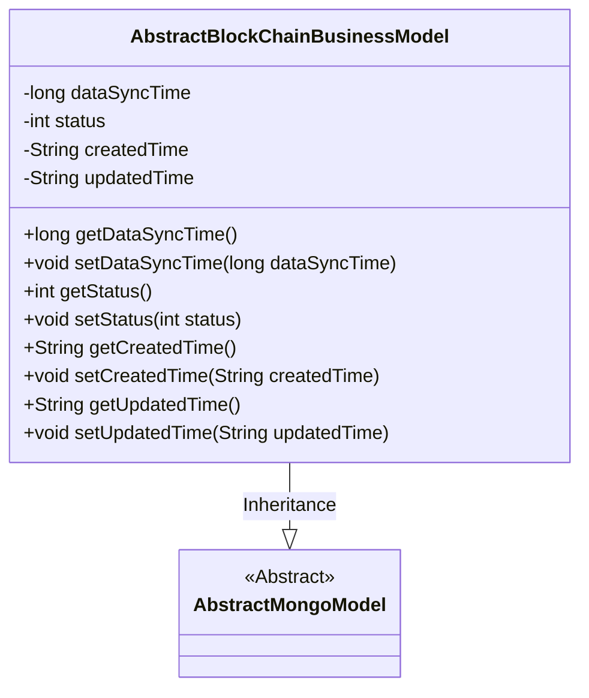

# Basic Information

|      |      |
|------|------|
| Name | AbstractBlockChainBusinessModel |
| Language | .java |
| Code Path | WeFe/common/java/common-data-mongodb/src/main/java/com/welab/wefe/common/data/mongodb/entity/base/AbstractBlockChainBusinessModel.java |
| Package Name | com.welab.wefe.common.data.mongodb.entity.base |
| Dependencies | ['java.util.Date', 'com.welab.wefe.common.util.DateUtil'] |
| Brief Description | The `AbstractBlockChainBusinessModel` class extends `AbstractMongoModel` and includes fields for data synchronization time, status, creation time, and update time, along with their corresponding getter/setter methods. |

# Description

The `AbstractBlockChainBusinessModel` class inherits from `AbstractMongoModel` and includes attributes such as data synchronization time, status flag, as well as creation and update times. The data synchronization time defaults to the current system time, while the status flag indicates whether the data is deleted (1 for deleted, 0 for not deleted). The creation and update times are represented as strings in the `YYYY_MM_DD_HH_MM_SS` format. The class provides getter and setter methods for each attribute to access and modify these fields.

# Class Summary

| Name   | Type  | Description |
|-------|------|-------------|
| AbstractBlockChainBusinessModel | class | AbstractBlockChainBusinessModel extends AbstractMongoModel, containing fields for data synchronization time, status, creation and update times along with their corresponding getter/setter methods. |

## Class AbstractBlockChainBusinessModel

|      |      |
|------|------|
| Access Modifier | public |
| Type | class |
| Name | AbstractBlockChainBusinessModel |
| Description | AbstractBlockChainBusinessModel extends AbstractMongoModel, containing fields for data synchronization time, status, creation and update times along with their corresponding getter/setter methods. |

### UML Class Diagram

This code demonstrates an abstract base class for blockchain business models, inheriting from `AbstractMongoModel`. The class contains core fields such as data synchronization time, status flag, and creation/update timestamps, with standard getter/setter methods provided for all fields. This class is primarily used to manage metadata of blockchain business data, including data state tracking and timestamp recording, providing foundational model support for concrete business implementations.

### Internal Method Call Graph

```mermaid
graph TD
    A["Class AbstractBlockChainBusinessModel"]
    B["Inherits from: AbstractMongoModel"]
    C["Property: long dataSyncTime"]
    D["Property: int status"]
    E["Property: String createdTime"]
    F["Property: String updatedTime"]
    G["Method: getDataSyncTime()"]
    H["Method: setDataSyncTime(long)"]
    I["Method: getStatus()"]
    J["Method: setStatus(int)"]
    K["Method: getCreatedTime()"]
    L["Method: setCreatedTime(String)"]
    M["Method: getUpdatedTime()"]
    N["Method: setUpdatedTime(String)"]

    A --> B
    A --> C
    A --> D
    A --> E
    A --> F
    A --> G
    A --> H
    A --> I
    A --> J
    A --> K
    A --> L
    A --> M
    A --> N
```

This code demonstrates an AbstractBlockChainBusinessModel class that inherits from AbstractMongoModel, primarily used for data management in blockchain business models. The class contains four core properties: data synchronization time (dataSyncTime), status (status), creation time (createdTime), and update time (updatedTime), each with corresponding getter and setter methods. The createdTime and updatedTime are initialized as formatted strings of the current time using the DateUtil utility class, while dataSyncTime is initialized with the current timestamp. This class provides fundamental timestamp and status management capabilities for blockchain business data.

### Field List

| Name  | Type  | Description |
|-------|-------|------|
| status | int | The private integer variable `status` is used to store state information. |
| updatedTime = DateUtil.toStringYYYY_MM_DD_HH_MM_SS2(new Date()) | String | Define a string variable `updatedTime` to store the formatted string of the current time in year, month, day, hour, minute, and second. |
| createdTime = DateUtil.toStringYYYY_MM_DD_HH_MM_SS2(new Date()) | String | Define a string variable `createdTime` to store the formatted string of the current time in year, month, day, hour, minute, and second. |
| dataSyncTime = System.currentTimeMillis() | long | Define a long integer variable dataSyncTime with an initial value of the current system time in milliseconds. |

### Method List

| Name  | Type  | Description |
|-------|-------|------|
| setStatus | void | Methods for setting status values, which assign the input parameter `status` to the `status` property of the current object. |
| getCreatedTime | String | Method to get creation time, returns the value of the createdTime variable as a string. |
| setDataSyncTime | void | The method for setting data synchronization time, with the parameter being a long integer dataSyncTime, assigns the value to the class member variable dataSyncTime. |
| getDataSyncTime | long | Method to obtain the data synchronization time, which returns a long integer value dataSyncTime. |
| getStatus | int | This is a Java method that returns the value of the integer variable status. |
| setCreatedTime | void | The method to set the creation time assigns the parameter createdTime to the object's createdTime property. |
| getUpdatedTime | String | Methods to obtain the update time, returning a string-type variable updatedTime. |
| setUpdatedTime | void | This is a Java method used to set the updatedTime property of an object, accepting a string parameter updatedTime. |

