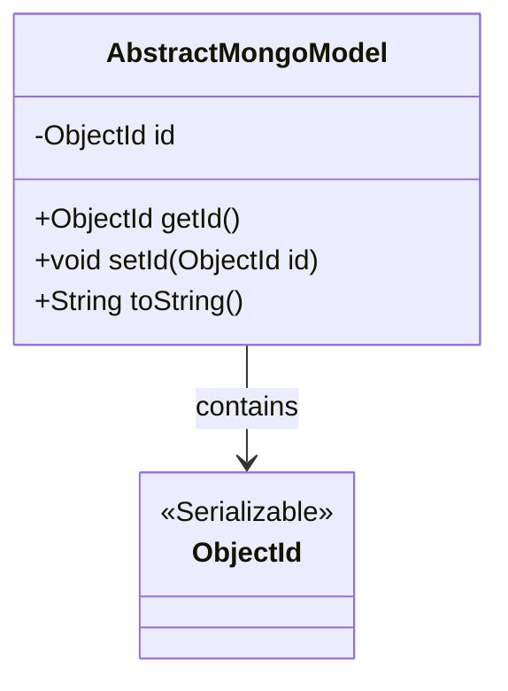
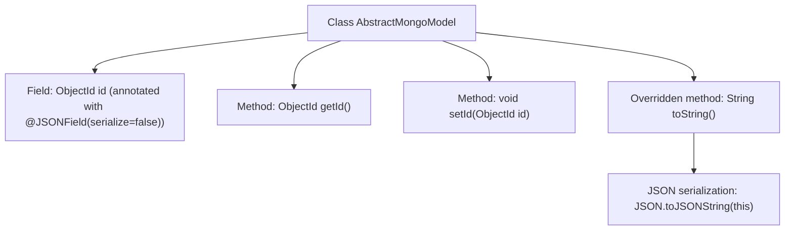

# Basic Information

|      |      |
|------|------|
| Name | AbstractMongoModel |
| Language | .java |
| Code Path | WeFe/common/java/common-data-mongodb/src/main/java/com/welab/wefe/common/data/mongodb/entity/base/AbstractMongoModel.java |
| Package Name | com.welab.wefe.common.data.mongodb.entity.base |
| Dependencies | ['com.alibaba.fastjson.JSON', 'com.alibaba.fastjson.annotation.JSONField', 'org.bson.types.ObjectId', 'java.io.Serializable'] |
| Brief Description | The AbstractMongoModel class implements the Serializable interface, contains an id field (ignored during JSON serialization), provides getter/setter methods, and the toString method returns a JSON string. |

# Description

This is an abstract MongoDB model class named AbstractMongoModel, which implements the Serializable interface to ensure serializability. The class contains a private id field of type ObjectId, marked with the @JSONField annotation to indicate it should not be serialized. It provides getId and setId methods for accessing and modifying the id field. The toString method is overridden to convert the object into a JSON string output using a JSON utility.

# Class Summary

| Name   | Type  | Description |
|-------|------|-------------|
| AbstractMongoModel | class | The AbstractMongoModel class implements the Serializable interface, contains a private ObjectId-type id field (ignored during JSON serialization), provides getter/setter methods for id, and overrides the toString method to return a JSON string. |

## Class AbstractMongoModel

|      |      |
|------|------|
| Access Modifier | public |
| Type | class |
| Name | AbstractMongoModel |
| Description | The AbstractMongoModel class implements the Serializable interface, contains a private ObjectId-type id field (ignored during JSON serialization), provides getter/setter methods for id, and overrides the toString method to return a JSON string. |

### UML Class Diagram

This class diagram describes an abstract MongoDB model class named AbstractMongoModel, which implements the Serializable interface. It contains a private ObjectId field named id, along with corresponding getter and setter methods. The toString() method outputs the object's content using JSON serialization. There is a composition relationship between AbstractMongoModel and the ObjectId class, indicating that the former relies on the latter to store MongoDB's unique identifier. The overall design reflects the fundamental characteristics of MongoDB's document model, making it suitable as a base class for other concrete model classes.

### Internal Method Call Graph

This flowchart illustrates the structure of the AbstractMongoModel class, which contains a private ObjectId-type field "id" annotated with @JSONField(serialize=false), along with corresponding getter/setter methods. Notably, the toString() method implements object serialization via JSON.toJSONString, while the id field will be excluded from serialization results due to the annotation configuration. The class design demonstrates typical handling of MongoDB document IDs while providing object string representation through JSON serialization.

### Field List

| Name  | Type  | Description |
|-------|-------|------|
| id | ObjectId | The private ObjectId type field 'id' uses the JSONField annotation to disable serialization. |

### Method List

| Name  | Type  | Description |
|-------|-------|------|
| getId | ObjectId | The method returns the id attribute of the object. |
| setId | void | Methods for setting the object ID, assigning the passed ObjectId to the id property of the current object. |
| toString | String | This method overrides toString() to return the JSON string representation of the current object. |

