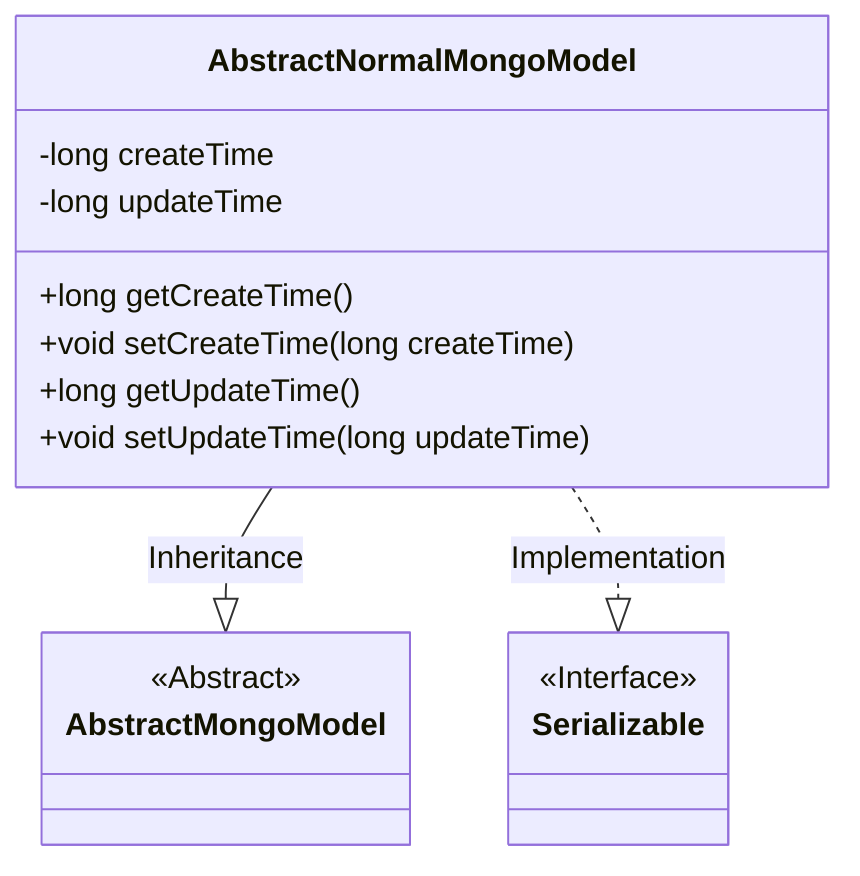
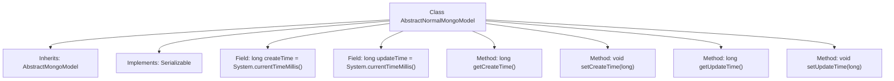

# Basic Information

|      |      |
|------|------|
| Name | AbstractNormalMongoModel |
| Language | .java |
| Code Path | WeFe/common/java/common-data-mongodb/src/main/java/com/welab/wefe/common/data/mongodb/entity/base/AbstractNormalMongoModel.java |
| Package Name | com.welab.wefe.common.data.mongodb.entity.base |
| Dependencies | ['java.io.Serializable'] |
| Brief Description | The `AbstractNormalMongoModel` class extends `AbstractMongoModel` and implements `Serializable`, containing fields for creation time and update time along with their corresponding getter and setter methods. |

# Description

This is an abstract class named AbstractNormalMongoModel, which extends AbstractMongoModel and implements the Serializable interface. The class contains two long-type properties: createTime and updateTime, both with default values set to the current system time. It provides getter and setter methods for these two properties to retrieve and set the creation time and update time.

# Class Summary

| Name   | Type  | Description |
|-------|------|-------------|
| AbstractNormalMongoModel | class | Abstract MongoDB model class, inheriting AbstractMongoModel and implementing Serializable, containing create time and update time attributes along with their getter/setter methods. |

## Class AbstractNormalMongoModel

|      |      |
|------|------|
| Access Modifier | public |
| Type | class |
| Name | AbstractNormalMongoModel |
| Description | Abstract MongoDB model class, inheriting AbstractMongoModel and implementing Serializable, containing create time and update time attributes along with their getter/setter methods. |

### UML Class Diagram

This class diagram illustrates the structure where AbstractNormalMongoModel inherits from the abstract class AbstractMongoModel and implements the Serializable interface. The class contains two private timestamp fields, createTime and updateTime, along with corresponding getter/setter methods for recording the creation and update times of MongoDB models. Through inheritance, this class acquires the foundational MongoDB capabilities from its parent class, while supporting object persistence and transmission via the serialization interface.

### Internal Method Call Graph

This code demonstrates a class named AbstractNormalMongoModel, which inherits from AbstractMongoModel and implements the Serializable interface. The class contains two long-type fields, createTime and updateTime, initialized with System.currentTimeMillis(). It provides four methods: getCreateTime and setCreateTime for accessing and modifying the createTime field, and getUpdateTime and setUpdateTime for accessing and modifying the updateTime field. This class is primarily used to record creation and update timestamps for objects in MongoDB data models.

### Field List

| Name  | Type  | Description |
|-------|-------|------|
| updateTime = System.currentTimeMillis() | long | Define a private long integer variable updateTime with an initial value of the current system time in milliseconds. |
| createTime = System.currentTimeMillis() | long | Define a long integer variable createTime with an initial value of the current system time in milliseconds. |

### Method List

| Name  | Type  | Description |
|-------|-------|------|
| getUpdateTime | long | Methods to obtain the update time, returning the value of the long integer variable updateTime. |
| setCreateTime | void | The method to set the creation time, with the parameter being a long integer timestamp. |
| getCreateTime | long | Methods to obtain the creation time, returning a long integer value createTime. |
| setUpdateTime | void | This is a Java method used to set the updateTime property of an object, accepting a long-type parameter updateTime. |

