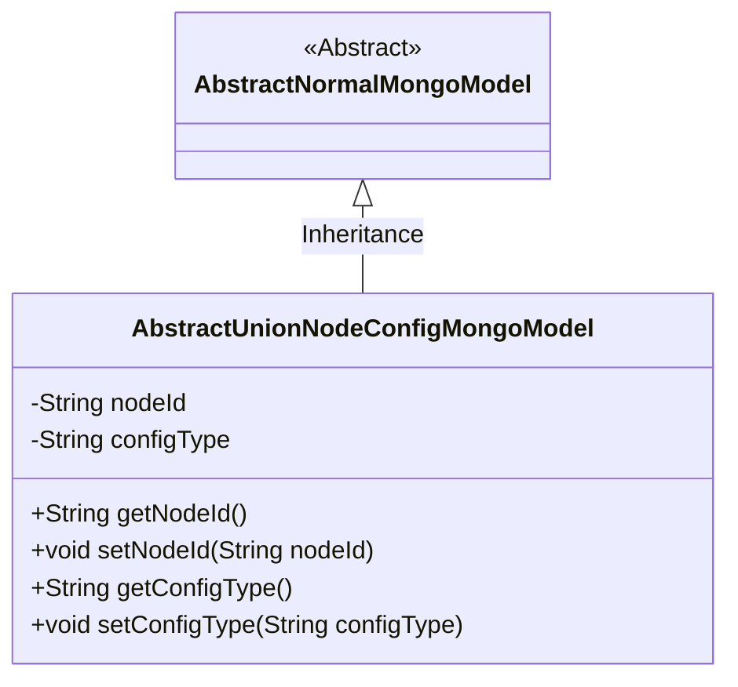
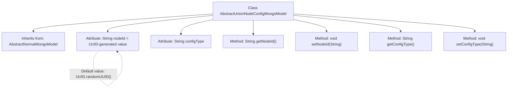

# Basic Information

|      |      |
|------|------|
| Name | AbstractUnionNodeConfigMongoModel |
| Language | .java |
| Code Path | WeFe/common/java/common-data-mongodb/src/main/java/com/welab/wefe/common/data/mongodb/entity/base/AbstractUnionNodeConfigMongoModel.java |
| Package Name | com.welab.wefe.common.data.mongodb.entity.base |
| Dependencies | ['java.util.UUID'] |
| Brief Description | AbstractUnionNodeConfigMongoModel extends AbstractNormalMongoModel, containing auto-generated nodeId and configurable configType fields along with their getter/setter methods. |

# Description

This is a Java class named AbstractUnionNodeConfigMongoModel, which extends AbstractNormalMongoModel. The class contains two main attributes: nodeId and configType. The nodeId attribute is initialized as a random UUID string with hyphens removed, and corresponding getter and setter methods are provided. The configType attribute has no initial value but also includes getter and setter methods. This class is primarily used for MongoDB data model configuration.

# Class Summary

| Name   | Type  | Description |
|-------|------|-------------|
| AbstractUnionNodeConfigMongoModel | class | Abstract MongoDB model class, containing randomly generated nodeId and configType attributes along with their getter/setter methods. |

## Class AbstractUnionNodeConfigMongoModel

|      |      |
|------|------|
| Access Modifier | public |
| Type | class |
| Name | AbstractUnionNodeConfigMongoModel |
| Description | Abstract MongoDB model class, containing randomly generated nodeId and configType attributes along with their getter/setter methods. |

### UML Class Diagram

This class diagram illustrates the inheritance relationship where AbstractUnionNodeConfigMongoModel extends the abstract class AbstractNormalMongoModel. The subclass contains two protected string attributes: nodeId (auto-generated UUID) and configType, along with corresponding getter/setter methods. The diagram clearly depicts the class hierarchy and member access control. The nodeId automatically generates a hyphen-stripped UUID value upon instantiation, while configType must be set via its setter method.

### Internal Method Call Graph

This flowchart illustrates the inheritance relationship and member structure of the AbstractUnionNodeConfigMongoModel class. The class inherits from AbstractNormalMongoModel and contains two core attributes: an auto-generated UUID-formatted nodeId and a configurable configType, along with standard getter/setter methods. The nodeId attribute is initialized with a default value generated via UUID.randomUUID() with hyphens removed, demonstrating the class's unique identifier generation capability.

### Field List

| Name  | Type  | Description |
|-------|-------|------|
| configType | String | This is a protected string variable named configType, used to store configuration type information. |
| nodeId = UUID.randomUUID().toString().replaceAll("-", "") | String | Generate a random UUID and remove hyphens, assigning it to the nodeId string variable. |

### Method List

| Name  | Type  | Description |
|-------|-------|------|
| getNodeId | String | Methods to obtain the node ID, returns the nodeId as a string type. |
| setNodeId | void | Methods for setting the node ID: Assign the parameter nodeId to the nodeId property of the current object. |
| getConfigType | String | Methods for obtaining the configuration type, returning a string variable `configType`. |
| setConfigType | void | The method setConfigType is used to set the configuration type, with the parameter being the string configType. |

