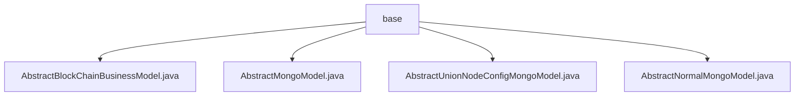

# Basic Information

|      |      |
|------|------|
| Name | base |
| Language | .java |
| Code Path | WeFe/common/java/common-data-mongodb/src/main/java/com/welab/wefe/common/data/mongodb/entity/base |
| Package Name | docs.common.java.common-data-mongodb.src.main.java.com.welab.wefe.common.data.mongodb.entity.base |
| Brief Description | AbstractBlockChainBusinessModel extends AbstractMongoModel, containing synchronization time, status flag (1 for deleted, 0 for not deleted), and creation/update time (in YYYY_MM_DD_HH_MM_SS format). AbstractMongoModel includes an ObjectId-type id field and is serializable. AbstractUnionNodeConfigMongoModel extends AbstractNormalMongoModel, containing nodeId (random UUID) and configType attributes. AbstractNormalMongoModel includes createTime and updateTime attributes, defaulting to the current time. |

# Description

## Overview  
This module provides a general-purpose data model abstraction layer based on MongoDB, with its core responsibilities being the definition of storage specifications for blockchain business data and a time-tracking mechanism. The interface specifications include serialization support (e.g., implementing the `Serializable` interface) and standard field access (via getter/setter methods). Key data structures include the `ObjectId` primary key of `AbstractMongoModel`, the timestamp fields of `AbstractNormalMongoModel`, and the status identifier of `AbstractBlockChainBusinessModel`. The only external dependency required is the MongoDB driver. For example, `AbstractUnionNodeConfigMongoModel` uses UUID to generate node IDs.  

## Primary Business Scenarios  
The module supports distributed node configuration management (similar to a registry pattern) and blockchain business data persistence. Business processes revolve around the model inheritance hierarchy: base model → time-tracking model → business model. Interaction patterns are implemented through JSON serialization (e.g., overriding the `toString` method) and standard field operations. Typical applications include node registration (e.g., `nodeId` initialization) and data state maintenance (e.g., soft-delete flags). The API types are uniformly encapsulated as basic CRUD operations.

### Package Internal Structure View

This flowchart illustrates the hierarchical relationship of four Java class files under the base directory, where all class files are directly subordinate to the base node without any intermediate nested structure. These class files are abstract model classes, including core data persistence components such as blockchain business models, Mongo base models, union node configuration models, and normal models.

# File List

| Name   | Type  | Description |
|-------|------|-------------|
| [AbstractBlockChainBusinessModel.java](AbstractBlockChainBusinessModel.md) | file | The `AbstractBlockChainBusinessModel` class inherits from `AbstractMongoModel` and includes fields for data synchronization time, status, creation time, and update time, along with their corresponding getter/setter methods. |
| [AbstractMongoModel.java](AbstractMongoModel.md) | file | The AbstractMongoModel class implements the Serializable interface, contains an id field (ignored during JSON serialization), provides getter/setter methods, and the toString method returns a JSON string. |
| [AbstractUnionNodeConfigMongoModel.java](AbstractUnionNodeConfigMongoModel.md) | file | AbstractUnionNodeConfigMongoModel extends AbstractNormalMongoModel, containing auto-generated nodeId and configurable configType fields along with their getter/setter methods. |
| [AbstractNormalMongoModel.java](AbstractNormalMongoModel.md) | file | The `AbstractNormalMongoModel` class extends `AbstractMongoModel` and implements `Serializable`, containing fields for creation time and update time along with their corresponding getter and setter methods. |

