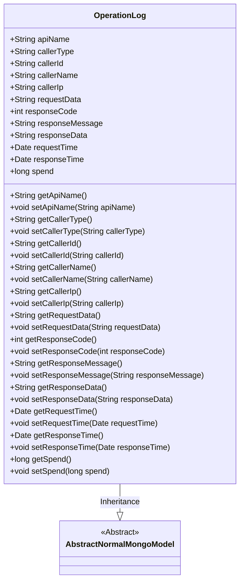

# Basic Information

|      |      |
|------|------|
| Name | OperationLog |
| Language | .java |
| Code Path | WeFe/common/java/common-data-mongodb/src/main/java/com/welab/wefe/common/data/mongodb/entity/common/OperationLog.java |
| Package Name | com.welab.wefe.common.data.mongodb.entity.common |
| Dependencies | ['com.welab.wefe.common.data.mongodb.constant.MongodbTable', 'com.welab.wefe.common.data.mongodb.entity.base.AbstractNormalMongoModel', 'org.springframework.data.mongodb.core.mapping.Document', 'java.util.Date'] |
| Brief Description | Operation log class, which records API interface call information, including request, response, caller, and time consumption data. |

# Description

The OperationLog class is a MongoDB document model designed for recording API operation logs. It includes the requested interface name, caller type, ID, name, and IP address, as well as request parameters. It also logs the response status code, message, and content, while storing the request time, response time, and processing duration. This class provides getter and setter methods for all fields to facilitate data access and manipulation.

# Class Summary

| Name   | Type  | Description |
|-------|------|-------------|
| OperationLog | class | The OperationLog class records API operation logs, containing fields such as interface name, caller information, request/response data, and time consumption. |

## Class OperationLog

|      |      |
|------|------|
| Access Modifier | @Document(collection = MongodbTable.Common.OPERATION_LOG);;public |
| Type | class |
| Name | OperationLog |
| Description | The OperationLog class records API operation logs, containing fields such as interface name, caller information, request/response data, and time consumption. |

### UML Class Diagram

This code defines a class named OperationLog for recording operation log information, which inherits from the abstract class AbstractNormalMongoModel. The class contains multiple public fields and methods for storing and manipulating various API call-related information, such as request interface name, caller information, request parameters, response data, timestamps, etc. The getter and setter methods allow read and write operations on these fields. The class is marked as a MongoDB document collection, indicating that its instances will be persisted in a MongoDB database.

### Internal Method Call Graph

```mermaid
graph TD
    A["Class OperationLog"]
    B["Inherits: AbstractNormalMongoModel"]
    C["Annotation: @Document(collection=MongodbTable.Common.OPERATION_LOG)"]
    D["Property: String apiName"]
    E["Property: String callerType"]
    F["Property: String callerId"]
    G["Property: String callerName"]
    H["Property: String callerIp"]
    I["Property: String requestData"]
    J["Property: int responseCode"]
    K["Property: String responseMessage"]
    L["Property: String responseData"]
    M["Property: Date requestTime"]
    N["Property: Date responseTime"]
    O["Property: long spend"]
    P["Getter/Setter Methods"]

    A --> B
    A --> C
    A --> D
    A --> E
    A --> F
    A --> G
    A --> H
    A --> I
    A --> J
    A --> K
    A --> L
    A --> M
    A --> N
    A --> O
    A --> P
```

This flowchart illustrates the complete structure of the OperationLog class, which inherits from AbstractNormalMongoModel and is annotated as a MongoDB document. The diagram includes 14 core properties that encompass comprehensive API call logging information (such as interface name, caller details, request/response data, and time consumption metrics), along with corresponding Getter/Setter methods. All properties utilize fundamental types like String, int, and Date, fully mapping the data storage requirements for API call logs.

### Field List

| Name  | Type  | Description |
|-------|-------|------|
| callerId | String | Defined a public string variable callerId. |
| responseTime | Date | Response time variable, of type Date. |
| requestData | String | Declare a public string variable named requestData. |
| callerIp | String | Declare a public string variable callerIp to store the caller's IP address. |
| apiName | String | Define a variable for API name with string type. |
| requestTime | Date | The class member variable `requestTime`, of type `Date`, represents the request time. |
| responseData | String | Declare a public string variable responseData. |
| responseMessage | String | Declare a public string variable responseMessage. |
| callerName | String | The public string variable `callerName` is used to store the caller's name. |
| responseCode | int | Define an integer variable responseCode to store the response code. |
| callerType | String | Define a string type variable named callerType. |
| spend | long | The variable `spend`, of type long integer, represents the expenditure amount. |

### Method List

| Name  | Type  | Description |
|-------|-------|------|
| setResponseMessage | void | Methods for setting the response message, assigning the input string to the `responseMessage` member variable of the class. |
| setApiName | void | The method for setting the API name assigns the passed apiName to the apiName property of the current object. |
| getSpend | long | Public method to get the spend value, returns a long type. |
| getResponseMessage | String | Methods to obtain the response message, returns the responseMessage of string type. |
| getResponseTime | Date | Methods to obtain the response time, returning a Date type value. |
| setCallerType | void | The method for setting the caller type assigns the parameter `callerType` to the property of the same name in the current object. |
| setRequestTime | void | The method to set the request time assigns the passed Date object to the `requestTime` property of the class. |
| setCallerIp | void | Methods for setting the caller's IP address. |
| getRequestData | String | Methods to obtain request data, returns requestData of string type. |
| getCallerType | String | Methods to obtain the caller type, returning a string `callerType`. |
| getApiName | String | Methods to obtain the API name, returning a string-type apiName. |
| setResponseTime | void | The method to set the response time assigns the incoming Date object to the responseTime property of the class. |
| setResponseData | void | The method to set the response data assigns the passed string to the `responseData` member variable of the class. |
| getCallerIp | String | Methods to obtain the caller's IP address, returning the value of the callerIp variable as a string. |
| getRequestTime | Date | Methods to obtain the request time, returning the requestTime of Date type. |
| getResponseData | String | Methods to obtain response data, returning a string-type variable responseData. |
| setCallerId | void | The method to set the caller ID assigns the parameter callerId to the callerId property of the current object. |
| setRequestData | void | Java method: Set request data string. Assigns the input parameter requestData to the class member variable of the same name. |
| setResponseCode | void | Methods for setting HTTP response status codes, assigning the incoming integer value to the class's responseCode member variable. |
| setCallerName | void | Methods for setting the caller name, assigning the parameter callerName to the class member variable callerName. |
| getResponseCode | int | This method returns an integer response code. |
| getCallerId | String | The method returns the caller ID string. |
| getCallerName | String | Methods to obtain the caller name, returning the value of the callerName variable as a string type. |
| setSpend | void | The method to set the spending amount assigns the parameter `spend` to the class member variable `spend`. |

