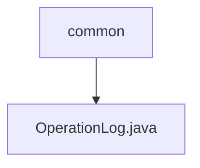

# Basic Information

|      |      |
|------|------|
| Name | common |
| Language | .java |
| Code Path | WeFe/common/java/common-data-mongodb/src/main/java/com/welab/wefe/common/data/mongodb/entity/common |
| Package Name | docs.common.java.common-data-mongodb.src.main.java.com.welab.wefe.common.data.mongodb.entity.common |
| Brief Description | Operation log class, recording API interface call information, including request, response, caller, and time consumption data. |

# Description

The `OperationLog` class is a MongoDB document model designed for recording API operation logs. It includes the requested interface name, caller type, ID, name, and IP address, as well as request parameters. It also logs the response status code, message, and content, while storing the request time, response time, and duration. This class provides getter and setter methods for all fields to facilitate data access.

### Package Internal Structure View

Flowchart description: This structure illustrates a simple hierarchical relationship where the common directory contains an OperationLog.java file. This is a typical data storage layer structure used for storing MongoDB entity classes, with OperationLog.java likely serving to record system operation logs.

# File List

| Name   | Type  | Description |
|-------|------|-------------|
| [OperationLog.java](OperationLog.md) | file | Operation log class, which records API interface call information, including request, response, caller, and time consumption data. |

