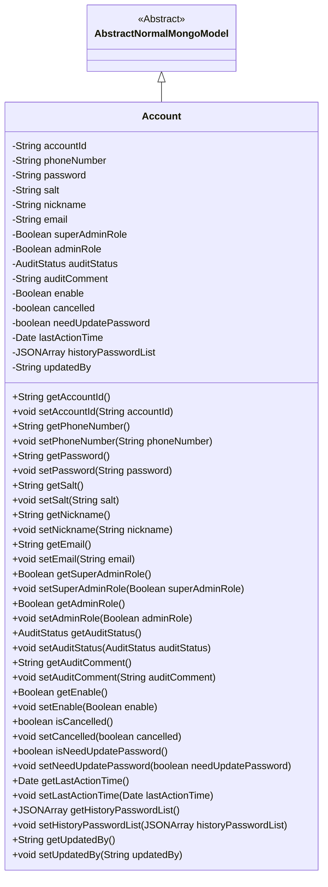

# Basic Information

|      |      |
|------|------|
| Name | Account |
| Language | .java |
| Code Path | WeFe/common/java/common-data-mongodb/src/main/java/com/welab/wefe/common/data/mongodb/entity/manager/Account.java |
| Package Name | com.welab.wefe.common.data.mongodb.entity.manager |
| Dependencies | ['com.alibaba.fastjson.JSONArray', 'com.welab.wefe.common.data.mongodb.constant.MongodbTable', 'com.welab.wefe.common.data.mongodb.entity.base.AbstractNormalMongoModel', 'com.welab.wefe.common.wefe.enums.AuditStatus', 'org.springframework.data.mongodb.core.mapping.Document', 'javax.persistence.EnumType', 'javax.persistence.Enumerated', 'java.util.Date', 'java.util.UUID'] |
| Brief Description | MongoDB account class, including ID, phone number, password, salt, nickname, email, administrator role, review status, availability, cancellation status, password update requirement, last activity time, historical passwords, and updater information. |

# Description

This is a MongoDB account entity class, containing basic information such as account ID, phone number, password, salt value, nickname, and email. It also records administrator roles, review status, availability status, cancellation status, password update requirements, last activity time, historical password list, and updater information. It provides getter and setter methods for all fields.

# Class Summary

| Name   | Type  | Description |
|-------|------|-------------|
| Account | class | MongoDB Account Class, including ID, mobile number, password, salt, nickname, email, administrator role, review status, availability, deactivation status, password update flag, last activity time, historical passwords, and updater information. |

## Class Account

|      |      |
|------|------|
| Access Modifier | @Document(collection = MongodbTable.ACCOUNT);public |
| Type | class |
| Name | Account |
| Description | MongoDB Account Class, including ID, mobile number, password, salt, nickname, email, administrator role, review status, availability, deactivation status, password update flag, last activity time, historical passwords, and updater information. |

### UML Class Diagram

Class Diagram Description: The Account class inherits from the AbstractNormalMongoModel abstract class, representing the account document structure in MongoDB. It includes basic information such as account ID, phone number, password, salt value, nickname, and email, as well as business fields like administrator role flags, audit status, and account status. All fields are private attributes accessed through public getter/setter methods, complying with JavaBean specifications. The class is associated with a MongoDB collection through the @Document annotation, reflecting ORM mapping relationships.

### Internal Method Call Graph

```mermaid
graph TD
    A["Class Account"]
    B["Inherits: AbstractNormalMongoModel"]
    C["Annotation: @Document(collection=MongodbTable.ACCOUNT)"]
    D["Property: String accountId"]
    E["Property: String phoneNumber"]
    F["Property: String password"]
    G["Property: String salt"]
    H["Property: String nickname"]
    I["Property: String email"]
    J["Property: Boolean superAdminRole"]
    K["Property: Boolean adminRole"]
    L["Property: AuditStatus auditStatus"]
    M["Property: String auditComment"]
    N["Property: Boolean enable"]
    O["Property: boolean cancelled"]
    P["Property: boolean needUpdatePassword"]
    Q["Property: Date lastActionTime"]
    R["Property: JSONArray historyPasswordList"]
    S["Property: String updatedBy"]
    T["Method: getAccountId/setAccountId"]
    U["Method: getPhoneNumber/setPhoneNumber"]
    V["Method: getPassword/setPassword"]
    W["Method: getSalt/setSalt"]
    X["Method: getNickname/setNickname"]
    Y["Method: getEmail/setEmail"]
    Z["Method: getSuperAdminRole/setSuperAdminRole"]
    AA["Method: getAdminRole/setAdminRole"]
    AB["Method: getAuditStatus/setAuditStatus"]
    AC["Method: getAuditComment/setAuditComment"]
    AD["Method: getEnable/setEnable"]
    AE["Method: isCancelled/setCancelled"]
    AF["Method: isNeedUpdatePassword/setNeedUpdatePassword"]
    AG["Method: getLastActionTime/setLastActionTime"]
    AH["Method: getHistoryPasswordList/setHistoryPasswordList"]
    AI["Method: getUpdatedBy/setUpdatedBy"]

    A --> B
    A --> C
    A --> D
    A --> E
    A --> F
    A --> G
    A --> H
    A --> I
    A --> J
    A --> K
    A --> L
    A --> M
    A --> N
    A --> O
    A --> P
    A --> Q
    A --> R
    A --> S
    A --> T
    A --> U
    A --> V
    A --> W
    A --> X
    A --> Y
    A --> Z
    A --> AA
    A --> AB
    A --> AC
    A --> AD
    A --> AE
    A --> AF
    A --> AG
    A --> AH
    A --> AI
```

This code defines a MongoDB Account entity class that inherits from AbstractNormalMongoModel, containing basic attributes such as account ID, phone number, password, salt value, nickname, and email, as well as business attributes like administrator roles, audit status, and account status. Each attribute has corresponding getter and setter methods for data access operations. The class specifies the corresponding MongoDB collection name through the @Document annotation.

### Field List

| Name  | Type  | Description |
|-------|-------|------|
| email | String | Private string type variable email |
| auditComment | String | Private string type variable used to store review comments. |
| accountId = UUID.randomUUID().toString().replaceAll("-", "") | String | Generate a random UUID without hyphens as the account ID. |
| cancelled | boolean | The boolean variable `cancelled` indicates whether it has been canceled. |
| updatedBy | String | The field updatedBy records the information of the last updater. |
| auditStatus | AuditStatus | The enumeration type field auditStatus is stored in string format. |
| needUpdatePassword | boolean | The boolean variable needUpdatePassword indicates whether a password update is required. |
| phoneNumber | String | Define a private string variable phoneNumber. |
| enable | Boolean | The boolean variable `enable` is used to control the state of a feature switch. |
| nickname | String | Declare a private string variable nickname. |
| salt | String | Declare a private string variable salt. |
| adminRole | Boolean | Private boolean variable indicating whether it is an administrator role. |
| historyPasswordList | JSONArray | Private JSON array stores a list of historical passwords. |
| lastActionTime | Date | Private member variable, recording the time of the last operation, of type Date. |
| superAdminRole | Boolean | Private boolean variable indicating whether it is a super administrator role. |
| password | String | Private string type password variable. |

### Method List

| Name  | Type  | Description |
|-------|-------|------|
| getPhoneNumber | String | Methods to obtain the phone number, returns a string phoneNumber. |
| setEnable | void | Public method for setting the enabled state, with a boolean parameter 'enable' to update the current object's enable property. |
| getPassword | String | Method to obtain the password, returns a string-type password value. |
| getLastActionTime | Date | Get the date object of the last operation time. |
| setPassword | void | Method for setting password: Assign the input string to the class member variable password. |
| setNeedUpdatePassword | void | Method for setting the password update flag, where the parameter determines whether a password update is required. |
| getSalt | String | Public method to obtain the salt value. |
| setAuditStatus | void | The method to set the audit status assigns the passed `auditStatus` to the `auditStatus` property of the current object. |
| isCancelled | boolean | Check if the task has been canceled and return the boolean state of `cancelled`. |
| isNeedUpdatePassword | boolean | This method returns a boolean value indicating whether a password update is required. |
| setNickname | void | The method to set a user nickname assigns the input parameter to the nickname property of the object. |
| getAccountId | String | Public method to obtain the accountId, returns the accountId as a string. |
| getAuditComment | String | Method to obtain audit comments, returns the auditComment string. |
| setEmail | void | This is a Java method used to set the email property of an object. The method takes a string parameter email and assigns it to the email field of the current object. |
| setLastActionTime | void | Set the last operation time of the object to the specified date. |
| getEmail | String | Methods to obtain the email string. |
| getHistoryPasswordList | JSONArray | This is a Java method that returns a JSONArray object named historyPasswordList. |
| setHistoryPasswordList | void | Method to set historical password list, with parameters as a JSON array. |
| getUpdatedBy | String | The method getUpdatedBy returns the value of the updatedBy field. |
| setUpdatedBy | void | Set the updater method with the parameter string updatedBy, and assign it to the member variable updatedBy. |
| setCancelled | void | Public method to set the cancellation status, with a boolean parameter `cancelled` for updating the internal state. |
| getAuditStatus | AuditStatus | Methods to obtain the audit status, returning the value of the auditStatus variable. |
| setSalt | void | The method setSalt is used to set a string-type salt value. |
| getAdminRole | Boolean | This method returns a boolean value indicating whether the administrator role is present. |
| setAdminRole | void | The method to set the administrator role, which accepts a boolean parameter and assigns it to the member variable adminRole. |
| setSuperAdminRole | void | Method to set whether a user is a super administrator role. |
| setAuditComment | void | This is a Java method used to set the value of the auditComment property. The method accepts a string parameter named auditComment and assigns it to the class member variable of the same name. |
| getNickname | String | Methods to obtain the nickname, returning a string-type variable `nickname`. |
| setAccountId | void | The method to set the account ID involves assigning the parameter accountId to the accountId property of the current object. |
| getEnable | Boolean | This is a Java method that returns the boolean value of the enable variable. |
| setPhoneNumber | void | This is a Java method used to set the phone number attribute in a class. The method takes a string parameter phoneNumber and assigns it to the member variable of the class. |
| getSuperAdminRole | Boolean | Methods to obtain the super administrator role status, returns a boolean value. |

