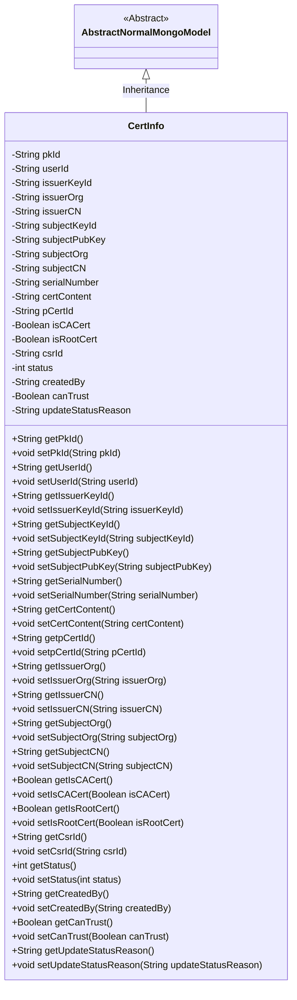

# Basic Information

|      |      |
|------|------|
| Name | CertInfo |
| Language | .java |
| Code Path | WeFe/common/java/common-data-mongodb/src/main/java/com/welab/wefe/common/data/mongodb/entity/manager/CertInfo.java |
| Package Name | com.welab.wefe.common.data.mongodb.entity.manager |
| Dependencies | ['java.util.UUID', 'javax.persistence.Column', 'org.springframework.data.mongodb.core.mapping.Document', 'com.welab.wefe.common.data.mongodb.constant.MongodbTable', 'com.welab.wefe.common.data.mongodb.entity.base.AbstractNormalMongoModel'] |
| Brief Description | The CertInfo class is used to store certificate information, including fields such as primary key ID, user ID, issuer and applicant details, certificate content, status, etc., and supports MongoDB storage. |

# Description

The CertInfo class is a MongoDB document model designed to store certificate information. It includes fields such as the primary key ID, user ID, issuer's private key ID and organization information, applicant's private key ID and public key content along with organization details, certificate serial number, certificate content, parent certificate ID, flags indicating whether it is a CA or root certificate, certificate request ID, status, creator, trust flag, and reason for status updates. All fields have corresponding getter and setter methods.

# Class Summary

| Name   | Type  | Description |
|-------|------|-------------|
| CertInfo | class | The CertInfo class stores certificate information, including fields such as user ID, issuing authority, applicant, certificate content, and status, and is used for MongoDB database operations. |

## Class CertInfo

|      |      |
|------|------|
| Access Modifier | @Document(collection = MongodbTable.CERT_INFO);public |
| Type | class |
| Name | CertInfo |
| Description | The CertInfo class stores certificate information, including fields such as user ID, issuing authority, applicant, certificate content, and status, and is used for MongoDB database operations. |

### UML Class Diagram

### Internal Method Call Graph

This flowchart illustrates the complete structure of the CertInfo class, including its inheritance relationship, class annotation, 22 attributes, and corresponding getter/setter methods. As a MongoDB document model, it is associated with the CERT_INFO collection via the @Document annotation and inherits the basic functionality of AbstractNormalMongoModel. The attributes cover core certificate information (such as issuer, applicant, serial number), status control fields (e.g., status, canTrust), and metadata (e.g., creator, update time). All attributes are equipped with standard accessor methods, forming a complete POJO structure.

### Field List

| Name  | Type  | Description |
|-------|-------|------|
| issuerCN | String | The private string variable issuerCN is used to store the issuer common name. |
| issuerKeyId | String | The private string variable issuerKeyId is used to store the issuer key identifier. |
| subjectKeyId | String | Private string variable, storing the topic key identifier. |
| serialVersionUID = 2536000530329139954L | long | Defined a private static final long serialVersionUID 2536000530329139954L. |
| isCACert | Boolean | Database field mapping: isCACert corresponds to the table column is_ca_cert, boolean type. |
| subjectPubKey | String | Declare a private string variable subjectPubKey. |
| issuerOrg | String | Declare a private string variable issuerOrg to store issuer organization information. |
| certContent | String | The private string variable certContent is used to store certificate content. |
| createdBy | String | Private string variable, records creator information. |
| isRootCert | Boolean | This field indicates whether it is a root certificate, boolean type. |
| status | int | The private integer variable `status` is used to represent the state. |
| subjectCN | String | Private string variable storing the Chinese name of the topic. |
| pkId = UUID.randomUUID().toString().replaceAll("-", "") | String | Generate a random UUID and remove the hyphens to use as a unique ID. |
| updateStatusReason | String | Database field mapping: update_status_reason, type as string. |
| subjectOrg | String | Declare a private string variable subjectOrg. |
| userId | String | Declare a private string variable userId. |
| canTrust | Boolean | Private boolean variable indicating whether it is trusted. |
| serialNumber | String | private string variable serialNumber |
| pCertId | String | The private string variable pCertId is used to store the certificate ID. |
| csrId | String | The private string variable csrId is used to store the CSR identifier. |

### Method List

| Name  | Type  | Description |
|-------|-------|------|
| getCreatedBy | String | Methods to obtain creator information, returning a string-type variable createdBy. |
| getStatus | int | The method returns a status value, status. |
| getSubjectOrg | String | Methods to obtain the subjectOrg string. |
| setSubjectKeyId | void | The method to set the subject key ID assigns the input string to the class member variable `subjectKeyId`. |
| getUserId | String | Methods to obtain the user ID, returning a string-type userId. |
| setSubjectCN | void | The method for setting the common name of the subject, with the parameter being of string type, assigns the value to the member variable subjectCN of the class. |
| getSerialNumber | String | The method to obtain the serial number, returns a string-type serialNumber. |
| setCreatedBy | void | This is a Java method used to set the value of the createdBy property. The method takes a string parameter named createdBy and assigns it to the property of the same name in the current object. |
| getIsRootCert | Boolean | Methods to obtain the root certificate status, returning a boolean value `isRootCert`. |
| setStatus | void | Methods for setting status values, assigning the input parameter `status` to the `status` property of the object. |
| getIssuerCN | String | Method to obtain the issuer's common name, returns a string issuerCN. |
| setPkId | void | Methods for setting the primary key ID: Assign the parameter pkId to the class's pkId property. |
| getSubjectCN | String | Get the string value of topic CN. |
| setUserId | void | Methods for setting the user ID: Assign the input string to the userId member variable of the class. |
| setIsRootCert | void | Method to set the root certificate status, with a boolean parameter. |
| setIssuerKeyId | void | The method to set the issuer key ID assigns the input string to the class member variable `issuerKeyId`. |
| getIssuerKeyId | String | Method to obtain the issuer key ID, returns a string issuerKeyId. |
| getPkId | String | Methods to obtain the primary key ID, returns the value of the pkId field. |
| getCsrId | String | Common methods for obtaining csrId. |
| getSubjectPubKey | String | Methods to obtain the topic public key, returns a string type. |
| setIssuerOrg | void | The method for setting the name of the issuing authority assigns the parameter `issuerOrg` to the property of the same name in the current object. |
| setSerialNumber | void | This is a Java method used to set the serial number property of an object. The method takes a string parameter serialNumber and assigns it to the serialNumber member variable of the object. |
| setSubjectOrg | void | The method to set the subject organization assigns the input string to the `subjectOrg` member variable of the class. |
| setpCertId | void | This is a Java method used to set the value of the pCertId property of an object. The method takes a string parameter pCertId and assigns it to the member variable of the same name in the current object. |
| setCertContent | void | The method to set the certificate content assigns the input string to the class member variable certContent. |
| setCsrId | void | Method to set CSR ID: Assign the input parameter csrId to the csrId field of the current object. |
| getCertContent | String | The method returns the certificate content string. |
| getSubjectKeyId | String | Methods to obtain the subject key ID, returning a string-type subjectKeyId. |
| getIsCACert | Boolean | This is a Java method that returns a boolean value isCACert, indicating whether it is a CA certificate. |
| getCanTrust | Boolean | The method returns a boolean value canTrust, indicating whether it is trustworthy. |
| setCanTrust | void | This is a Java method used to set the boolean value of the canTrust property. |
| getUpdateStatusReason | String | Method to obtain the update status reason, returns a string-type updateStatusReason. |
| setUpdateStatusReason | void | The method for setting the update status reason assigns the input parameter to the class member variable `updateStatusReason`. |
| setSubjectPubKey | void | The method to set the subject public key assigns the input string to the subjectPubKey member variable of the class. |
| setIssuerCN | void | The method to set the issuer common name assigns the parameter issuerCN to the class member variable issuerCN. |
| setIsCACert | void | Method to set whether the certificate is a CA certificate, with a boolean parameter. |
| getIssuerOrg | String | This is a Java method that returns the value of a string variable named issuerOrg. |
| getpCertId | String | The method returns a pCertId value of string type. |

