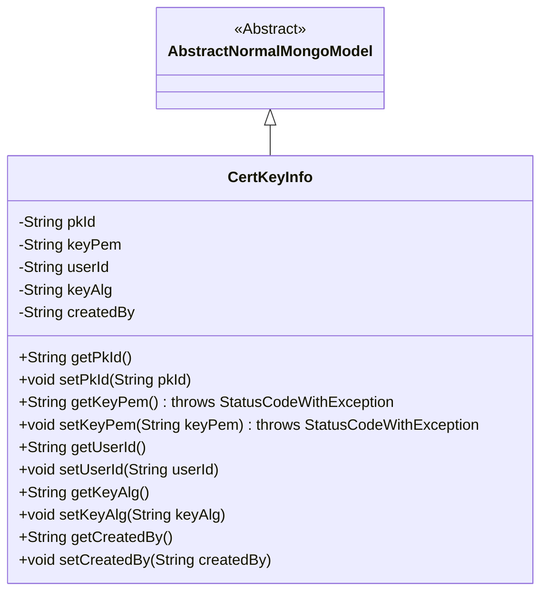

# Basic Information

|      |      |
|------|------|
| Name | CertKeyInfo |
| Language | .java |
| Code Path | WeFe/common/java/common-data-mongodb/src/main/java/com/welab/wefe/common/data/mongodb/entity/manager/CertKeyInfo.java |
| Package Name | com.welab.wefe.common.data.mongodb.entity.manager |
| Dependencies | ['java.util.UUID', 'org.springframework.data.mongodb.core.mapping.Document', 'com.welab.wefe.common.data.mongodb.constant.MongodbTable', 'com.welab.wefe.common.data.mongodb.entity.base.AbstractNormalMongoModel', 'com.welab.wefe.common.exception.StatusCodeWithException'] |
| Brief Description | The CertKeyInfo class stores MongoDB certificate key information, including the primary key ID, private key PEM, user ID, private key algorithm, and creator fields, and provides getter and setter methods for each attribute. |

# Description

This is a MongoDB document class named CertKeyInfo, used for storing certificate key information. The class contains five main fields: pkId serves as the primary key, generated using UUID with hyphens removed; keyPem stores the private key content in PEM format; userId associates with the user identifier; keyAlg records the private key algorithm; createdBy records the creator information. All fields provide standard getter and setter methods, with the read/write operations of keyPem potentially throwing a StatusCodeWithException. This class inherits from AbstractNormalMongoModel and is annotated to be stored in the MongodbTable.CERT_KEY_INFO collection.

# Class Summary

| Name   | Type  | Description |
|-------|------|-------------|
| CertKeyInfo | class | The CertKeyInfo class stores MongoDB certificate key information, including primary key ID, private key PEM, user ID, algorithm, creator fields, and their corresponding getter/setter methods. |

## Class CertKeyInfo

|      |      |
|------|------|
| Access Modifier | @Document(collection = MongodbTable.CERT_KEY_INFO);public |
| Type | class |
| Name | CertKeyInfo |
| Description | The CertKeyInfo class stores MongoDB certificate key information, including primary key ID, private key PEM, user ID, algorithm, creator fields, and their corresponding getter/setter methods. |

### UML Class Diagram

This class diagram illustrates that the CertKeyInfo class inherits from the AbstractNormalMongoModel abstract class, representing a MongoDB document model. CertKeyInfo contains five private fields: pkId (primary key), keyPem (private key content), userId (user ID), keyAlg (private key algorithm), and createdBy (creator), with getter and setter methods provided for each field. The getter and setter methods for the keyPem field may throw a StatusCodeWithException. By inheriting, this class acquires the basic functionality of a MongoDB model, designed for storing certificate key-related information.

### Internal Method Call Graph

```mermaid
graph TD
    A["Class CertKeyInfo"]
    B["Inherits: AbstractNormalMongoModel"]
    C["Property: String pkId"]
    D["Property: String keyPem"]
    E["Property: String userId"]
    F["Property: String keyAlg"]
    G["Property: String createdBy"]
    H["Method: getPkId()"]
    I["Method: setPkId(String pkId)"]
    J["Method: getKeyPem()"]
    K["Method: setKeyPem(String keyPem)"]
    L["Method: getUserId()"]
    M["Method: setUserId(String userId)"]
    N["Method: getKeyAlg()"]
    O["Method: setKeyAlg(String keyAlg)"]
    P["Method: getCreatedBy()"]
    Q["Method: setCreatedBy(String createdBy)"]

    A --> B
    A --> C
    A --> D
    A --> E
    A --> F
    A --> G
    A --> H
    A --> I
    A --> J
    A --> K
    A --> L
    A --> M
    A --> N
    A --> O
    A --> P
    A --> Q
```

This flowchart illustrates the structure of the CertKeyInfo class, which inherits from AbstractNormalMongoModel and contains 5 private properties along with their corresponding getter/setter methods. The pkId property is initialized using a UUID and formatted, while the keyPem and setKeyPem methods may throw a StatusCodeWithException. The overall structure is clear, reflecting the basic characteristics of a MongoDB document model, with properties designed to store certificate and key-related information.

### Field List

| Name  | Type  | Description |
|-------|-------|------|
| userId | String | Declare a private string variable userId. |
| createdBy | String | Private string variable, recording creator information. |
| keyPem | String | The private string variable keyPem is used to store the key in PEM format. |
| keyAlg | String | Private string variable storing the key algorithm type. |
| pkId = UUID.randomUUID().toString().replaceAll("-", "") | String | Generate a random UUID as the primary key ID and remove the hyphens. |
| serialVersionUID = -7731011364389900165L | long | Declare a private static final serial version UID with the value -7731011364389900165L. |

### Method List

| Name  | Type  | Description |
|-------|-------|------|
| getUserId | String | Methods to obtain the user ID, returning a string-type userId. |
| getPkId | String | Methods to obtain the primary key ID, returning a pkId string. |
| setKeyPem | void | Set the key PEM string, which may throw a StatusCodeWithException. |
| getKeyPem | String | Get the key PEM string, may throw a StatusCodeWithException. |
| setKeyAlg | void | Define the method `setKeyAlg` to set the value of the member variable `keyAlg`. |
| getCreatedBy | String | This is a Java method that returns the string-type value of the createdBy field. |
| setCreatedBy | void | Java Method: Set Creator Field Value. |
| getKeyAlg | String | String method for obtaining the key algorithm, returns the value of the keyAlg variable. |
| setUserId | void | The method to set the user ID assigns the parameter userId to the userId property of the current object. |
| setPkId | void | Methods for setting the primary key ID, assigning the parameter pkId to the class's pkId property. |

