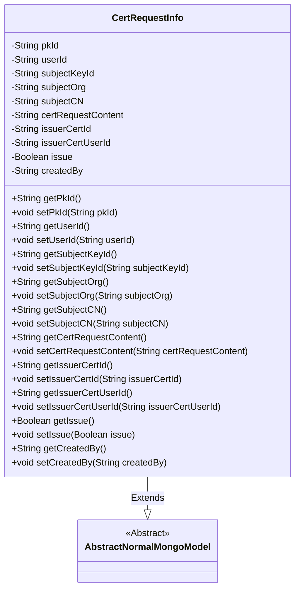

# Basic Information

|      |      |
|------|------|
| Name | CertRequestInfo |
| Language | .java |
| Code Path | WeFe/common/java/common-data-mongodb/src/main/java/com/welab/wefe/common/data/mongodb/entity/manager/CertRequestInfo.java |
| Package Name | com.welab.wefe.common.data.mongodb.entity.manager |
| Dependencies | ['java.util.UUID', 'org.springframework.data.mongodb.core.mapping.Document', 'com.welab.wefe.common.data.mongodb.constant.MongodbTable', 'com.welab.wefe.common.data.mongodb.entity.base.AbstractNormalMongoModel'] |
| Brief Description | The CertRequestInfo class is used to store certificate request information, including fields such as user ID, private key ID, organization name, common name, request content, issuer certificate ID, issuance status, and creator. |

# Description

The CertRequestInfo class is a MongoDB document model used for storing certificate request information. It inherits from AbstractNormalMongoModel and includes fields such as primary key ID, user ID, applicant private key ID, organization name, common name, certificate request content, issuing authority certificate ID and user ID, issuance flag, and creator. All fields are provided with getter and setter methods, and the primary key ID defaults to a UUID string without hyphens.

# Class Summary

| Name   | Type  | Description |
|-------|------|-------------|
| CertRequestInfo | class | The CertRequestInfo class stores certificate request information, including fields such as user ID, applicant private key ID, organization name, common name, request content, issuing authority certificate ID, issuance status, and creator. |

## Class CertRequestInfo

|      |      |
|------|------|
| Access Modifier | @Document(collection = MongodbTable.CERT_REQUEST_INFO);public |
| Type | class |
| Name | CertRequestInfo |
| Description | The CertRequestInfo class stores certificate request information, including fields such as user ID, applicant private key ID, organization name, common name, request content, issuing authority certificate ID, issuance status, and creator. |

### UML Class Diagram

This class diagram illustrates that the CertRequestInfo class inherits from the AbstractNormalMongoModel abstract class, representing a MongoDB document model for certificate request information. The class contains multiple private fields to store certificate request-related data such as user ID, applicant information, certificate content, issuance status, etc., and provides public getter and setter methods for each field. The @Document annotation specifies the corresponding MongoDB collection name for this model, reflecting its persistence characteristics.

### Internal Method Call Graph

```mermaid
graph TD
    A["Class CertRequestInfo"]
    B["Inherits: AbstractNormalMongoModel"]
    C["Annotation: @Document(collection=MongodbTable.CERT_REQUEST_INFO)"]
    D["Property: String pkId"]
    E["Property: String userId"]
    F["Property: String subjectKeyId"]
    G["Property: String subjectOrg"]
    H["Property: String subjectCN"]
    I["Property: String certRequestContent"]
    J["Property: String issuerCertId"]
    K["Property: String issuerCertUserId"]
    L["Property: Boolean issue"]
    M["Property: String createdBy"]
    N["Method: getPkId()/setPkId()"]
    O["Method: getUserId()/setUserId()"]
    P["Method: getSubjectKeyId()/setSubjectKeyId()"]
    Q["Method: getSubjectOrg()/setSubjectOrg()"]
    R["Method: getSubjectCN()/setSubjectCN()"]
    S["Method: getCertRequestContent()/setCertRequestContent()"]
    T["Method: getIssuerCertId()/setIssuerCertId()"]
    U["Method: getIssuerCertUserId()/setIssuerCertUserId()"]
    V["Method: getIssue()/setIssue()"]
    W["Method: getCreatedBy()/setCreatedBy()"]

    A --> B
    A --> C
    A --> D
    A --> E
    A --> F
    A --> G
    A --> H
    A --> I
    A --> J
    A --> K
    A --> L
    A --> M
    A --> N
    A --> O
    A --> P
    A --> Q
    A --> R
    A --> S
    A --> T
    A --> U
    A --> V
    A --> W
```

This flowchart illustrates the complete structure of the CertRequestInfo class, which inherits from AbstractNormalMongoModel and is annotated with a MongoDB collection mapping. The class contains 12 private properties (such as pkId, userId, etc.) and corresponding getter/setter methods for managing certificate request information. All properties and methods are clearly presented through hierarchical relationships, reflecting the data encapsulation characteristics of this entity class.

### Field List

| Name  | Type  | Description |
|-------|-------|------|
| issuerCertUserId | String | Declare a private string variable issuerCertUserId to store the certificate issuer user ID. |
| serialVersionUID = 7150886210876056683L | long | Declare a private static final serialization ID with the value 7150886210876056683L. |
| userId | String | Private string type user ID |
| certRequestContent | String | The private string variable certRequestContent is used to store the certificate request content. |
| subjectOrg | String | Declare a private string variable subjectOrg. |
| issuerCertId | String | Declare a private string variable issuerCertId to store the certificate issuer ID. |
| createdBy | String | Private string variable, records creator information. |
| issue | Boolean | The private boolean variable `issue` is used to indicate the problem status. |
| subjectCN | String | Define a private string variable subjectCN. |
| subjectKeyId | String | The private string variable subjectKeyId is used to store the subject key identifier. |
| pkId = UUID.randomUUID().toString().replaceAll("-", "") | String | Generate a random UUID string and remove the hyphens, storing it as pkId. |

### Method List

| Name  | Type  | Description |
|-------|-------|------|
| getSubjectOrg | String | Methods to obtain the subjectOrg string. |
| getSubjectKeyId | String | Methods to obtain the subjectKeyId, returning the subjectKeyId value as a string type. |
| setSubjectKeyId | void | The method to set the subject key ID assigns the input string to the member variable subjectKeyId of the class. |
| setIssuerCertId | void | The method for setting the issuer certificate ID assigns the parameter issuerCertId to the class member variable issuerCertId. |
| setIssuerCertUserId | void | The method to set the issuer certificate user ID assigns the parameter value to the class member variable issuerCertUserId. |
| getPkId | String | Methods to obtain the primary key ID, returning the value of the pkId field. |
| setPkId | void | Methods for setting the primary key ID, assigning the parameter pkId to the class's pkId member variable. |
| setUserId | void | Methods for setting the user ID, assigning the parameter userId to the userId property of the current object. |
| setSubjectCN | void | This is a Java method used to set the value of the subjectCN property of a class. The method takes a string parameter subjectCN and assigns it to the member variable of the same name in the class. |
| getSubjectCN | String | Method to obtain the subjectCN, returns a string-type variable subjectCN. |
| setSubjectOrg | void | This is a Java method used to set the value of the member variable subjectOrg. The method takes a string parameter and assigns it to the subjectOrg property of the current object. |
| getIssuerCertUserId | String | Method to obtain the issuer certificate user ID, returns a string-type value `issuerCertUserId`. |
| setCertRequestContent | void | The method for setting certificate request content assigns the input parameters to the class member variable certRequestContent. |
| getIssuerCertId | String | The method to obtain the issuer certificate ID, returns the issuerCertId string. |
| getCertRequestContent | String | This method returns the certificate request content string. |
| getUserId | String | Methods to obtain the user ID, returns a string-type userId. |
| getIssue | Boolean | This is a Java method that returns the boolean value of the issue variable. |
| setIssue | void | This is a Java method used to set the boolean value of the issue property. The method is named setIssue, which accepts a Boolean parameter and assigns it to the class's member variable issue. |
| getCreatedBy | String | Methods to obtain creator information, returns a string-type variable createdBy. |
| setCreatedBy | void | Methods for setting the creator attribute, with the parameter being of string type. |

