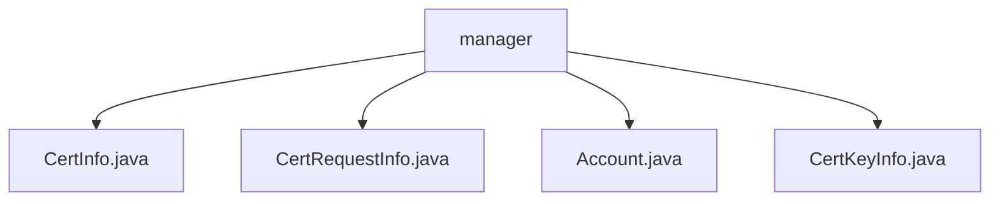

# Basic Information

|      |      |
|------|------|
| Name | manager |
| Language | .java |
| Code Path | WeFe/common/java/common-data-mongodb/src/main/java/com/welab/wefe/common/data/mongodb/entity/manager |
| Package Name | docs.common.java.common-data-mongodb.src.main.java.com.welab.wefe.common.data.mongodb.entity.manager |
| Brief Description | The CertInfo class stores certificate information, including ID, user ID, public-private key pair, serial number, etc. The CertRequestInfo class stores certificate request information, inherits from AbstractNormalMongoModel, and contains fields such as ID and user ID. The Account class stores account information, including ID, phone number, password, etc. The CertKeyInfo class stores certificate key information, containing fields such as primary key and private key PEM. |

# Description

## Overview  
This module is a collection of MongoDB data models designed for certificate management, with its core responsibility being the storage of full lifecycle certificate data (such as keys, requests, and issuance information) and associated account information. The interface specifications uniformly adopt the standard getter/setter pattern. For example, CertInfo provides methods for certificate content storage and retrieval, while CertRequestInfo supports application status queries. Key data structures include certificate information (containing CA flags, serial numbers), key PEM-format content, and basic account information (such as tri-state markers). The only external dependency is MongoDB, with basic CRUD functionality implemented through AbstractNormalMongoModel.

## Core Business Scenarios  
The module supports end-to-end certificate issuance management, similar to a PKI system: after user authentication via the Account entity, CertRequestInfo submits the application, CertKeyInfo stores the key pair, and CertInfo ultimately records the issuance result. A typical interaction involves a CA authority updating status flags after reviewing a request. Features encompass key generation (e.g., PEM storage for RSA algorithms), certificate chain tracing (via parent certificate IDs), and account security controls (such as historical password validation). Integration use cases include certificate issuance APIs and account status synchronization.

### Package Internal Structure View

This flowchart illustrates four Java files under the manager directory: CertInfo.java, CertRequestInfo.java, Account.java, and CertKeyInfo.java. These files are directly subordinate to the manager directory with no deeper nested structure. The entire layout is clear and concise, reflecting the four entity class files stored in the manager directory.

# File List

| Name   | Type  | Description |
|-------|------|-------------|
| [CertInfo.java](CertInfo.md) | file | The CertInfo class is used to store certificate information, including fields such as primary key ID, user ID, issuer and applicant details, certificate content, status, etc., with support for MongoDB storage. |
| [CertRequestInfo.java](CertRequestInfo.md) | file | The CertRequestInfo class is used to store certificate request information, including fields such as user ID, private key ID, organization name, common name, request content, issuing authority certificate ID, issuance status, and creator. |
| [Account.java](Account.md) | file | MongoDB Account Class, including ID, phone number, password, salt, nickname, email, administrator role, review status, availability, cancellation status, password update requirement, last activity time, historical passwords, and updater information. |
| [CertKeyInfo.java](CertKeyInfo.md) | file | The CertKeyInfo class stores MongoDB certificate key information, including primary key ID, private key PEM, user ID, private key algorithm, and creator fields, providing getter and setter methods for each attribute. |

