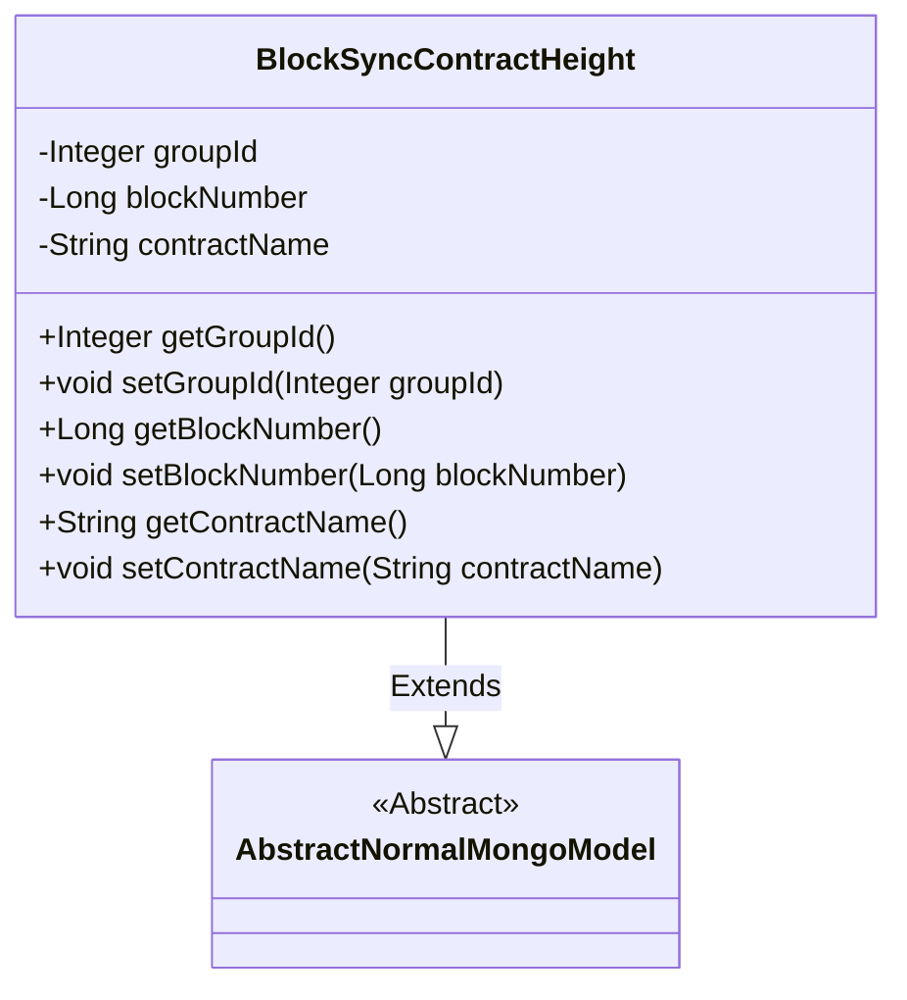
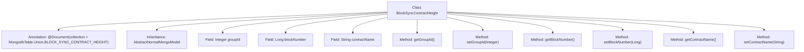

# Basic Information

|      |      |
|------|------|
| Name | BlockSyncContractHeight |
| Language | .java |
| Code Path | WeFe/common/java/common-data-mongodb/src/main/java/com/welab/wefe/common/data/mongodb/entity/union/BlockSyncContractHeight.java |
| Package Name | com.welab.wefe.common.data.mongodb.entity.union |
| Dependencies | ['com.welab.wefe.common.data.mongodb.constant.MongodbTable', 'com.welab.wefe.common.data.mongodb.entity.base.AbstractNormalMongoModel', 'org.springframework.data.mongodb.core.mapping.Document'] |
| Brief Description | MongoDB entity class BlockSyncContractHeight, containing fields groupId, blockNumber, and contractName, used to store block synchronization contract height information. |

# Description

This is a Java class named BlockSyncContractHeight, used to represent the document structure in the MongoDB collection BLOCK_SYNC_CONTRACT_HEIGHT. The class inherits from AbstractNormalMongoModel and includes three private fields: groupId (integer type), blockNumber (long type), and contractName (string type). Each field has corresponding getter and setter methods for accessing and modifying the field values. This class is primarily used to store contract height information during block synchronization.

# Class Summary

| Name   | Type  | Description |
|-------|------|-------------|
| BlockSyncContractHeight | class | The BlockSyncContractHeight class is used to store block synchronization contract height information, including the groupId, blockNumber, and contractName fields along with their corresponding getter/setter methods. |

## Class BlockSyncContractHeight

|      |      |
|------|------|
| Access Modifier | @Document(collection = MongodbTable.Union.BLOCK_SYNC_CONTRACT_HEIGHT);public |
| Type | class |
| Name | BlockSyncContractHeight |
| Description | The BlockSyncContractHeight class is used to store block synchronization contract height information, including the groupId, blockNumber, and contractName fields along with their corresponding getter/setter methods. |

### UML Class Diagram

This class diagram depicts a MongoDB entity class BlockSyncContractHeight, which inherits from the abstract base class AbstractNormalMongoModel. The class contains three private fields: groupId (Integer type), blockNumber (Long type), and contractName (String type), along with standard getter and setter methods for each field. The @Document annotation specifies the corresponding MongoDB collection name for this entity, reflecting its persistence characteristics for storing contract height information during block synchronization.

### Internal Method Call Graph

This flowchart illustrates the structure of the BlockSyncContractHeight class, which is a MongoDB document class inheriting from AbstractNormalMongoModel, annotated with a specific collection name. The class contains three private fields (groupId, blockNumber, contractName) along with their corresponding getter and setter methods. All methods are directly linked to the main class without internal invocation relationships, clearly reflecting the typical characteristics of a POJO class.

### Field List

| Name  | Type  | Description |
|-------|-------|------|
| blockNumber | Long | Private long integer variable storing the block number. |
| contractName | String | The private string variable `contractName` is used to store the contract name. |
| groupId | Integer | The private integer variable groupId is used to identify the group number. |

### Method List

| Name  | Type  | Description |
|-------|-------|------|
| setContractName | void | Java Method: Set Contract Name, assign the parameter contractName to the class member variable this.contractName. |
| setBlockNumber | void | The method for setting the block number assigns the input parameter to the blockNumber property of the object. |
| setGroupId | void | This is a Java method used to set the groupId property of an object, accepting an Integer type parameter. |
| getContractName | String | Methods to obtain the contract name, returning a string-type variable contractName. |
| getGroupId | Integer | Methods to obtain the group ID, returning an integer-type groupId. |
| getBlockNumber | Long | Methods to obtain the block number, returns a long integer value blockNumber. |

