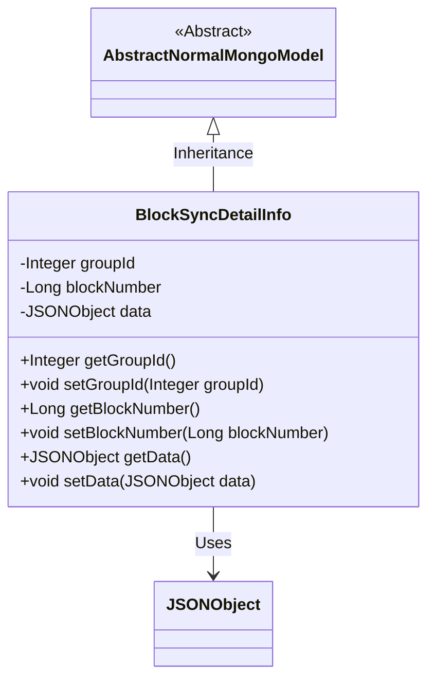

# Basic Information

|      |      |
|------|------|
| Name | BlockSyncDetailInfo |
| Language | .java |
| Code Path | WeFe/common/java/common-data-mongodb/src/main/java/com/welab/wefe/common/data/mongodb/entity/union/BlockSyncDetailInfo.java |
| Package Name | com.welab.wefe.common.data.mongodb.entity.union |
| Dependencies | ['com.alibaba.fastjson.JSONObject', 'com.welab.wefe.common.data.mongodb.constant.MongodbTable', 'com.welab.wefe.common.data.mongodb.entity.base.AbstractNormalMongoModel', 'org.springframework.data.mongodb.core.mapping.Document'] |
| Brief Description | The MongoDB entity class BlockSyncDetailInfo includes fields such as groupId, blockNumber, and data, which are used to store block synchronization details. |

# Description

This is a Java class named BlockSyncDetailInfo, designed for the BLOCK_SYNC_DETAIL_INFO collection in a MongoDB database. It extends the AbstractNormalMongoModel base class and contains three main attributes: groupId as an integer field representing the group ID, blockNumber as a long field indicating the block number, and data as a JSONObject field storing JSON data. The class provides standard getter and setter methods for each attribute. It uses the @Document annotation to specify the corresponding MongoDB collection name.

# Class Summary

| Name   | Type  | Description |
|-------|------|-------------|
| BlockSyncDetailInfo | class | The MongoDB entity class BlockSyncDetailInfo includes fields such as groupId, blockNumber, and data, which are used to store block synchronization details. |

## Class BlockSyncDetailInfo

|      |      |
|------|------|
| Access Modifier | @Document(collection = MongodbTable.Union.BLOCK_SYNC_DETAIL_INFO);public |
| Type | class |
| Name | BlockSyncDetailInfo |
| Description | The MongoDB entity class BlockSyncDetailInfo includes fields such as groupId, blockNumber, and data, which are used to store block synchronization details. |

### UML Class Diagram

Class Diagram Description: This diagram illustrates the structure of a MongoDB entity class BlockSyncDetailInfo, which inherits from the abstract base class AbstractNormalMongoModel. It contains three private fields (groupId, blockNumber, and data) along with their corresponding getter/setter methods. The data field uses the JSONObject type to store structured data and is associated with the JSONObject class via a dependency relationship. The class annotation @Document indicates that this is a mapping entity for a MongoDB collection, used to store block synchronization details.

### Internal Method Call Graph

```mermaid
graph TD
    A["Class BlockSyncDetailInfo"]
    B["Inherits from: AbstractNormalMongoModel"]
    C["Annotation: @Document(collection = MongodbTable.Union.BLOCK_SYNC_DETAIL_INFO)"]
    D["Property: Integer groupId"]
    E["Property: Long blockNumber"]
    F["Property: JSONObject data"]
    G["Method: getGroupId()"]
    H["Method: setGroupId(Integer groupId)"]
    I["Method: getBlockNumber()"]
    J["Method: setBlockNumber(Long blockNumber)"]
    K["Method: getData()"]
    L["Method: setData(JSONObject data)"]

    A --> B
    A --> C
    A --> D
    A --> E
    A --> F
    A --> G
    A --> H
    A --> I
    A --> J
    A --> K
    A --> L
```

This flowchart illustrates the structure of the BlockSyncDetailInfo class, which inherits from AbstractNormalMongoModel and uses the @Document annotation to specify the MongoDB collection name. The class contains three private properties: groupId, blockNumber, and data, which store an integer-type group ID, a long-type block number, and a JSON-formatted data object, respectively. The class provides getter and setter methods for these properties to enable reading and modification. The flowchart clearly reflects the class's inheritance relationship, annotation usage, and the association between properties and methods.

### Field List

| Name  | Type  | Description |
|-------|-------|------|
| blockNumber | Long | Block number, long integer private variable. |
| groupId | Integer | The private integer variable `groupId` is used to store the group identifier. |
| data | JSONObject | Private JSON object data |

### Method List

| Name  | Type  | Description |
|-------|-------|------|
| getGroupId | Integer | Methods to obtain the group ID, which returns an integer-type groupId. |
| getData | JSONObject | Retrieve and return a data object of type JSONObject. |
| setBlockNumber | void | This is a Java method used to set the blockNumber property value of an object. The method takes a parameter of type Long and assigns it to the member variable blockNumber of the object. |
| setGroupId | void | Set the group ID value of integer type. |
| getBlockNumber | Long | Methods to obtain the block number, with a return type of long integer. |
| setData | void | Methods for setting JSON object data. |

