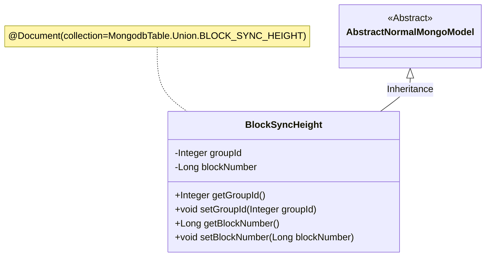
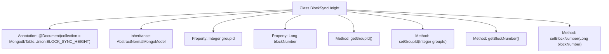

# Basic Information

|      |      |
|------|------|
| Name | BlockSyncHeight |
| Language | .java |
| Code Path | WeFe/common/java/common-data-mongodb/src/main/java/com/welab/wefe/common/data/mongodb/entity/union/BlockSyncHeight.java |
| Package Name | com.welab.wefe.common.data.mongodb.entity.union |
| Dependencies | ['com.welab.wefe.common.data.mongodb.constant.MongodbTable', 'com.welab.wefe.common.data.mongodb.entity.base.AbstractNormalMongoModel', 'org.springframework.data.mongodb.core.mapping.Document'] |
| Brief Description | The Java class `BlockSyncHeight` is used to store block synchronization height information, containing the fields `groupId` and `blockNumber` along with their corresponding getter/setter methods. |

# Description

This is a Java class named BlockSyncHeight, designed for the BLOCK_SYNC_HEIGHT collection in a MongoDB database. It extends AbstractNormalMongoModel and contains two private fields: groupId (integer type) and blockNumber (long type). The class provides standard getter and setter methods for these fields to retrieve and assign values. The @Document annotation specifies the corresponding MongoDB collection name for this class.

# Class Summary

| Name   | Type  | Description |
|-------|------|-------------|
| BlockSyncHeight | class | The BlockSyncHeight class is used for storing block synchronization height information in MongoDB, containing the groupId and blockNumber fields along with their getter/setter methods. |

## Class BlockSyncHeight

|      |      |
|------|------|
| Access Modifier | @Document(collection = MongodbTable.Union.BLOCK_SYNC_HEIGHT);public |
| Type | class |
| Name | BlockSyncHeight |
| Description | The BlockSyncHeight class is used for storing block synchronization height information in MongoDB, containing the groupId and blockNumber fields along with their getter/setter methods. |

### UML Class Diagram

This code defines a MongoDB document entity class named BlockSyncHeight, which inherits from the abstract class AbstractNormalMongoModel. The class contains two private fields, groupId and blockNumber, representing the group ID and block height respectively, along with corresponding getter/setter methods. The @Document annotation specifies the collection name of this entity in MongoDB, reflecting its association with the MongodbTable configuration. This class is primarily used for storing and synchronizing blockchain block height information, serving as one of the core components of the data persistence layer.

### Internal Method Call Graph

This code defines a MongoDB document class named BlockSyncHeight, which inherits from the base class AbstractNormalMongoModel. The class contains two core properties: groupId (integer type) and blockNumber (long type), used to store the group ID and block height value respectively. Access and modification of these properties are provided through getter and setter methods. The class-level @Document annotation specifies the collection name in MongoDB, indicating this is a data model for recording block synchronization heights. The entire class structure is concise, focusing on maintaining critical height information during blockchain synchronization processes.

### Field List

| Name  | Type  | Description |
|-------|-------|------|
| blockNumber | Long | The private long integer variable blockNumber is used to store the block number. |
| groupId | Integer | The private integer variable groupId is used to identify the group. |

### Method List

| Name  | Type  | Description |
|-------|-------|------|
| getBlockNumber | Long | Methods to obtain the block number, returns a long integer value blockNumber. |
| getGroupId | Integer | Methods to obtain the group ID, which returns an integer-type groupId. |
| setGroupId | void | The method to set the group ID involves assigning the parameter groupId to the class's member variable groupId. |
| setBlockNumber | void | Method for setting block number: Assign the input parameter to the blockNumber property of the object. |

