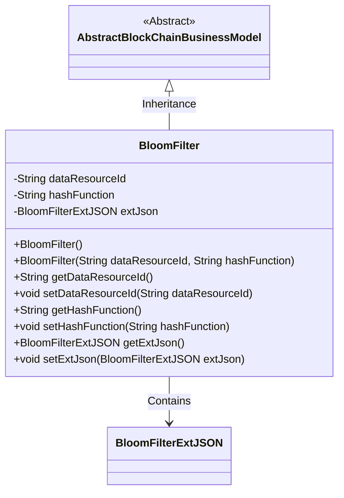

# Basic Information

|      |      |
|------|------|
| Name | BloomFilter |
| Language | .java |
| Code Path | WeFe/common/java/common-data-mongodb/src/main/java/com/welab/wefe/common/data/mongodb/entity/union/BloomFilter.java |
| Package Name | com.welab.wefe.common.data.mongodb.entity.union |
| Dependencies | ['com.welab.wefe.common.data.mongodb.constant.MongodbTable', 'com.welab.wefe.common.data.mongodb.entity.base.AbstractBlockChainBusinessModel', 'com.welab.wefe.common.data.mongodb.entity.union.ext.BloomFilterExtJSON', 'com.welab.wefe.common.data.mongodb.entity.union.ext.DataResourceExtJSON', 'org.springframework.data.mongodb.core.mapping.Document'] |
| Brief Description | The BloomFilter class extends AbstractBlockChainBusinessModel and includes the dataResourceId, hashFunction, and extJson attributes, providing constructor methods and getter/setter. |

# Description

The content describes a Java class named BloomFilter, which extends AbstractBlockChainBusinessModel and is used for the MongoDB collection MongodbTable.Union.BLOOM_FILTER. The class includes private fields dataResourceId and hashFunction, as well as an extJson object of type BloomFilterExtJSON. It provides both parameterless and parameterized constructors, along with getter and setter methods for each field.

# Class Summary

| Name   | Type  | Description |
|-------|------|-------------|
| BloomFilter | class | The BloomFilter class extends AbstractBlockChainBusinessModel, containing attributes such as dataResourceId, hashFunction, and the extJson object, while providing constructors and getter/setter methods. |

## Class BloomFilter

|      |      |
|------|------|
| Access Modifier | @Document(collection = MongodbTable.Union.BLOOM_FILTER);public |
| Type | class |
| Name | BloomFilter |
| Description | The BloomFilter class extends AbstractBlockChainBusinessModel, containing attributes such as dataResourceId, hashFunction, and the extJson object, while providing constructors and getter/setter methods. |

### UML Class Diagram

This code describes a BloomFilter class that inherits from the abstract class AbstractBlockChainBusinessModel. The BloomFilter contains three main private fields: dataResourceId, hashFunction, and extJson (of type BloomFilterExtJSON), along with constructors and corresponding getter/setter methods. The class forms a composition relationship with the BloomFilterExtJSON class through the extJson field, which is used to store extended JSON data. The overall design reflects the foundational structure of a blockchain business model, achieving functional extension through inheritance and composition.

### Internal Method Call Graph

```mermaid
graph TD
    A["Class BloomFilter"]
    B["Annotation: @Document(collection = MongodbTable.Union.BLOOM_FILTER)"]
    C["Inheritance: AbstractBlockChainBusinessModel"]
    D["Field: String dataResourceId"]
    E["Field: String hashFunction"]
    F["Field: BloomFilterExtJSON extJson"]
    G["Constructor: BloomFilter()"]
    H["Constructor: BloomFilter(String dataResourceId, String hashFunction)"]
    I["Method: getDataResourceId()"]
    J["Method: setDataResourceId(String dataResourceId)"]
    K["Method: getHashFunction()"]
    L["Method: setHashFunction(String hashFunction)"]
    M["Method: getExtJson()"]
    N["Method: setExtJson(BloomFilterExtJSON extJson)"]

    A --> B
    A --> C
    A --> D
    A --> E
    A --> F
    A --> G
    A --> H
    A --> I
    A --> J
    A --> K
    A --> L
    A --> M
    A --> N
```

This flowchart illustrates the complete structure of the BloomFilter class, including class annotation, inheritance relationship, attribute fields, constructors, and member methods. The class is annotated as a MongoDB document type, inherits from AbstractBlockChainBusinessModel, contains three core attributes (dataResourceId, hashFunction, and extJson), provides both no-argument and parameterized constructors, and implements standard getter/setter methods for each attribute. The extJson attribute is encapsulated using the BloomFilterExtJSON class, reflecting the composite design pattern.

### Field List

| Name  | Type  | Description |
|-------|-------|------|
| extJson = new BloomFilterExtJSON() | BloomFilterExtJSON | Create a private Bloom filter extended JSON object instance. |
| dataResourceId | String | private String dataResourceId |
| hashFunction | String | The private string variable hashFunction is used to store the name of the hash function. |

### Method List

| Name  | Type  | Description |
|-------|-------|------|
| setHashFunction | void | Java Method: Set Hash Function String Parameter. |
| setDataResourceId | void | The method to set the data resource ID assigns the input parameter to the class member variable `dataResourceId`. |
| getDataResourceId | String | Methods to obtain the data resource ID, which returns a string-type dataResourceId. |
| setExtJson | void | The method `setExtJson` is used to set the `extJson` attribute value of type `BloomFilterExtJSON`. |
| getHashFunction | String | Methods to obtain the name of a hash function. |
| getExtJson | BloomFilterExtJSON | Get the extJson object of type BloomFilterExtJSON. |

