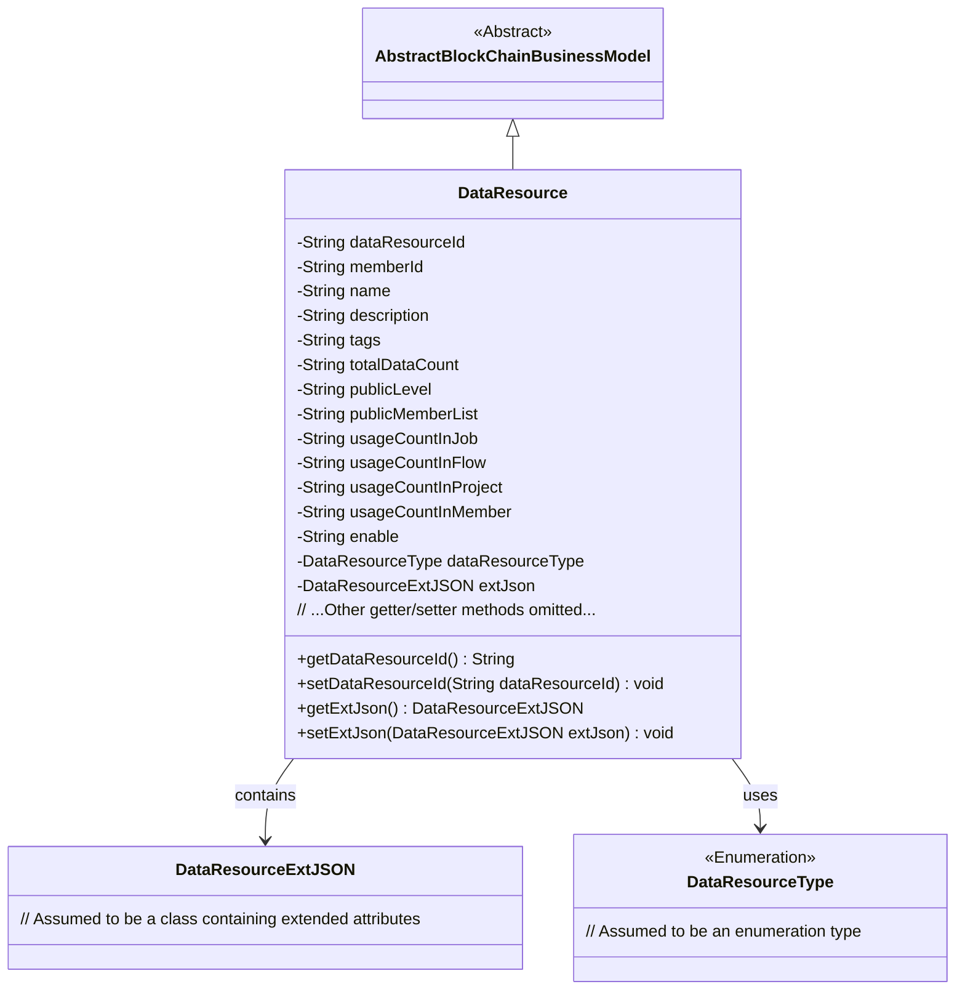

# Basic Information

|      |      |
|------|------|
| Name | DataResource |
| Language | .java |
| Code Path | WeFe/common/java/common-data-mongodb/src/main/java/com/welab/wefe/common/data/mongodb/entity/union/DataResource.java |
| Package Name | com.welab.wefe.common.data.mongodb.entity.union |
| Dependencies | ['com.welab.wefe.common.data.mongodb.constant.MongodbTable', 'com.welab.wefe.common.data.mongodb.entity.base.AbstractBlockChainBusinessModel', 'com.welab.wefe.common.data.mongodb.entity.union.ext.DataResourceExtJSON', 'com.welab.wefe.common.wefe.enums.DataResourceType', 'org.springframework.data.mongodb.core.mapping.Document'] |
| Brief Description | The DataResource class stores MongoDB data resource information, including attributes such as ID, name, description, tags, data volume, public level, usage statistics, and extended JSON. |

# Description

The `DataResource` class is a MongoDB document model that inherits from `AbstractBlockChainBusinessModel` and corresponds to the `Union.DATA_RESOURCE` collection. This class includes core attributes such as data resource ID, member ID, name, description, tags, total data volume, public level, and public member list. It also records usage counts in jobs, processes, projects, and members, as well as activation status and resource type. Extended information is stored via the `DataResourceExtJSON` object. All attributes provide getter and setter methods, supporting flexible data operations and business logic processing.

# Class Summary

| Name   | Type  | Description |
|-------|------|-------------|
| DataResource | class | The DataResource class represents a data resource in MongoDB, containing attributes such as ID, name, description, tags, data volume, public level, and usage statistics, inheriting from AbstractBlockChainBusinessModel. |

## Class DataResource

|      |      |
|------|------|
| Access Modifier | @Document(collection = MongodbTable.Union.DATA_RESOURCE);public |
| Type | class |
| Name | DataResource |
| Description | The DataResource class represents a data resource in MongoDB, containing attributes such as ID, name, description, tags, data volume, public level, and usage statistics, inheriting from AbstractBlockChainBusinessModel. |

### UML Class Diagram

This code defines a blockchain data resource model class that inherits from the abstract base class AbstractBlockChainBusinessModel. The class includes core attributes such as data resource ID, member ID, name, and description, as well as business fields like usage statistics and public level. Extended attributes are stored through DataResourceExtJSON. All fields are accessed via getter/setter methods, complying with JavaBean specifications, and the resource type is constrained by the enumeration type DataResourceType.

### Internal Method Call Graph

```mermaid
graph TD
    A["Class DataResource"]
    B["Inherits: AbstractBlockChainBusinessModel"]
    C["Annotation: @Document(collection = MongodbTable.Union.DATA_RESOURCE)"]
    D["Property: String dataResourceId"]
    E["Property: String memberId"]
    F["Property: String name"]
    G["Property: String description"]
    H["Property: String tags"]
    I["Property: String totalDataCount"]
    J["Property: String publicLevel"]
    K["Property: String publicMemberList"]
    L["Property: String usageCountInJob"]
    M["Property: String usageCountInFlow"]
    N["Property: String usageCountInProject"]
    O["Property: String usageCountInMember"]
    P["Property: String enable"]
    Q["Property: DataResourceType dataResourceType"]
    R["Property: DataResourceExtJSON extJson"]
    S["Getter/Setter Method Group"]
    T["getDataResourceId/setDataResourceId"]
    U["getMemberId/setMemberId"]
    V["getName/setName"]
    W["getDescription/setDescription"]
    X["getTags/setTags"]
    Y["getTotalDataCount/setTotalDataCount"]
    Z["getPublicLevel/setPublicLevel"]
    AA["getPublicMemberList/setPublicMemberList"]
    AB["getUsageCountInJob/setUsageCountInJob"]
    AC["getUsageCountInFlow/setUsageCountInFlow"]
    AD["getUsageCountInProject/setUsageCountInProject"]
    AE["getUsageCountInMember/setUsageCountInMember"]
    AF["getEnable/setEnable"]
    AG["getDataResourceType/setDataResourceType"]
    AH["getExtJson/setExtJson"]

    A --> B
    A --> C
    A --> D
    A --> E
    A --> F
    A --> G
    A --> H
    A --> I
    A --> J
    A --> K
    A --> L
    A --> M
    A --> N
    A --> O
    A --> P
    A --> Q
    A --> R
    A --> S
    S --> T
    S --> U
    S --> V
    S --> W
    S --> X
    S --> Y
    S --> Z
    S --> AA
    S --> AB
    S --> AC
    S --> AD
    S --> AE
    S --> AF
    S --> AG
    S --> AH
```

This flowchart illustrates the complete structure of the DataResource class, including its inheritance relationship, MongoDB document annotation, 14 string-type properties, 1 enum-type property, 1 custom object property, and corresponding 16 sets of Getter/Setter methods. The class inherits from AbstractBlockChainBusinessModel, indicating it is a blockchain business model, and is mapped to the DATA_RESOURCE collection in MongoDB via the @Document annotation. All properties are private fields with access interfaces provided through public methods, complying with JavaBean specifications.

### Field List

| Name  | Type  | Description |
|-------|-------|------|
| usageCountInFlow | String | The private string variable `usageCountInFlow` is used to record the number of uses within the flow. |
| extJson = new DataResourceExtJSON() | DataResourceExtJSON | Define a private variable extJson, initialized as a new instance of the DataResourceExtJSON class. |
| enable | String | The private string variable "enable" is used to control the state of the feature switch. |
| usageCountInProject | String | Number of times the string variable is used within the project. |
| tags | String | The private string variable `tags` is used to store tag information. |
| memberId | String | Member ID string variable |
| publicLevel | String | The private string variable publicLevel is used to store public level information. |
| dataResourceType | DataResourceType | The variable for private data resource type is dataResourceType. |
| description | String | Private string type variable description |
| usageCountInJob | String | Private string variable, recording the number of uses in the job. |
| usageCountInMember | String | The member variable `usageCountInMember`, of string type, is used to record the usage count. |
| publicMemberList | String | The private string variable publicMemberList is used to store the public member list. |
| dataResourceId | String | The private string-type variable dataResourceId is used to identify the data resource. |
| totalDataCount | String | Private string variable used to store the total data count. |
| name | String | Declare a private string variable name. |

### Method List

| Name  | Type  | Description |
|-------|-------|------|
| getUsageCountInJob | String | Get the usage count in the job. |
| setUsageCountInProject | void | Set the public method for the number of uses within the project. |
| getDataResourceId | String | Methods to obtain the data resource ID, returns the data resource ID as a string type. |
| getUsageCountInMember | String | The method to obtain the member's usage count returns the string-type value of `usageCountInMember`. |
| getName | String | This is a Java method that returns the value of the member variable "name" of type String. |
| setPublicLevel | void | Set a public level method to assign the input string to the publicLevel member variable of the class. |
| setTotalDataCount | void | Set the total data counting method and assign the input string to the class variable totalDataCount. |
| setPublicMemberList | void | The method for setting the public member list assigns the input string to the class's publicMemberList variable. |
| getTotalDataCount | String | Public method to obtain the totalDataCount value. |
| getEnable | String | Public method to get the enable value, returns a string type. |
| setUsageCountInMember | void | This is a Java method used to set the value of the member variable `usageCountInMember`. The method takes a string parameter and assigns it to the class's member variable. |
| getUsageCountInProject | String | Get the string method for counting usage within a project. |
| getExtJson | DataResourceExtJSON | Get the extended JSON data resource object. |
| getMemberId | String | The method getMemberId returns the member ID string memberId. |
| setName | void | The method to set the object name assigns the parameter `name` to the `name` property of the object. |
| setEnable | void | Java Method: Set the string value of the enable attribute. |
| getUsageCountInFlow | String | Get the process usage count string method. |
| setDataResourceId | void | The method for setting the data resource ID assigns the input parameter to the class member variable `dataResourceId`. |
| setDataResourceType | void | Methods for setting data resource types, assigning input parameters to member variables of the class. |
| setUsageCountInFlow | void | Java Method: Set the number of uses in the process, with the parameter being of string type. |
| setUsageCountInJob | void | This is a Java method used to set the value of the usage count property in a job. The method takes a string parameter and assigns it to the class member variable `usageCountInJob`. |
| getPublicMemberList | String | The method to obtain the public member list returns a string-type variable publicMemberList. |
| setDescription | void | This is a Java method used to set the description property of an object. The method takes a string parameter, description, and assigns it to the description field of the current object. |
| getPublicLevel | String | Public method to obtain the publicLevel value. |
| setTags | void | Set the label string. |
| getDataResourceType | DataResourceType | Methods for obtaining the data resource type, returns the value of the dataResourceType field. |
| getDescription | String | Methods to obtain the description information, returning the description value of string type. |
| getTags | String | The method getTags returns the value of the string tags. |
| setMemberId | void | The method to set the member ID assigns the input parameter to the class's member variable `memberId`. |
| setExtJson | void | Set external JSON data object. |

