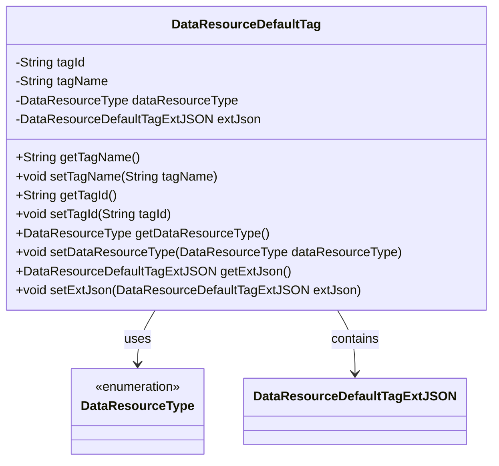

# Basic Information

|      |      |
|------|------|
| Name | DataResourceDefaultTag |
| Language | .java |
| Code Path | WeFe/common/java/common-data-mongodb/src/main/java/com/welab/wefe/common/data/mongodb/entity/union/DataResourceDefaultTag.java |
| Package Name | com.welab.wefe.common.data.mongodb.entity.union |
| Dependencies | ['com.welab.wefe.common.data.mongodb.constant.MongodbTable', 'com.welab.wefe.common.data.mongodb.entity.base.AbstractBlockChainBusinessModel', 'com.welab.wefe.common.data.mongodb.entity.union.ext.DataResourceDefaultTagExtJSON', 'com.welab.wefe.common.wefe.enums.DataResourceType', 'org.springframework.data.mongodb.core.mapping.Document', 'java.util.UUID'] |
| Brief Description | The Java class DataResourceDefaultTag represents the default tags in a MongoDB collection, containing tag ID, name, resource type, and extended JSON fields, and inherits from AbstractBlockChainBusinessModel. |

# Description

This is a Java class named DataResourceDefaultTag, which represents the default tags of data resources in a MongoDB collection. The class extends AbstractBlockChainBusinessModel and includes four main attributes: tagId (an auto-generated UUID string), tagName (the tag name), dataResourceType (an enumeration of data resource types), and extJson (an extended JSON object). The class provides standard getter and setter methods for each attribute, supporting read and write operations for these fields. This class is mapped to a specified collection in MongoDB, used for storing and managing default tag information of data resources.

# Class Summary

| Name   | Type  | Description |
|-------|------|-------------|
| DataResourceDefaultTag | class | The Java class `DataResourceDefaultTag` represents the default data resource tags in a MongoDB collection, containing tag ID, name, resource type, and extended JSON attributes, and inherits from `AbstractBlockChainBusinessModel`. |

## Class DataResourceDefaultTag

|      |      |
|------|------|
| Access Modifier | @Document(collection = MongodbTable.Union.DATA_RESOURCE_DEFAULT_TAG);public |
| Type | class |
| Name | DataResourceDefaultTag |
| Description | The Java class `DataResourceDefaultTag` represents the default data resource tags in a MongoDB collection, containing tag ID, name, resource type, and extended JSON attributes, and inherits from `AbstractBlockChainBusinessModel`. |

### UML Class Diagram

This code defines a class named DataResourceDefaultTag, which inherits from AbstractBlockChainBusinessModel (not shown in the diagram). The class represents default tags for data resources, containing tag ID, name, resource type, and extended JSON information. The tagId is automatically generated as a UUID with hyphens removed during initialization, while other fields are accessed and modified via getter/setter methods. The class has association relationships with the DataResourceType enumeration and the DataResourceDefaultTagExtJSON class.

### Internal Method Call Graph

```mermaid
graph TD
    A["Class DataResourceDefaultTag"]
    B["Annotation: @Document(collection = MongodbTable.Union.DATA_RESOURCE_DEFAULT_TAG)"]
    C["Inheritance: AbstractBlockChainBusinessModel"]
    D["Property: String tagId = UUID.randomUUID().toString().replaceAll('-', '')"]
    E["Property: String tagName"]
    F["Property: DataResourceType dataResourceType"]
    G["Property: DataResourceDefaultTagExtJSON extJson = new DataResourceDefaultTagExtJSON()"]
    H["Method: String getTagName()"]
    I["Method: void setTagName(String tagName)"]
    J["Method: String getTagId()"]
    K["Method: void setTagId(String tagId)"]
    L["Method: DataResourceType getDataResourceType()"]
    M["Method: void setDataResourceType(DataResourceType dataResourceType)"]
    N["Method: DataResourceDefaultTagExtJSON getExtJson()"]
    O["Method: void setExtJson(DataResourceDefaultTagExtJSON extJson)"]

    A --> B
    A --> C
    A --> D
    A --> E
    A --> F
    A --> G
    A --> H
    A --> I
    A --> J
    A --> K
    A --> L
    A --> M
    A --> N
    A --> O
```

This code defines a class named DataResourceDefaultTag, which inherits from the AbstractBlockChainBusinessModel class and uses MongoDB's @Document annotation to specify the collection name. The class contains four private properties: tagId (generated via UUID with hyphens removed), tagName, dataResourceType, and extJson (initialized as a new DataResourceDefaultTagExtJSON object). Corresponding getter and setter methods are provided for each property to access and modify their values. This class primarily represents default tag information for data resources, with the extJson property offering extended JSON data storage capabilities.

### Field List

| Name  | Type  | Description |
|-------|-------|------|
| dataResourceType | DataResourceType | The private data resource type variable dataResourceType. |
| tagName | String | Private string variable used to store tag names. |
| extJson = new DataResourceDefaultTagExtJSON() | DataResourceDefaultTagExtJSON | Initialize a default tag extension JSON object instance. |
| tagId = UUID.randomUUID().toString().replaceAll("-", "") | String | Generate a random UUID string without hyphens and assign it to tagId. |

### Method List

| Name  | Type  | Description |
|-------|-------|------|
| getTagId | String | Methods to obtain the tag ID, returns the tagId as a string type. |
| getTagName | String | Methods to obtain the tag name, returns the tagName as a string type. |
| getDataResourceType | DataResourceType | Methods for obtaining the data resource type, returns `dataResourceType`. |
| setTagId | void | Methods for setting the tag ID: Assign the input string to the object's tagId property. |
| setTagName | void | This is a Java method used to set the value of the tagName property of an object. The method takes a string parameter tagName and assigns it to the property of the same name in the current object. |
| setDataResourceType | void | The method for setting the data resource type takes a parameter of type DataResourceType and assigns it to the dataResourceType property of the current object. |
| getExtJson | DataResourceDefaultTagExtJSON | The method returns an extJson object of type DataResourceDefaultTagExtJSON. |
| setExtJson | void | The method `setExtJson` is used to set the `extJson` property, with the parameter being of type `DataResourceDefaultTagExtJSON`. |

